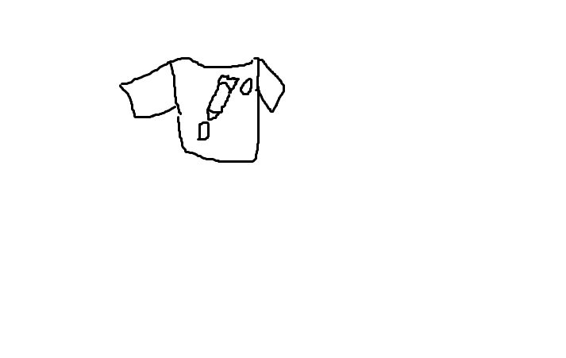

# This is a H1
## This is a H2
### This is a H3
#### This is a H4
##### This is a H5
###### This is a H6

Markdown은 텍스트 기반의 마크업언어로 2004년 존그루버에 의해 만들어졌으며 쉽게 쓰고 읽을 수 있으
며 HTML로 변환이 가능하다. 특수기호와 문자를 이용한 매우 간단한 구조의 문법을 사용하여 웹에서도 보
다 빠르게 컨텐츠를 작성하고 보다 직관적으로 인식할 수 있다.

마크다운이 최근 각광받기 시작한 이유는 깃헙(https://github.com) 덕분이다. 깃헙의 저장소Repository에
관한 정보를 기록하는 README.md는 깃헙을 사용하는 사람이라면 누구나 가장 먼저 접하게 되는 마크다
운 문서였다. 마크다운을 통해서 설치방법, 소스코드 설명, 이슈 등을 간단하게 기록하고 가독성을 높일 수
있다는 강점이 부각되면서 점점 여러 곳으로 퍼져가게 된다.

> # 출처: 구글검색
> 구글에서 검색한 내용을 참고하였습니다.

1. 첫
   1. 첫
   2. 두
   3. 셋
2. 두
3. 셋
   
- 첫
  - 첫 
  - 두
  - 셋
- 두
  - 첫
    - 두
      - 셋
- 셋

* 첫
  1. 첫
  2. 두
    * 셋

## HTMl
HTML은 웹 페이지의 골격을 표현하는 구조적 언어입니다.

```javascript
const name = req.body.name;
    if(name === undefined) {
        console.log("noname")
    }
```

[네이버](https://www.naver.com)로 이동하기


| | HTML | CSS | JS |
|---|---|---|---|
| A | 92 | 87 | 42 | 
| A | 92 | 87 | 42 | 
| A | 92 | 87 | 42 | 
| A | 92 | 87 | 42 | 
| A | 92 | 87 | 42 | 
