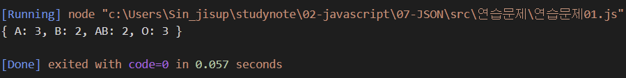
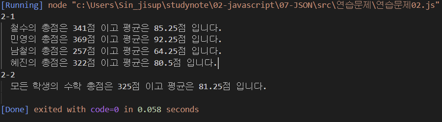
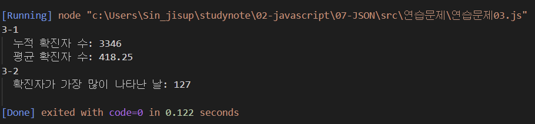

# JSON 연습문제

## 문제1.

다음은 10명의 학생들에 대한 혈액형 데이터이다.

```
['A', 'A', 'A', 'O', 'B', 'B', 'O', 'AB', 'AB', 'O']
```

아래와 같은 JSON을 정의하고, 각 혈액형별 학생수를 아래의 json의 각 key에 대한 value에 저장하시오. (혈액형별 학생 수를 for문을 활용하여 산출해야 합니다.)

```js
const result = {"A" : 0, "B" : 0, "AB" : 0, "O" : 0};
```

```js
const blood = ['A', 'A', 'A', 'O', 'B', 'B', 'O', 'AB', 'AB', 'O'];
let count_A = 0
let count_B = 0
let count_O = 0
let count_AB = 0

for (let i = 0; i <blood.length; i++){
    if (blood[i] == 'A') {
        count_A++
    } else if (blood[i] == 'B'){
        count_B++
    } else if (blood[i] == "O") {
        count_O++
    } else if (blood[i] == 'AB') {
        count_AB++
    }

}
const result = {"A": count_A, "B": count_B, "AB": count_AB, "O": count_O}
console.log(result)
```


---

## 문제2.

다음의 JSON은 어느 학급의 중간고사 성적을 나타낸다.

```js
const exam = {
    "철수": [89, 82, 79, 91],
    "민영": [91, 95, 94, 89],
    "남철": [65, 57, 71, 64],
    "혜진": [82, 76, 81, 83]
}
```

### 2-1.

위 데이터에서 학생별 총점과 평균을 구하시오.

#### 출력결과

```
철수의 총점은 341점 이고 평균은 85.25점 입니다.
민영의 총점은 369점 이고 평균은 92.25점 입니다.
남철의 총점은 257점 이고 평균은 64.25점 입니다.
혜진의 총점은 322점 이고 평균은 80.5점 입니다.
```

### 2-2.

위 문제의 점수가 순서대로 국어, 영어, 수학, 과학일 경우 수학에 대한 모든 학생의 총점과 평균을 구하시오.

#### 출력결과

```
모든 학생의 수학 총점은 325점 이고 평균은 81.25점 입니다.
```
```js
console.group("2-1")
let avg = 0

for (let k in exam) {
    let studSum = 0
    for (let i = 0; i < exam[k].length; i++){
        studSum += exam[k][i]
    }
    avg = studSum / exam[k].length;
    console.log("%s의 총점은 %d점 이고 평균은 %d점 입니다.", k, studSum, avg)
}
console.groupEnd()

console.group("2-2")
let mathSum = 0
let count = 0
for (let t in exam) {
    mathSum += exam[t][2]
    count++
}
let mathAvg = mathSum / count;
console.log("모든 학생의 수학 총점은 %d점 이고 평균은 %d점 입니다.", mathSum, mathAvg)
console.groupEnd()
```

---

## 문제3.

아래의 데이터는 2021년 01월 25일부터 02월 01일까지의 Covid19 일별 확진자 수를 표현한 자료구조다.

```javascript
covid19 = [
    {date: '0125': active: 426}, 
    {date: '0126': active: 343}, 
    {date: '0127': active: 547}, 
    {date: '0128': active: 490}, 
    {date: '0129': active: 460}, 
    {date: '0130': active: 443}, 
    {date: '0131': active: 338}, 
    {date: '0201': active: 299}
]
```

### 3-1.

1월 25일부터 2월 1일까지의 누적 확진자 수와 일 평균 확진자 수를 구하시오.

#### 출력결과

```
누적 확진자 수: 3346
평균 확진자 수: 418.25
```


### 3-2

1월 25일부터 2월 1일까지 중에서 확진자가 가장 많이 나타난 날짜는 언제인가?

#### 출력결과

```
확진자가 가장 많이 나타난 날: 0127
```
```js
console.group("3-1")
let sum = 0
let count = 0
for (let k in covid19) {
    sum += covid19[k].active
    count++
}
let avg = sum / count
console.log("누적 확진자 수: %d", sum)
console.log("평균 확진자 수: %d", avg)
console.groupEnd()

console.group("3-2")
let max = covid19[0].active
let maxDate = covid19[0].date
for (let i in covid19) {
    if (max < covid19[i].active){
        max = covid19[i].active
        maxDate = covid19[i].date
    }
}
console.log("확진자가 가장 많이 나타난 날: %d", maxDate)
console.groupEnd()
```
