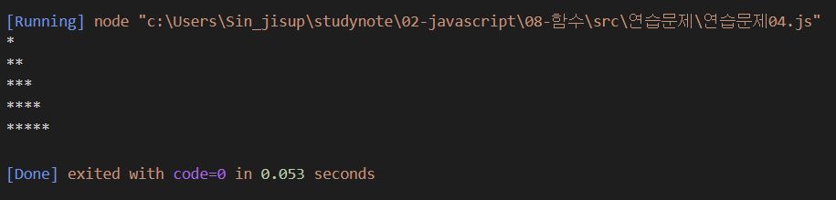
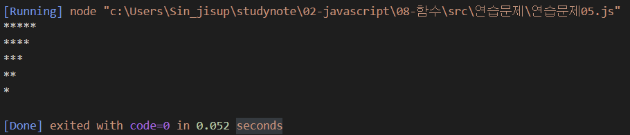

## 문제4

문제1번을 재귀함수 기법으로 다시 구현해 보세요.

```js
// max는 최대 행 수, current는 현재 출력중인 행의 위치
function printStar(max, current=1) {
    ... 구현하세요 ...
}

printStar(5);
```

```js
function printStar(max, current=1) {
    if (current > max){
        return;
    } else {
        let str = "" 
        for (let i =0; i < current; i++){
            str += "*"
        }
        console.log(str)
        printStar(max, current+1);
    }
}

printStar(5)
```


## 문제5 

문제2번을 재귀함수 기법으로 다시 구현해 보세요.

```js
// max는 최대 행 수, current는 현재 출력중인 행의 위치
function printRevStar(max, current=1) {
    ... 구현하세요 ...
}

printRevStar(5);
```

```js
function printRevStar(max, current=1) {
    if (current > max){
        return;
    } else{
        let str = ""
        for (let i = max; i > current - 1; i--){
            str +="*"
        }
        console.log(str)
        printRevStar(max, current+1)
    }
}

printRevStar(5)
```
