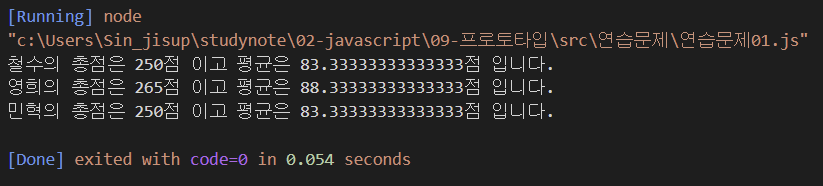
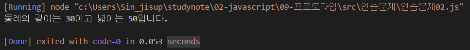

# 프로토타입 연습문제

## 문제1. 

국어, 영어, 수학 점수를 생성자 파라미터로 입력받아서 합계와 평균을 구하는 클래스 Student를 작성하시오.

이 때 Stuent 클래스는 합계를 리턴하는 메서드인 `sum()`과 평균을 리턴하는 `avg()`를 제공합니다.

작성된 클래스를 활용하여 아래 표에 대한 학생별 합계 점수와 평균점수를 출력하시오.

클래스는 JSON 형식으로 작성되어야 합니다.

| 이름 | 국어 | 영어 | 수학 |
|---|---|---|---|
| 철수 | 92 | 81 | 77 |
| 영희 | 72 | 95 | 98 |
| 민혁 | 80 | 86 | 84 |


#### 출력결과

```
철수의 총점은 250점 이고 평균은 83.33333333333333점 입니다.
영희의 총점은 265점 이고 평균은 88.33333333333333점 입니다.
민혁의 총점은 250점 이고 평균은 83.33333333333333점 입니다.
```

```js
const score = {
    '철수': [92, 81, 77],
    '영희': [72, 95, 98],
    '민혁': [80, 86, 84]
}

function student(ko, en, math) {
    this._ko = ko
    this._en = en
    this._math = math
}

student.prototype = {
    sum: function() {
        let sum = this._ko + this._en + this._math
        return sum
    },
    avg: function() {
        let avg = (this._ko + this._en + this._math) / score['철수'].length
        return avg
    }
}

for (let i in score){
    const some = new student(score[i][0], score[i][1], score[i][2])
    console.log('%s의 총점은 %d점 이고 평균은 %d점 입니다.', i, some.sum(), some.avg())
}
```



## 문제2.

가로(`width`), 세로(`height`)정보를 getter, setter로 관리하는 Rectangle 클래스를 정의하시오.

이 클래스는 생성자의 파라미터가 없으며 둘레의 길이를 구해 리턴하는 getAround() 메서드와 넓이를 구해 리턴하는 gerArea() 메서드를 제공합니다.

클래스는 JSON 형식으로 작성되어야 합니다.


#### 출력결과

가로가 10이고 세로가 5인 경우

```
둘레의 길이는 30이고 넓이는 50입니다.
```

```js
function Rectangle(w, h) {
    this._width = w
    this._height = h
}

Rectangle.prototype = {
    get w() {
        return this._width
    },
    set w(param) {
        this._width = param
    },
    get h() {
        return this._height
    },
    set h(param) {
        this._height = param
    },
    getAround: function() {
        return 2*this._width + 2*this._height
    },
    getArea: function() {
        return this._width*this._height
    }
}

const something = new Rectangle(10, 5);

console.log("둘레의 길이는 %d이고 넓이는 %d입니다.", something.getAround() ,something.getArea() )
```
