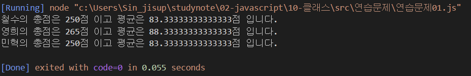
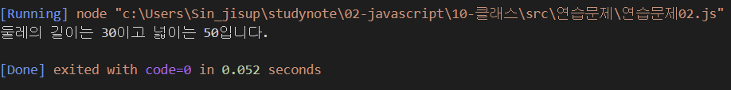

# Class 기반 객체지향 연습문제

## 문제1.

앞 단원에서 수행한 연습문제 1,2번을 Class 기반의 객체지행으로 재구성하시오.

```js
const score = {
    '철수': [92, 81, 77],
    '영희': [72, 95, 98],
    '민혁': [80, 86, 84]
}

class StudentClass {
    constructor(ko, en, math){
        this._ko = ko
        this._en = en
        this._math = math
    }
    sum() {
        let sum = this._ko + this._en + this._math
        return sum
    }
    avg() {
        let avg = (this._ko + this._en + this._math) / score['철수'].length
        return avg
    }
}

for (let i in score){
    const some = new StudentClass(score[i][0], score[i][1], score[i][2])
    console.log('%s의 총점은 %d점 이고 평균은 %d점 입니다.', i, some.sum(), some.avg())
}
```


```js
class RectangleClass {
    constructor() {
        this._width = null
        this._height = null
    }
    set width(value) {
        if(!value) {
            console.log("width를 입력하세요.")
            return
        }
        this._width = value
    }
    get width() {
        return this._width 
    }
    set height(value) {
        if(!value) {
            console.log("height를 입력하세요.")
            return
        }
        this._height = value
    }
    get height() {
        return this._height
    }

    getAround() {
        return 2 * this.width + 2 * this.height
    }

    getArea() {
        return this.width * this.height
    }
}

const rectangle = new RectangleClass();
rectangle.width = 10
rectangle.height = 5

!rectangle.width || !rectangle.height ? console.log("값이 비어있어 결과값이 없습니다."): console.log("둘레의 길이는 %d이고 넓이는 %d입니다.", rectangle.getAround() ,rectangle.getArea())
```
