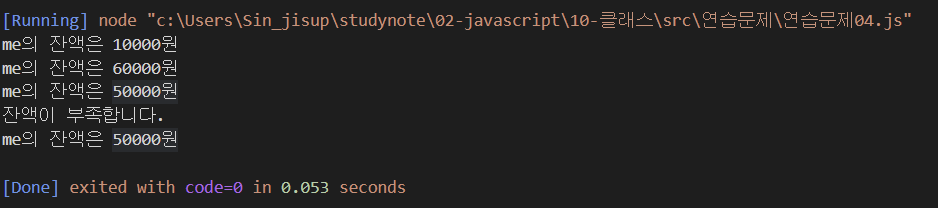

문제 1 - 다음을 만족하는 Student 클래스를 작성하시오.

1) String형의 학과와 정수형의 학번을 프로퍼티로로 선언후 생성자를 통해 주입
2) getter, setter를 정의
3) sayHello() 메서드를 통해 "나는 OOOO학과 OO학번 입니다." 를 출력하는 기능을 구현

```js
class StudentClass {
    constructor(department, id) {
        this._department = department
        if(!department) {
            console.log("학과를 입력하세요.")
            return;
        } else if (typeof(this._department) !== typeof("string")) {
            console.log("학과명은 문자입니다.")
            return;
        }
        this._id = id
        if(!id) {
            console.log("학번을 입력하세요.")
            return;
        } else if (typeof(this._id) !== typeof(1)) {
            console.log("학번은 숫자입니다.")
            return;
        }
    }

    set department(value) {
        this._department = value
    }

    get department() {
        return this._department
    }
    
    set id(value) {

        this._id = value
    }

    get id(){
        return this._id
    }

    sayHello() {
        typeof(this.id) === typeof(1) && typeof(this.department) === typeof("string") ? console.log("저는 %s학과 %d학번 입니다.", this.department, this.id) : console.log("입력을 확인하십시오.")
    }
}

const me = new StudentClass("나노융합공학과", 2015314013)

me.sayHello()
```


문제 - 2. 다음을 만족하는 클래스 Account를 작성하시오.

1) 다음의 2 개의 필드를 선언
    문자열 owner; (이름)
    숫자형 balance; (금액)
2) 위 모든 필드에 대한 getter와 setter의 구현
3) 위 모든 필드를 사용하는 가능한 모든 생성자의 구현
4) 메소드 deposit()의 헤드는 다음과 같으며 인자인 금액을 저축하는 메소드
    deposit(amount)
5) 메소드 withdraw()의 헤드는 다음과 같으며 인자인 금액을 인출(리턴)하는 메소드
    withdraw(long amount)
    인출 상한 금액은 잔액까지로 하며, 이 경우 이러한 상황을 출력

```js
class Account {
    constructor(owner, balance){
        this._owner = owner
        this._balance = balance
    }
    set owner(value) {
        this._owner = value
    }
    get owner() {
        return this._owner
    }
    set balance(value) {
        this._balance = value
    }
    get balance() {
        return this._balance
    }
    deposit(amount) {
        this.balance += amount
    }
    withDraw(amount) {
        if (this.balance < amount) {
            console.log("잔액이 부족합니다.")
            return 0;
        }
        this.balance -= amount
        return amount
    }
}

const me = new Account("me", 10000)
console.log("%s의 잔액은 %d원", me.owner, me.balance);

me.deposit(50000)
console.log("%s의 잔액은 %d원", me.owner, me.balance);

me.withDraw(10000);
console.log("%s의 잔액은 %d원", me.owner, me.balance);

me.withDraw(70000);
console.log("%s의 잔액은 %d원", me.owner, me.balance);
```
