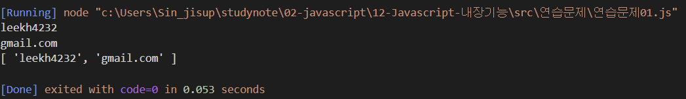
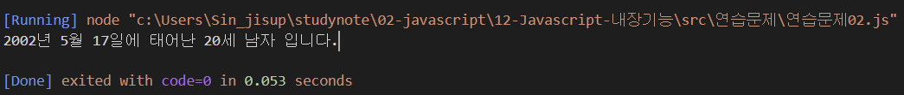
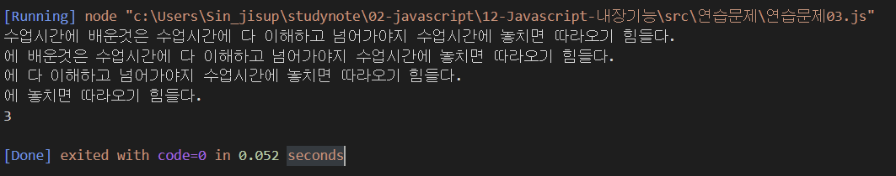
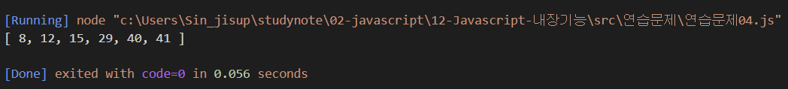
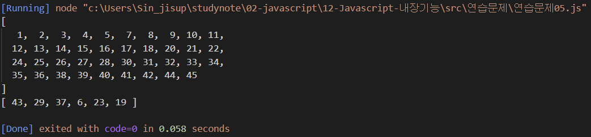
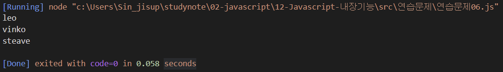

# 내장객체 연습문제

## 문제1.

자신의 이메일 주소를 `email` 이라는 변수에 저장하고 `@`를 기준으로 아이디와 도메인 부분을 분리하여 출력하시오.


### 출력결과

이메일이 leekh4232@gmail.com 인 경우

```
leekh4232
gmail.com
```

```js
const email = "leekh4232@gmail.com"

const findEmail = email.indexOf("@")
const name = email.substring(0, findEmail)
const mail = email.substring(findEmail + 1)
console.log(name)
console.log(mail)

const split = email.split("@")
console.log(split)
```



## 문제2.

임의의 주민번호를 다음과 같이 `*`을 포함하여 변수에 저장하시오.

```
ssn = '020517-3******'
```

또한 현재 년도를 now_year라는 변수로 저장하시오.

이 값을 사용하여 생년월일, 나이, 성별을 출력하시오.

#### 출력결과

```
2002년 5월 17일에 태어난 20세 남자 입니다.
```
```js
const now = new Date()
const now_year = now.getFullYear()

let ssn = '020517-3******'
const findSsn = ssn.substring(7,8)
const ssnYear = ssn.substring(0,2)
const ssnMonth = parseInt(ssn.substring(2,4))
const ssnDay = ssn.substring(4,6)
let ssnFullYear = 0
let mOrW = ""

if (findSsn == 3 || findSsn == 4){
    ssnFullYear = "20" + ssnYear
    findSsn == 3 ? mOrW = "남자" : mOrW = "여자"

} else {
    ssnFullYear = "19" + ssnYear
    findSsn == 1 ? mOrW = "남자" : mOrW = "여자"
}

console.log("%s년 %s월 %s일에 태어난 %d세 %s 입니다.", ssnFullYear, ssnMonth, ssnDay, now_year - parseInt(ssnFullYear), mOrW )
```



## 문제3.

아래의 문장에서 "수업시간"이라는 단어가 총 몇 번 등장하는지 카운트 하는 프로그램을 구현하시오.

```
str = "수업시간에 배운것은 수업시간에 다 이해하고 넘어가야지 수업시간에 놓치면 따라오기 힘들다."
```

#### 출력결과

```
3
```

```js
let str = "수업시간에 배운것은 수업시간에 다 이해하고 넘어가야지 수업시간에 놓치면 따라오기 힘들다."
let count = 0
const word = "수업시간"
let find = true


for(let i = 0; i< str.length; i++){
    console.log(str)
    let p = str.indexOf(word);
    find = p > -1

    if(find) {
        count++
        str = str.substring(p + word.length)
    } else {
        break
    }
}

console.log(count)
```

> 풀이보고 해결했습니다.

## 문제4. (로또번호 생성기 1)

주어진 범위 안에서 랜덤한 숫자를 추출하는 함수는 아래와 같다.

```javascript
function random(n1, n2) {
    return parseInt(Math.random() * (n2 - n1 + 1)) + n1;
}
```

0개의 원소를 갖는 배열 `lotto`를 생성하고 6회의 반복을 수행하는 for문을 사용하여 배열의 각 원소를 `1~45` 사이의 범위를 갖는 임의의 숫자로 채워 넣으시오.

반복이 종료되었을 때 `lotto`의 원소는 6개의 숫자가 채워져 있어야 하고 각 숫자는 중복되지 않아야 합니다.

중복되지 않는 숫자를 생성하기 위해 for문 안에서 무한반복을 위한 while문을 수행해야 합니다.

```js
let lotto = []

function random(n1, n2) {
    return parseInt(Math.random() * (n2 - n1 + 1)) + n1;
}

for (let i = 0; i < 6; i++) {
    while(true){
        let num = random(1,45)
        if (!lotto.includes(num)){
            lotto.push(num)
            break
        }
    }
    
}

for(let i = 0; i < lotto.length; i++){
    for (let j = 0; j < lotto.length; j++){
        if (lotto[i] < lotto[j]) {
            let tmp = lotto[i]
            lotto[i] = lotto[j]
            lotto[j] = tmp
        }
    }
}

console.log(lotto)
```

> 풀이보고 해결했습니다.

## 문제5. (로또번호 생성기 2)

`1~45`사이의 범위의 1씩 증가 하는 원소가 저장되어 있는 배열 `balls`을 생성하고 6개의 빈 칸을 갖는 배열 `lotto`를 생성하시오.

`lotto` 배열을 탐색하는 반복을 수행하면서 `balls` 배열에서 임의의 원소 하나를 추출하여 `lotto` 배열에 채워 넣으시오.

추출된 숫자는 `balls` 배열에서는 삭제되어야 합니다.

```js
function random(n1, n2) {
    return parseInt(Math.random() * (n2 - n1 + 1)) + n1;
}

let balls = [];
for (let i = 1; i < 46; i++) {
    balls.push(i)
}

let lotto = new Array(6)


for (let i = 0; i < lotto.length; i++) {
    const rnd = random(0, balls.length -1);

    lotto[i] = balls[rnd]

    balls.splice(rnd, 1);
}
console.log(balls)
console.log(lotto)
```

> 풀이보고 해결했습니다.


## 문제6.

수많은 마라톤 선수들이 마라톤에 참여하였습니다. 단 한 명의 선수를 제외하고는 모든 선수가 마라톤을 완주하였습니다.

마라톤에 참여한 선수들의 이름이 담긴 배열 participant와 완주한 선수들의 이름이 담긴 배열 completion이 주어질 때, 완주하지 못한 선수의 이름을 return 하도록 solution 함수를 작성해주세요.

```javascript
function solution(participant, completion) {
    var answer = '';
    return answer;
}
```

### 제한사항

- 마라톤 경기에 참여한 선수의 수는 1명 이상 100,000명 이하입니다.
- completion의 길이는 participant의 길이보다 1 작습니다.
- 참가자의 이름은 1개 이상 20개 이하의 알파벳 소문자로 이루어져 있습니다.
- 참가자 중에는 동명이인이 있을 수 없습니다.

### 입출력 예

| participant | completion | return |
|---|---|---|
| ["leo", "kiki", "eden"] | ["eden", "kiki"] | "leo" |
| ["marina", "josipa", "nikola", "vinko", "filipa"] | ["josipa", "filipa", "marina", "nikola"] | "vinko" |
| ["mislav", "stanko", "steave", "ana"] | ["stanko", "ana", "mislav"] | "steave |

```javascript
// "leo"는 참여자 명단에는 있지만, 완주자 명단에는 없기 때문에 완주하지 못했습니다.
// 출력결과: "leo"가 출력
console.log(solution(["leo", "kiki", "eden"], 
                     ["eden", "kiki"]));

// "vinko"는 참여자 명단에는 있지만, 완주자 명단에는 없기 때문에 완주하지 못했습니다.
// 출력결과: "vinko"가 출력
console.log(solution(["marina", "josipa", "nikola", "vinko", "filipa"], 
                     ["josipa", "filipa", "marina", "nikola"]));

// "steave"는 참여자 명단에는 있지만, 완주자 명단에는 없기 때문에 완주하지 못했습니다.
// 출력결과: "steave"가 출력
console.log(solution(["mislav", "stanko", "steave", "ana"], 
                     ["stanko", "ana", "mislav"]));
```

```js
function solution(participant, completion) {
    for (let i = 0; i < participant.length; i++){
        let p = participant[i]
        if (!completion.includes(p)){
            return p
        }
    }
    var answer = p;
    return answer;
}

console.log(solution(["leo", "kiki", "eden"], 
                     ["eden", "kiki"]));
console.log(solution(["marina", "josipa", "nikola", "vinko", "filipa"], 
                     ["josipa", "filipa", "marina", "nikola"]));
console.log(solution(["mislav", "stanko", "steave", "ana"], 
                     ["stanko", "ana", "mislav"]));
```

> 풀이보고 해결했습니다.