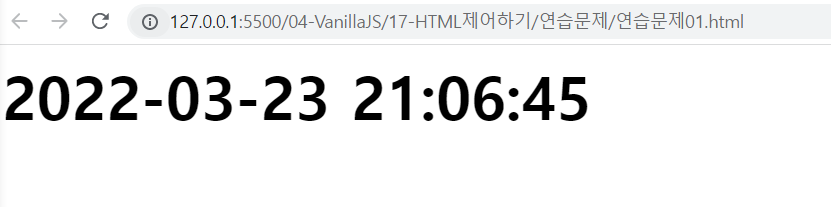

# HTML 제어하기 연습문제

## #문제1
아래 화면과 같이 현재 시각을 yyyy-mm-dd hh:mi:ss 형식으로 출력하는 웹 페이지를 구현하시오.

년도는 4자리 숫자로 구성되며 월,일,시,분,초는 2자리 숫자 입니다.

출력되는 시간은 매초마다 자동으로 화면상에서 갱신되어야 합니다.
```html
<!DOCTYPE html>
<html lang="ko">
<head>
    <meta charset="UTF-8">
    <meta name="viewport" content="width=device-width, initial-scale=1.0">
    <title>Document</title>
    <style>
        #time {
            font-size: 48px;
            font-weight: bolder;
        }
    </style>
</head>
<body>
    <div id="time"></div>

    <script>
        
        setInterval(() => {
            const time = new Date();
            let year = time.getFullYear();
            let month = time.getMonth() + 1;
            month = month < 10 ? "0" + month : month;
            let date = time.getDate();
            date = date < 10 ? "0" + date : date;
            let hh = time.getHours();
            hh = hh < 10 ? "0" + hh : hh;
            let mm = time.getMinutes();
            mm = mm < 10 ? "0" + mm : mm;
            let ss = time.getSeconds();
            ss = ss < 10 ? "0" + ss : ss;

            document.querySelector('#time').innerHTML = year+ "-" + month + "-" + date + " " + hh + ":" + mm + ":" + ss
        }, 1000);
        
    </script>
</body>
</html>
```


## #문제 2

아래 화면과 같이 off 상태의 버튼이 누를때마다 on/off 의 상태가 변경되도록 CSS를 적용할 수 있는 코드를 작성하세요.

```html
<!DOCTYPE html>
<html lang="ko">
<head>
    <meta charset="UTF-8">
    <meta name="viewport" content="width=device-width, initial-scale=1.0">
    <title>Document</title>
    <style>
        .btn {
            border: 1px solid black;
            color: blue;
            font-size: 18px;
            padding: 8px 16px;
            background-color: #ccc;
        }

        .active {
            color: red;
            background-color: yellow;
        }
    </style>
</head>
<body>
    <button class="btn">푸시알림 수신</button>

    <script>
        const btn = document.querySelector(".btn")
        btn.addEventListener("click", (e) =>{
            btn.classList.toggle("active")
        })
    </script>
</body>
</html>
```
 


## #문제 3
아래 화면과 같이 3장의 이미지가 3초마다 한번씩 자동으로 변경되는 웹 페이지를 작성하시오.

세 번째 이미지가 표시된 후 3초 후에는 다시 첫 번째 이미지가 표시되어야 합니다.

이미지 파일은 각자 임의의 이미지를 선정하여 사용하고, 이미지 파일 이름도 각자 임의로 구성합니다.

```html
<!DOCTYPE html>
<html lang="ko">
<head>
    <meta charset="UTF-8">
    <meta name="viewport" content="width=device-width, initial-scale=1.0">
    <title>Document</title>
    <style>
        .img {
            width: 400px;
            height: 400px;
        }
    </style>
</head>
<body>
    <div id="box">
        
    </div>

    <script>
        const imgList = ['img/iu01.jpg', 'img/iu02.jpg', 'img/iu03.jpg']
        let currentIndex = 0;
        setInterval(() => {
            document.querySelector(".img").setAttribute('src', imgList[currentIndex])

            currentIndex = (currentIndex + 1) % imgList.length; 
        }, 3000)
    </script>
</body>
</html>
```
 
 


##  #문제4

```html
<!DOCTYPE html>
<html lang="ko">
<head>
    <meta charset="UTF-8">
    <meta name="viewport" content="width=device-width, initial-scale=1.0">
    <title>Document</title>
</head>
<body>
    <div id="box"></div>
    <button class="btn" data-value="1">1일</button>
    <button class="btn" data-value="7">7일</button>
    <button class="btn" data-value="15">15일</button>
    <button class="btn" data-value="30">30일</button>
    <button class="btn" data-value="60">60일</button>

    <script>
        //처음 화면
        const now = new Date();
        document.querySelector("#box").innerHTML = now.getFullYear() + "-" + (now.getMonth() + 1) + "-" + now.getDate() + "~" + now.getFullYear() + "-" + (now.getMonth() + 1) + "-" + now.getDate()
        //버튼 눌렀을때
        document.querySelectorAll('.btn').forEach((v, i) => {
            v.addEventListener('click', e => {
                const time = new Date();
                const year = time.getFullYear();
                const month = time.getMonth() + 1;
                const date = time.getDate();
                const value = e.currentTarget.dataset.value;
                const timeset = new Date(time.setDate(date - value))
                return document.querySelector("#box").innerHTML = timeset.getFullYear() + "-" + (timeset.getMonth()+1) + "-" + timeset.getDate() + "~" + year + "-" + month + "-" + date
            })
        })
    </script>
</body>
</html>
```


