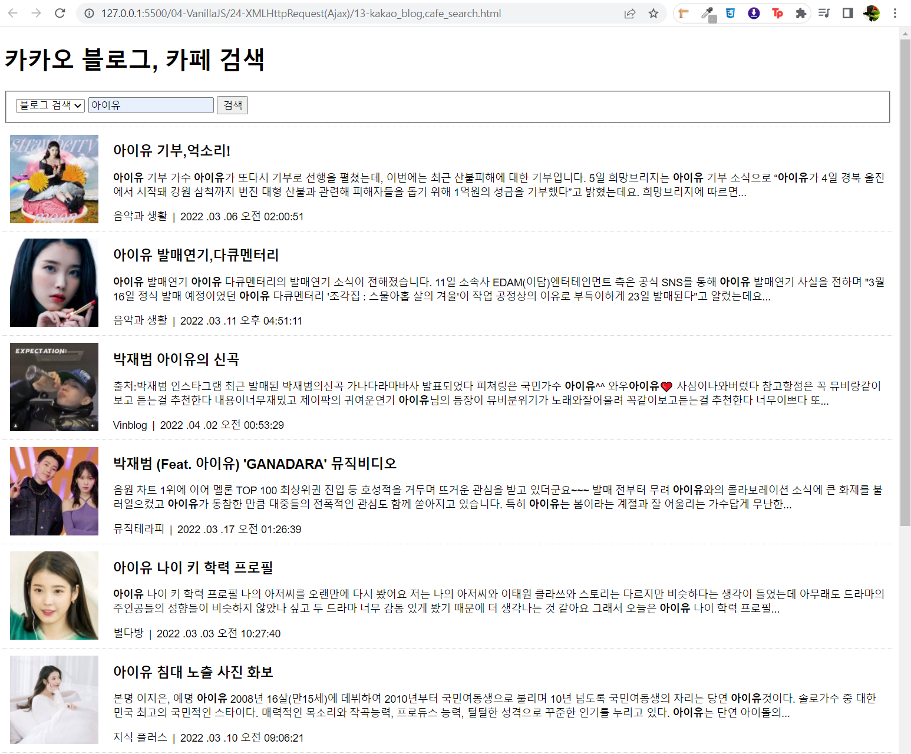
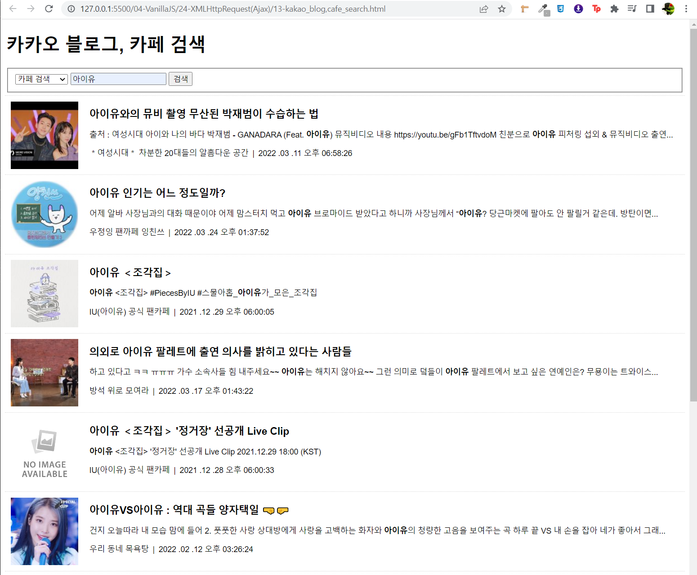

# 연습문제
```html
    <script src="https://cdn.jsdelivr.net/npm/axios/dist/axios.min.js"></script>
    <script>
        /** KAKAO REST KEY*/
        const KAKAO_REST_KEY = "000004737ac8470934d8666dd2cdb286";

        /** 페이지 번호*/
        let currentPage = 1;

        /** 검색어 */
        let queryKeyword = null;

        /** 마지막 페이지인지 검사 */
        let isEnd = false;

        // source 값
        let sourceValue = null;

        /** 검색폼의 submit이벤트 - 신규검색 */
        document.querySelector('#searchForm').addEventListener('submit', e=> {
            e.preventDefault();
            // selected 선택 값
            const source = document.querySelector('#source');
            sourceValue = source[source.selectedIndex].value
            
            // 검색어 값
            const queryField = document.querySelector('#query');
            queryKeyword = queryField.value.trim(); 

            //검색어가 입력되지 않은 경우에 대한 예외처리
            if (!queryKeyword) {
                alert('검색어를 입력하세요.');
                return;
            }

            //신규 검색
            currentPage = 1;
            get_image_search();
        });

        /** scroll 이벤트 - 추가검색 */
        window.addEventListener('scroll', e => {
            // 마지막 페이지이거나 이미 로딩바가 화면에 표시되고 있다면 처리 중단
            if (isEnd || document.querySelector('#loading').classList.contains('active')){
                return;
            }

            //스크롤바의 Y좌표
            const scrollY = window.scrollY

            //웹 브라우저의 높이
            const windowHeight = window.screen.availHeight;

            //HTML문서 높이
            const documentHeight = document.body.scrollHeight;

            if (scrollY + windowHeight >= documentHeight) {
                currentPage++
                get_image_search();
            }
        })

        async function get_image_search() {
            //로딩바 객체
            const loading = document.querySelector('#loading');

            //로딩바 화면에 표시하기
            loading.classList.add('active');

            //검색 결과가 표시될 영역
            const list = document.querySelector('#list');
            
            //1페이지에 대한 요청일 경우 기존에 표시되고 있던 검색결과가 있다면 삭제한다.
            if (currentPage == 1) {
                Array.from(list.getElementsByTagName('li')).forEach((v, i) => {
                    list.removeChild(v)
                })
            }

            //겸색결과를 저장할 빈 변수
            let json = null;

            try {
                json = await axios.get(`https://dapi.kakao.com/v2/search/${sourceValue}`, {
                    params: {
                        query: queryKeyword,
                        page: currentPage,
                    },
                    headers: {
                        Authorization: `KakaoAK ${KAKAO_REST_KEY}`
                    }
                })
                console.log(json)
            } catch(err) {
                console.error(err);
                alert('요쳥을 처리하는데 실패했습니다.')
            } finally {
                loading.classList.remove('active')
            }

            if (json != null) {
                const {data} = json;

                //다음 페이지를 요청할 수 있는지 판단하기 위한 값.
                isEnd = data.meta.is_end;
                
                data.documents.map((v, i) => {
                    const list = document.querySelector('#list');

                    const li = document.createElement('li');
                    const a = document.createElement('a');
                    a.setAttribute('href', v.url)
                    a.setAttribute('target', "_blank");
                    a.classList.add('use-thumbnail');

                    const img = document.createElement('img');
                    if (v.thumbnail == "") {
                        img.setAttribute('src', "img/noimage.jpg")
                    } else {
                        img.setAttribute('src', v.thumbnail);
                    }
                    

                    const h2 = document.createElement('h2');
                    h2.innerHTML = v.title;

                    const p = document.createElement('p');
                    p.innerHTML = v.contents;

                    const span1 = document.createElement('span');
                    const span2 = document.createElement('span');
                    span1.classList.add('info')
                    span2.classList.add('info')
                    let time = v.datetime.substring(0, 10);
                    let hour = v.datetime.substring(11, 19);
                    if (parseInt(hour) > 12) {
                        if((parseInt(hour)-12) >= 10) {
                            hour = "오후 " +(parseInt(hour) - 12) + hour.substring(2,8);
                        } else {
                            hour = "오후 " + "0" +(parseInt(hour) - 12) + hour.substring(2,8);
                        }
                    } else {
                        if (parseInt(hour) >= 10 ){
                            hour = "오전 " + parseInt(hour) + hour.substring(2,8);
                        } else {
                            hour = "오전 " + "0" + parseInt(hour) + hour.substring(2,8);
                        }
                    }
                    time = time.replaceAll('-', ' .')
                    span1.innerHTML = v[`${sourceValue}name`]
                    span2.innerHTML = time + " " + hour;

                    a.appendChild(img);
                    a.appendChild(h2);
                    a.appendChild(p);
                    a.appendChild(span1);
                    a.appendChild(span2);

                    li.appendChild(a);
                    list.appendChild(li);
                })
            }
        }
    </script>
```

