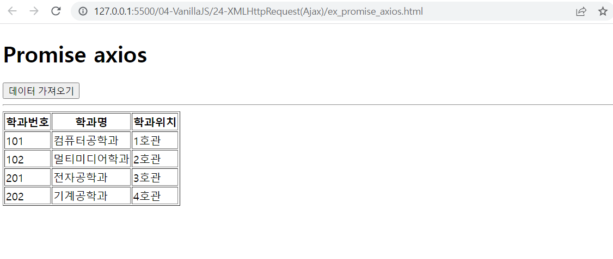
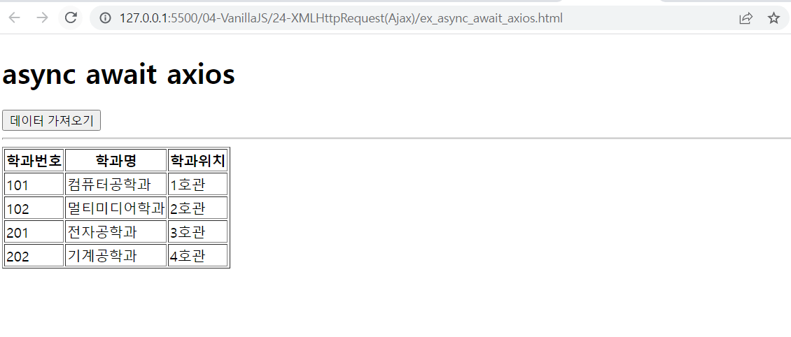

# 연습문제

## promise axios
```html
<!DOCTYPE html>
<html lang="ko">
<head>
    <meta charset="UTF-8">
    <meta name="viewport" content="width=device-width, initial-scale=1.0">
    <title>Document</title>
    <style>
        #loading {
            width: 100px;
            height: 100px;
            background-image: url(img/loading.gif);
            background-size: cover;
            background-position: center center;
            background-repeat: no-repeat;
            display: block;
            position: absolute;
            left: 50%;
            top: 50%;
            margin-top: -50px;
            margin-left: -50px;
            z-index: 9999;
            display:none;
        }

        #loading.active {
            display: block;
        }
    </style>
</head>
<body>
    <div id="loading"></div>
    <h1>Promise axios</h1>

    <button id="btn" type="button">데이터 가져오기</button>

    <hr />

    <table border="1">
        <thead>
            <tr>
                <th>학과번호</th>
                <th>학과명</th>
                <th>학과위치</th>
            </tr>
        </thead>
        <tbody id="list-body"></tbody>
    </table>
    <script src="https://cdn.jsdelivr.net/npm/axios/dist/axios.min.js"></script>
    <script>
        document.querySelector("#btn").addEventListener('click', (e) => {
            //로딩바 표시하기
            const loading = document.querySelector('#loading');
            loading.classList.add('active');
            const url = 'http://localhost:3000/department'

            axios
                .get(url)
                .then(({data}) => {
                    const listBody = document.querySelector('#list-body');
                    data.map((v, i) => {
                        const tr = document.createElement('tr');

                        const td1 = document.createElement('td');
                        td1.innerHTML = v.id

                        const td2 = document.createElement('td');
                        td2.innerHTML = v.dname

                        const td3 = document.createElement('td');
                        td3.innerHTML = v.loc
                        
                        tr.appendChild(td1)
                        tr.appendChild(td2)
                        tr.appendChild(td3)

                        listBody.appendChild(tr)
                    })
                })
                .catch((error) => {
                    console.error(error);
                    console.error(error.response.status)
                    console.error(error.response.statusText);
                    console.error(error.response.data);
                    alert(error.response.statusText)
                })
                .finally(() => {
                    loading.classList.remove('active');
                })
        })
    </script>
</body>
</html>
```


## async await axios 
```html
<!DOCTYPE html>
<html lang="ko">
<head>
    <meta charset="UTF-8">
    <meta name="viewport" content="width=device-width, initial-scale=1.0">
    <title>Document</title>
    <style>
        #loading {
            width: 100px;
            height: 100px;
            background-image: url('./img/loading.gif');
            background-position: center center;
            background-repeat: no-repeat;
            background-size: cover;
            position: absolute;
            top: 50%;
            left: 50%;
            margin-left: -50px;
            margin-top: -50px;
            z-index: 9999;
            display: none;;
        }

        #loading.active {
            display: block;
        }
    </style>
</head>
<body>
    <div id="loading"></div>
    <h1>async await axios</h1>

    <button id="btn" type="button">데이터 가져오기</button>
    <table border="1">
        <thead>
            <th>학과번호</th>
            <th>학과명</th>
            <th>학과위치</th>
        </thead>
        <tbody id="list-body"></tbody>
    </table>
    <script src="https://cdn.jsdelivr.net/npm/axios/dist/axios.min.js"></script>
    <script>
        document.querySelector('#btn').addEventListener('click', async (e) => {
            //로딩바
            const loading = document.querySelector('#loading')
            loading.classList.add('active')

            let json = null
            try {
                json = await axios.get('http://localhost:3000/department')
            } catch(e) {
                console.log(e);
                console.log(e.response.status)
                console.log(e.response.statusText)
                console.log(e.response.data)
                alert(e.response.statusText)
            } finally {
                loading.classList.remove('active');
            }

            if (json != null) {
                const listBody = document.querySelector('#list-body')
                
                json.data.map((v, i) => {
                    const {id, dname, loc} = json.data[i];
                    const tr = document.createElement('tr')
                
                    const td1 = document.createElement('td')
                    td1.innerHTML = id

                    const td2 = document.createElement('td')
                    td2.innerHTML = dname

                    const td3 = document.createElement('td')
                    td3.innerHTML = loc

                    tr.appendChild(td1)
                    tr.appendChild(td2)
                    tr.appendChild(td3)

                    listBody.appendChild(tr)
                })            
            }
        })
    </script>
</body>
</html>
```
