# 교수관리

## insomnia 결과

### 교수목록조회(GET)


### 교수상세조회(GET/id)


### 교수 추가(POST)


### 교수 수정(PUT)


### 교수 삭제(DELETE)


## professor 연습문제 

### index
```js
//페이지가 실행되면서 자동으로 동작해야 하므로 즉시실행함수형탤 구현.
(async () => {
    //ajax 결과가 저장될 json
    let json = null
    //ajax 요청
    try {
        json = await axios.get('http://localhost:3000/professor')
    } catch(e) {
        console.error(e);
        alert('요청을 처리하는데  실패했습니다.');
        return;
    }

    if (json != null) {
        const listBody = document.querySelector('#listBody')
        const {data} = json;
        
        data.forEach((v, i) => {
            //내용담을 tr 생성
            const tr = document.createElement('tr');

            //id 내용 추가
            const td1 = document.createElement('td');
            td1.innerHTML = v.id
            //교수이름 내용 추가
            const td2 = document.createElement('td');
            const a1 = document.createElement('a');
            a1.setAttribute('href', `view.html?id=${v.id}`)
            a1.innerHTML = v.name
            td2.appendChild(a1);
            //아이디 내용 추가
            const td3 = document.createElement('td');
            td3.innerHTML = v.userid;
            //직급 내용 추가
            const td4 = document.createElement('td');
            td4.innerHTML = v.position;
            //급여 내용 추가
            const td5 = document.createElement('td');
            td5.innerHTML = v.sal
            //입사일 내용 추가
            const td6 = document.createElement('td');
            td6.innerHTML = v.hiredate.substring(0,10);
            //보직수당 내용 추가
            const td7 = document.createElement('td');
            td7.innerHTML = v.comm;
            //부서번호(학과번호) 내용 추가
            const td8 = document.createElement('td');
            td8.innerHTML = v.deptno;
            //수정 및 삭제 추가
            const td9 = document.createElement('td');
            const a2 = document.createElement('a');
            //수정
            a2.setAttribute('href', `edit.html?id=${v.id}`);
            a2.innerHTML = '수정'
            td9.appendChild(a2)
            //삭제
            const a3 = document.createElement('a');
            a3.setAttribute('href', "#")
            a3.dataset.id = v.id;
            a3.dataset.name = v.name
            a3.innerHTML = '삭제'
            a3.classList.add('btn-delete')
            td9.appendChild(a3);

            //tr에 모든내용 추가
            tr.appendChild(td1);
            tr.appendChild(td2);
            tr.appendChild(td3);
            tr.appendChild(td4);
            tr.appendChild(td5);
            tr.appendChild(td6);
            tr.appendChild(td7);
            tr.appendChild(td8);
            tr.appendChild(td9);

            //최종결과물 listBody에 추가
            listBody.appendChild(tr);

            //삭제 버튼에 대한 클릭 이벤트 구현
            a3.addEventListener('click', async e => {
                e.preventDefault()
                const current = e.currentTarget;
                const id = current.dataset.id;
                const name = current.dataset.name;

                if (!confirm(`정말 ${name}(을)를 삭제하시겠습니까?`)){
                    return;
                }
                let json = null
                try {
                    json = await axios.delete(`http://localhost:3000/professor/${id}`);
                } catch(e) {
                    console.error(e);
                    alert('요청을 처리하는데 실패했습니다.')
                    return;
                }
                //현재 클릭된 곳에서 가장 가까운 tr선택 삭제
                if(json != null) {
                    current.closest('tr').remove();
                }
            })
        })
    }
})();
```


### view 
```js
//페이지가 실행되면서 자동으로 동작해야 하므로 즉시실행함수형태로 구현.
(async () => {
    //GET 파라미터 받기
    //querystring값이 key-value형태로 객체로 분리됨;
    const params = new URLSearchParams(window.location.search);
    // 객체에서 key사용하여 값을 추출 --> 10101;
    const id = params.get('id');
    console.log(id)

    //파라미터가 정상적이지 않으므로 메시지 출력, 전페이지 이동 처리 후 수행 중단(return)
    if(!id) {
        alert('학생번호가 없습니다.');
        history.back();
        return;
    }

    // ajax 요청
    let json = null
    
    try {
        json = await axios.get(`http://localhost:3000/professor/${id}`);
    } catch(e) {
        console.error(e);
        alert('요청을 처리하는데 실패했습니다.');
        return;
    }

    if (json != null){
        const {data} = json;
        document.querySelector(".id").innerHTML = data.id;
        document.querySelector(".name").innerHTML = data.name;
        document.querySelector(".userid").innerHTML = data.userid;
        document.querySelector(".position").innerHTML = data.position;
        document.querySelector(".sal").innerHTML = data.sal
        document.querySelector(".hiredate").innerHTML = data.hiredate.substring(0,10);
        document.querySelector(".comm").innerHTML = data.comm;
        document.querySelector(".deptno").innerHTML = data.deptno;

        //가져온 데이터의 일련번호를 사용하여 어떤 대상을 수정할지에 대한 링크 URL 구성
        document.querySelector('.btn-edit').setAttribute('href', 'edit.html?id=' + data.id);

        //가져온 데이터의 일련번호를 사용하여 어떤 대상을 삭제할지에 대한 dataset 구성
        const btnDelete = document.querySelector('.btn-delete');
        btnDelete.dataset.id = data.id;
        btnDelete.dataset.name = data.name;
    }
})();

document.querySelector('.btn-delete').addEventListener('click', e => {
    e.preventDefault();

    const current = e.currentTarget;
    const id = current.dataset.id;
    const name = current.dataset.name;

    if (!confirm(`정말 ${name}(을)를 삭제하시겠습니까?`)) {
        return;
    }

    let json = null;

    try {
        json = axios.delete(`http://localhost:3000/professor/${id}`);
    } catch(e) {
        console.error(e);
        alert('요청을 처리하는데 실패했습니다.');
        return;
    }

    if (json != null) {
        window.location = 'index.html';
    }
})
```


### add
```js
document.querySelector('#department-form').addEventListener('submit', async(e) => {
    e.preventDefault();

    //입력값 받아오기
    const name = document.querySelector('#name').value;
    const userid = document.querySelector('#userid').value;
    const position = document.querySelector('#position').value;
    const sal = document.querySelector('#sal').value;
    const hiredate = document.querySelector('#hiredate').value;
    const comm = document.querySelector('#comm').value;
    const deptno = document.querySelector('#deptno').value;

    let json = null;

    try {
        json = await axios.post('http://localhost:3000/professor', {
            name: name,
            userid: userid,
            position: position,
            sal: sal,
            hiredate: hiredate,
            comm: comm,
            deptno: deptno,
        }) 
    } catch(e) {
        console.error(e);
        alert('요청을 처리하는데 실패했습니다.');
        return;
    }

    if (json != null) {
        const {data} = json;

        window.location = 'view.html?id=' + data.id
    }
})
```


### edit 
```js
//페이지가 실행되면서 자동으로 동작해야 하므로 즉시실행함수형태로 구현.
(async () => {
    const params = new URLSearchParams(window.location.search);
    const id = params.get('id');
    console.log(id)
    if (!id) {
        alert('학생번호가 없습니다.');
        history.back();
        return;
    }

    //ajax요청
    let json = null
    try {
        json = await axios.get(`http://localhost:3000/professor/${id}`);
    } catch(e) {
        console.error(e);
        alert('요청을 처리하는데 실패했습니다.');
        return;
    }
    if (json != null) {
        const {data} = json;
        //가져온 데이터가 있다면 <input> 태그의 value속성으로 가져온 값을 적용한다.
        //일련번호와 같이 시스템이 관리하는 값은 hidden요소로 포함시킨다.
        document.querySelector("#id").value = data.id;
        document.querySelector("#name").value = data.name;
        document.querySelector("#userid").value = data.userid;
        document.querySelector("#position").value = data.position;
        document.querySelector("#sal").value = data.sal;
        document.querySelector("#hiredate").value = data.hiredate;
        document.querySelector("#comm").value = data.comm;
        document.querySelector("#deptno").value = data.deptno;
    }
})();

document.querySelector('#department-form').addEventListener('submit', async (e) => {
    e.preventDefault();
    //입력값 받아오기
    const id = document.querySelector('#id').value;
    const name = document.querySelector('#name').value;
    const userid = document.querySelector('#userid').value;
    const position = document.querySelector('#position').value;
    const sal = document.querySelector('#sal').value;
    const hiredate = document.querySelector('#hiredate').value;
    const comm = document.querySelector('#comm').value;
    const deptno = document.querySelector('#deptno').value;

    
    let json = null;
    try {
        json = await axios.put(`http://localhost:3000/professor/${id}`, {
            name: name,
            userid: userid,
            position: position,
            sal: sal,
            hiredate: hiredate,
            comm: comm,
            deptno: deptno,
        })
    } catch(e) {
        console.error(e);
        alert('요청을 처리하는데 실패했습니다.');
        return; 
    }

    if (json != null) {
        window.location.href = `view.html?id=${id}`;
    }
})
```


# 학생관리

## insomnia 결과

### 학생목록조회(GET)


### 학생상세조회(GET/id)


### 학생추가(POST)
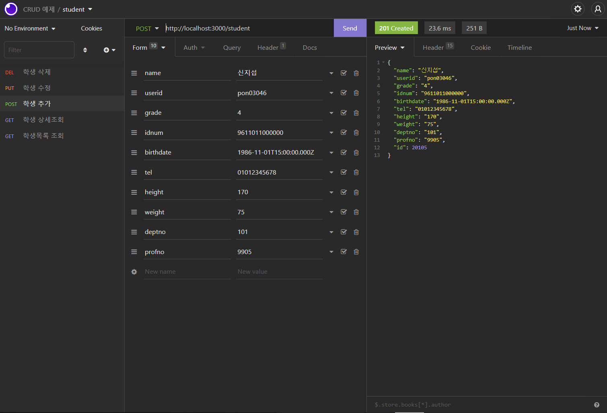
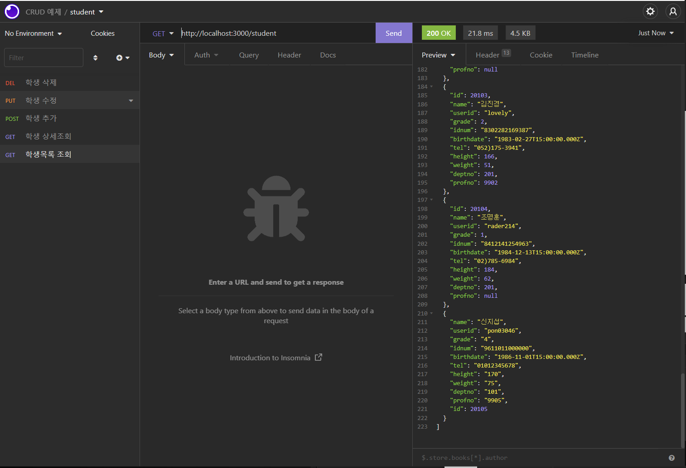

### 학생수정(PUT)
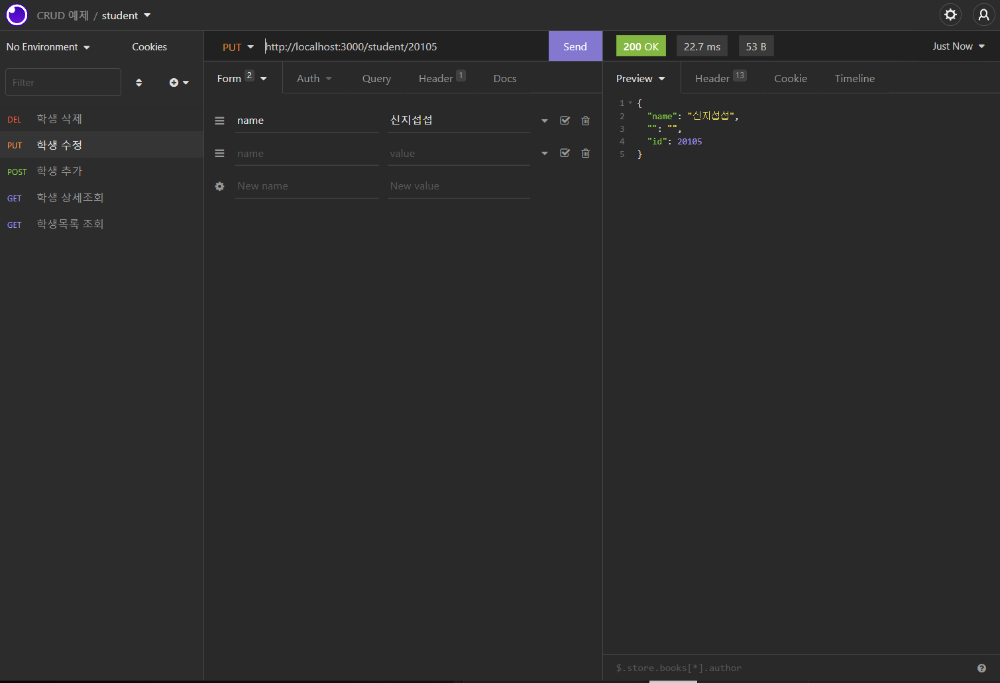
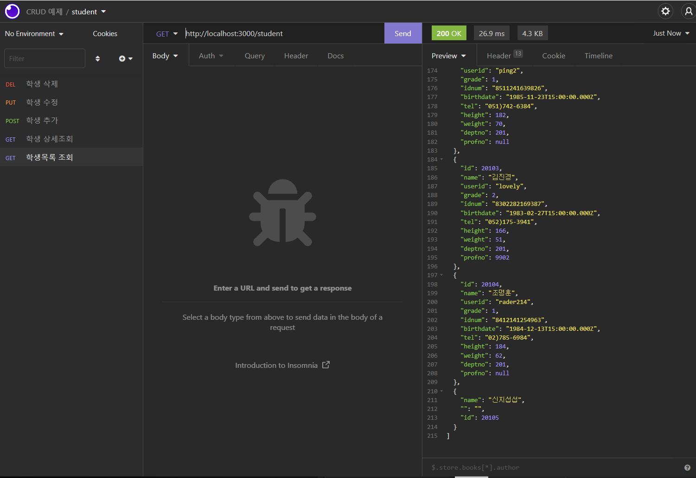

### 학생삭제(DELETE)
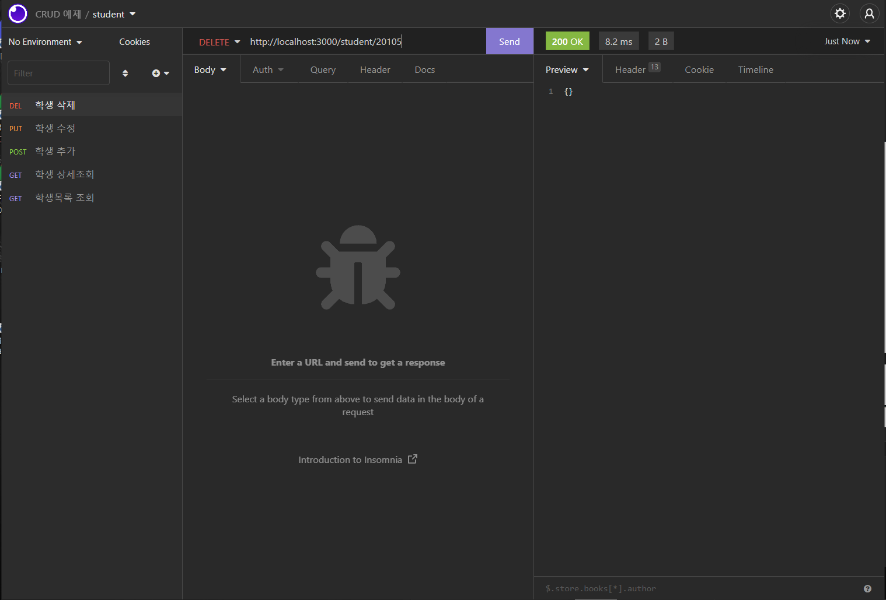
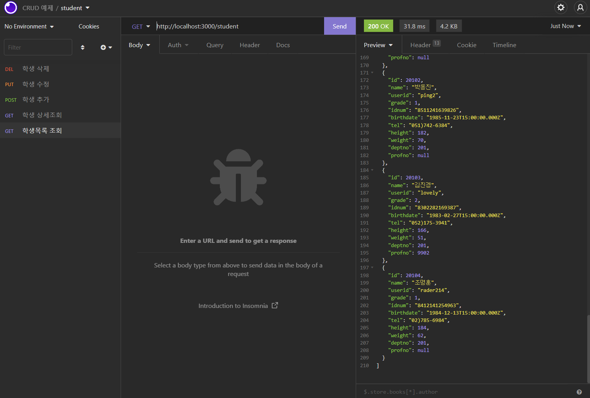


## student 연습문제

### index
```js
//페이지가 실행되면서 자동으로 동작해야 하므로 즉시실행함수형탤 구현.
(async () => {
    //ajax 결과가 저장될 json
    let json = null
    //ajax 요청
    try {
        json = await axios.get('http://localhost:3000/student')
    } catch(e) {
        console.error(e);
        alert('요청을 처리하는데  실패했습니다.');
        return;
    }

    if (json != null) {
        const listBody = document.querySelector('#listBody')
        const {data} = json;
        
        data.forEach((v, i) => {
            //내용담을 tr 생성
            const tr = document.createElement('tr');

            //id 내용 추가
            const td1 = document.createElement('td');
            td1.innerHTML = v.id
            //학생이름 내용 추가
            const td2 = document.createElement('td');
            const a1 = document.createElement('a');
            a1.setAttribute('href', `view.html?id=${v.id}`)
            a1.innerHTML = v.name
            td2.appendChild(a1);
            //아이디 내용 추가
            const td3 = document.createElement('td');
            td3.innerHTML = v.userid;
            //학년 내용 추가
            const td4 = document.createElement('td');
            td4.innerHTML = v.grade;
            //주민번호 내용 추가
            const td5 = document.createElement('td');
            td5.innerHTML = v.idnum.substring(0,6) + "-" + v.idnum.substring(6,7) + "*******";
            //생년월일 내용 추가
            const td6 = document.createElement('td');
            td6.innerHTML = v.birthdate.substring(0,10);
            //번호 내용 추가
            const td7 = document.createElement('td');
            td7.innerHTML = v.tel;
            //키 내용 추가
            const td8 = document.createElement('td');
            td8.innerHTML = v.height;
            //몸무게 내용 추가
            const td9 = document.createElement('td');
            td9.innerHTML = v.weight;
            //학과번호
            const td10 = document.createElement('td');
            td10.innerHTML = v.deptno;
            //담당교수의 일련번호
            const td11 = document.createElement('td');
            td11.innerHTML = v.profno;
            //수정 및 삭제 추가
            const td12 = document.createElement('td');
            const a2 = document.createElement('a');
            //수정
            a2.setAttribute('href', `edit.html?id=${v.id}`);
            a2.innerHTML = '수정'
            td12.appendChild(a2)
            //삭제
            const a3 = document.createElement('a');
            a3.setAttribute('href', "#")
            a3.dataset.id = v.id;
            a3.dataset.name = v.name
            a3.innerHTML = '삭제'
            a3.classList.add('btn-delete')
            td12.appendChild(a3);

            //tr에 모든내용 추가
            tr.appendChild(td1);
            tr.appendChild(td2);
            tr.appendChild(td3);
            tr.appendChild(td4);
            tr.appendChild(td5);
            tr.appendChild(td6);
            tr.appendChild(td7);
            tr.appendChild(td8);
            tr.appendChild(td9);
            tr.appendChild(td10);
            tr.appendChild(td11);
            tr.appendChild(td12);

            //최종결과물 listBody에 추가
            listBody.appendChild(tr);

            //삭제 버튼에 대한 클릭 이벤트 구현
            a3.addEventListener('click', async e => {
                e.preventDefault()
                const current = e.currentTarget;
                const id = current.dataset.id;
                const name = current.dataset.name;

                if (!confirm(`정말 ${name}(을)를 삭제하시겠습니까?`)){
                    return;
                }
                let json = null
                try {
                    json = await axios.delete(`http://localhost:3000/student/${id}`);
                } catch(e) {
                    console.error(e);
                    alert('요청을 처리하는데 실패했습니다.')
                    return;
                }
                
                if(json != null) {
                    current.closest('tr').remove();
                }
            })
        })
    }
})();
```
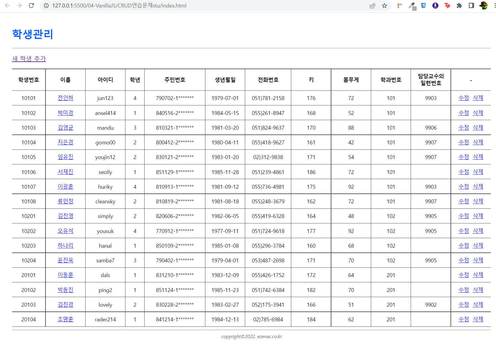
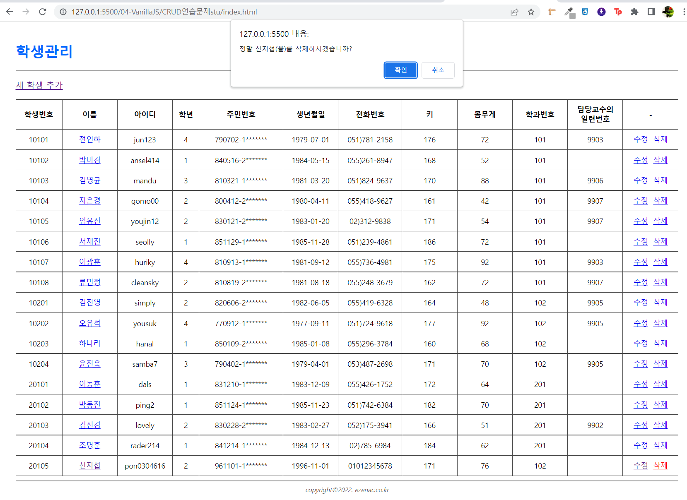
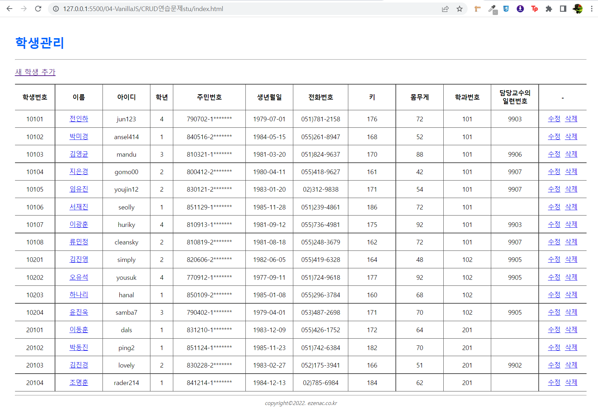

### view
```js
//페이지가 실행되면서 자동으로 동작해야 하므로 즉시실행함수형태로 구현.
(async () => {
    //GET 파라미터 받기
    //querystring값이 key-value형태로 객체로 분리됨;
    const params = new URLSearchParams(window.location.search);
    // 객체에서 key사용하여 값을 추출 --> 10101;
    const id = params.get('id');
    console.log(id)

    //파라미터가 정상적이지 않으므로 메시지 출력, 전페이지 이동 처리 후 수행 중단(return)
    if(!id) {
        alert('학생번호가 없습니다.');
        history.back();
        return;
    }

    // ajax 요청
    let json = null
    
    try {
        json = await axios.get(`http://localhost:3000/student/${id}`);
    } catch(e) {
        console.error(e);
        alert('요청을 처리하는데 실패했습니다.');
        return;
    }

    if (json != null){
        const {data} = json;
        document.querySelector(".id").innerHTML = data.id;
        document.querySelector(".name").innerHTML = data.name;
        document.querySelector(".userid").innerHTML = data.userid;
        document.querySelector(".grade").innerHTML = data.grade;
        document.querySelector(".idnum").innerHTML = data.idnum.substring(0,6) + "-" + data.idnum.substring(6,7) + "*******";
        document.querySelector(".birthdate").innerHTML = data.birthdate.substring(0,10);
        document.querySelector(".tel").innerHTML = data.tel;
        document.querySelector(".height").innerHTML = data.height;
        document.querySelector(".weight").innerHTML = data.weight;
        document.querySelector(".deptno").innerHTML = data.deptno;
        document.querySelector(".profno").innerHTML = data.profno;

        //가져온 데이터의 일련번호를 사용하여 어떤 대상을 수정할지에 대한 링크 URL 구성
        document.querySelector('.btn-edit').setAttribute('href', 'edit.html?id=' + data.id);

        //가져온 데이터의 일련번호를 사용하여 어떤 대상을 삭제할지에 대한 dataset 구성
        const btnDelete = document.querySelector('.btn-delete');
        btnDelete.dataset.id = data.id;
        btnDelete.dataset.name = data.name;
    }
})();

document.querySelector('.btn-delete').addEventListener('click', e => {
    e.preventDefault();

    const current = e.currentTarget;
    const id = current.dataset.id;
    const name = current.dataset.name;

    if (!confirm(`정말 ${name}(을)를 삭제하시겠습니까?`)) {
        return;
    }

    let json = null;

    try {
        json = axios.delete(`http://localhost:3000/student/${id}`);
    } catch(e) {
        console.error(e);
        alert('요청을 처리하는데 실패했습니다.');
        return;
    }

    if (json != null) {
        window.location = 'index.html';
    }
})
```
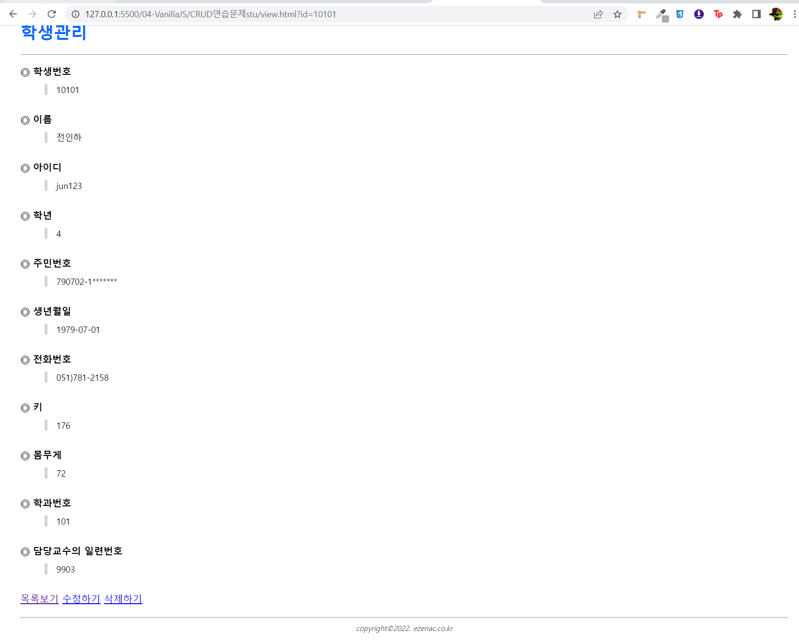
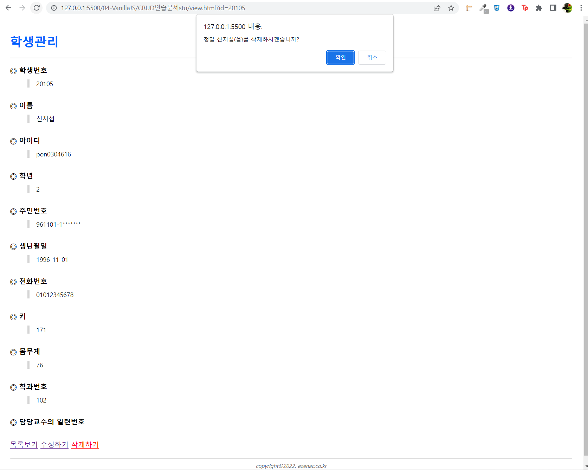


### add
```js
document.querySelector('#department-form').addEventListener('submit', async(e) => {
    e.preventDefault();

    //입력값 받아오기
    const name = document.querySelector('#name').value;
    const userid = document.querySelector('#userid').value;
    const grade = document.querySelector('#grade').value;
    const idnum = document.querySelector('#idnum').value;
    const birthdate = document.querySelector('#birthdate').value;
    const tel = document.querySelector('#tel').value;
    const height = document.querySelector('#height').value;
    const weight = document.querySelector('#weight').value;
    const deptno = document.querySelector('#deptno').value;
    const profno = document.querySelector('#profno').value;

    let json = null;

    try {
        json = await axios.post('http://localhost:3000/student', {
            name: name,
            userid: userid,
            grade: grade,
            idnum: idnum,
            birthdate: birthdate,
            tel: tel,
            height: height,
            weight: weight,
            deptno: deptno,
            profno: profno,
        }) 
    } catch(e) {
        console.error(e);
        alert('요청을 처리하는데 실패했습니다.');
        return;
    }

    if (json != null) {
        const {data} = json;

        window.location = 'view.html?id=' + data.id
    }
})
```
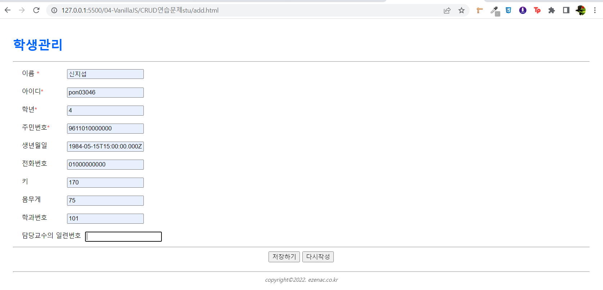
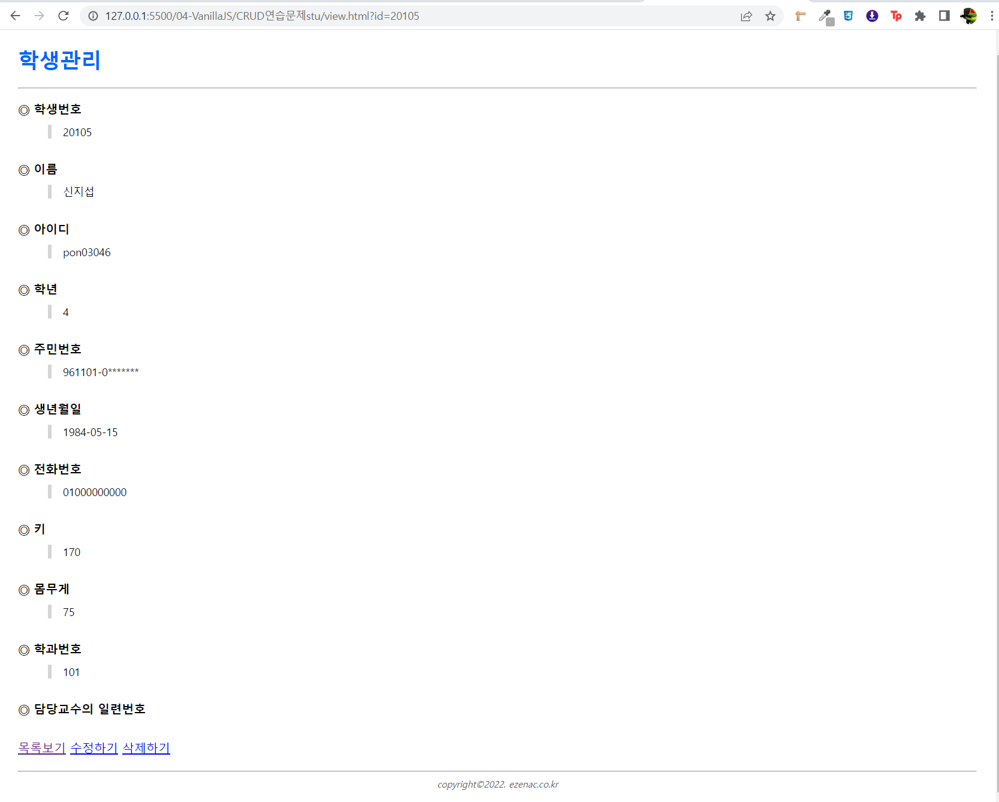


### edit
```js
//페이지가 실행되면서 자동으로 동작해야 하므로 즉시실행함수형태로 구현.
(async () => {
    const params = new URLSearchParams(window.location.search);
    const id = params.get('id');
    console.log(id)
    if (!id) {
        alert('학생번호가 없습니다.');
        history.back();
        return;
    }

    //ajax요청
    let json = null
    try {
        json = await axios.get(`http://localhost:3000/student/${id}`);
    } catch(e) {
        console.error(e);
        alert('요청을 처리하는데 실패했습니다.');
        return;
    }
    if (json != null) {
        const {data} = json;
        //가져온 데이터가 있다면 <input> 태그의 value속성으로 가져온 값을 적용한다.
        //일련번호와 같이 시스템이 관리하는 값은 hidden요소로 포함시킨다.
        document.querySelector("#id").value = data.id;
        document.querySelector("#name").value = data.name;
        document.querySelector("#userid").value = data.userid;
        document.querySelector("#grade").value = data.grade;
        document.querySelector("#idnum").value = data.idnum;
        document.querySelector("#birthdate").value = data.birthdate;
        document.querySelector("#tel").value = data.tel;
        document.querySelector("#height").value = data.height;
        document.querySelector("#weight").value = data.weight;
        document.querySelector("#deptno").value = data.deptno;
        document.querySelector("#profno").value = data.profno;
    }
})();

document.querySelector('#department-form').addEventListener('submit', async (e) => {
    e.preventDefault();
    //입력값 받아오기
    const id = document.querySelector('#id').value;
    const name = document.querySelector('#name').value;
    const userid = document.querySelector('#userid').value;
    const grade = document.querySelector('#grade').value;
    const idnum = document.querySelector('#idnum').value;
    const birthdate = document.querySelector('#birthdate').value;
    const tel = document.querySelector('#tel').value;
    const height = document.querySelector('#height').value;
    const weight = document.querySelector('#weight').value;
    const deptno = document.querySelector('#deptno').value;
    const profno = document.querySelector('#profno').value;
    
    let json = null;
    try {
        json = await axios.put(`http://localhost:3000/student/${id}`, {
            name: name,
            userid: userid,
            grade: grade,
            idnum: idnum,
            birthdate: birthdate,
            tel: tel,
            height: height,
            weight: weight,
            deptno: deptno,
            profno: profno,
        })
    } catch(e) {
        console.error(e);
        alert('요청을 처리하는데 실패했습니다.');
        return; 
    }

    if (json != null) {
        window.location.href = `view.html?id=${id}`;
    }
})
```
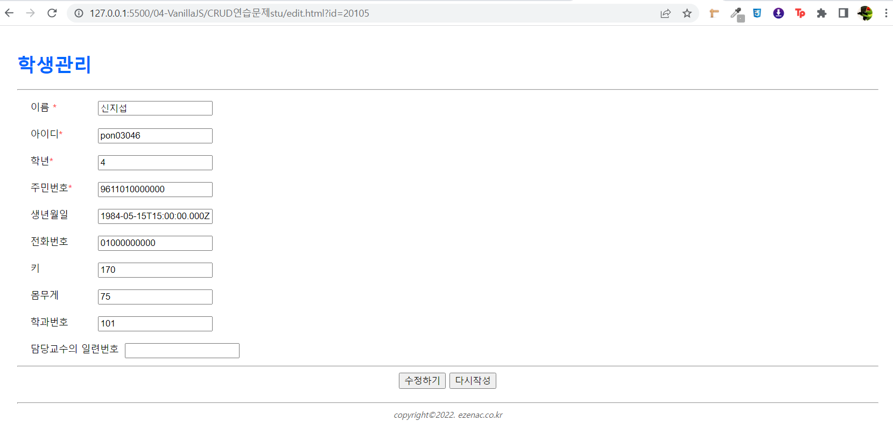
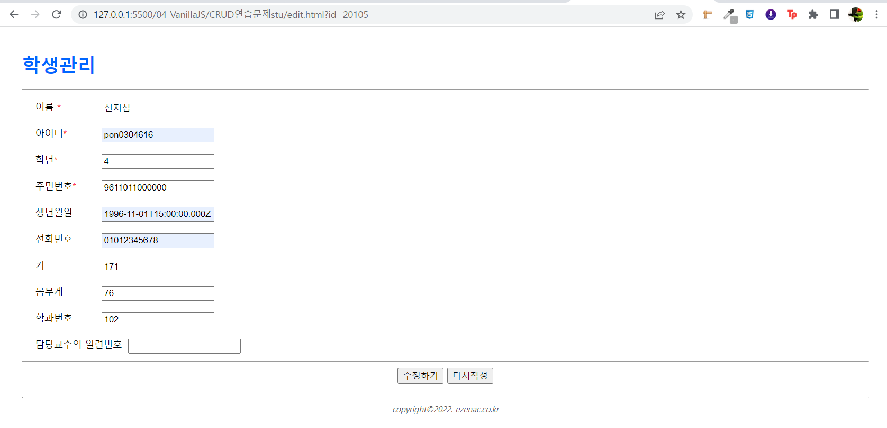
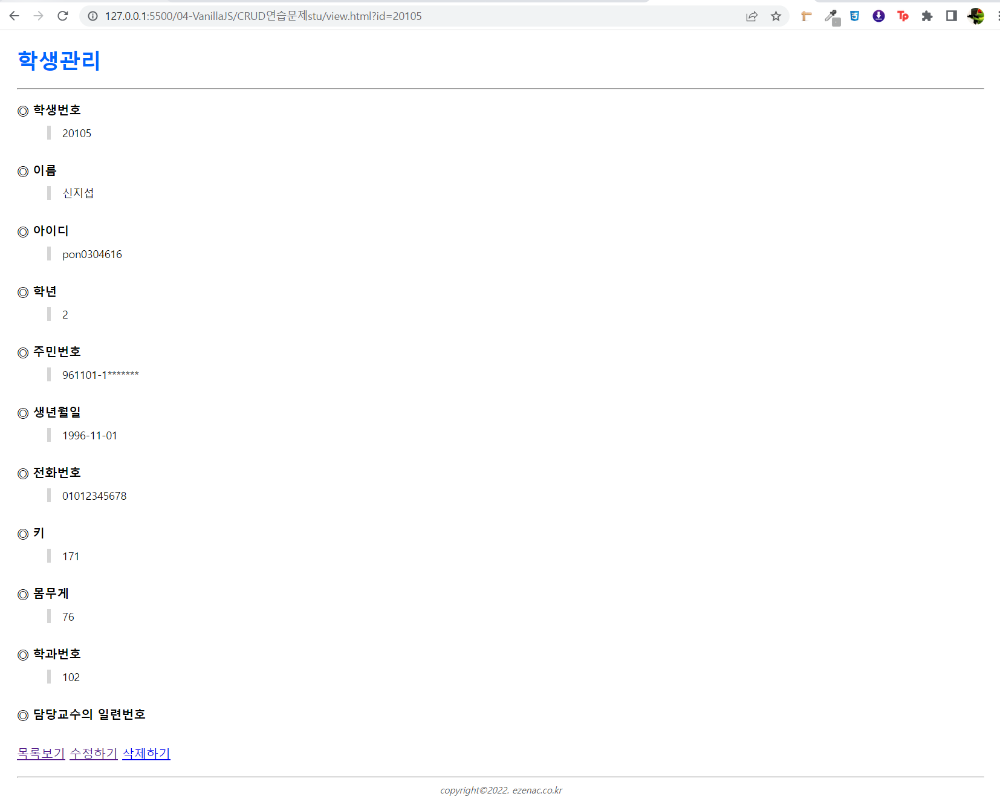
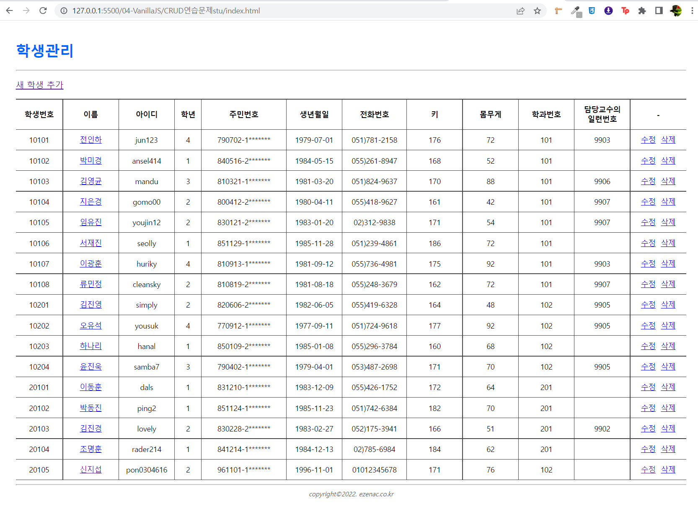