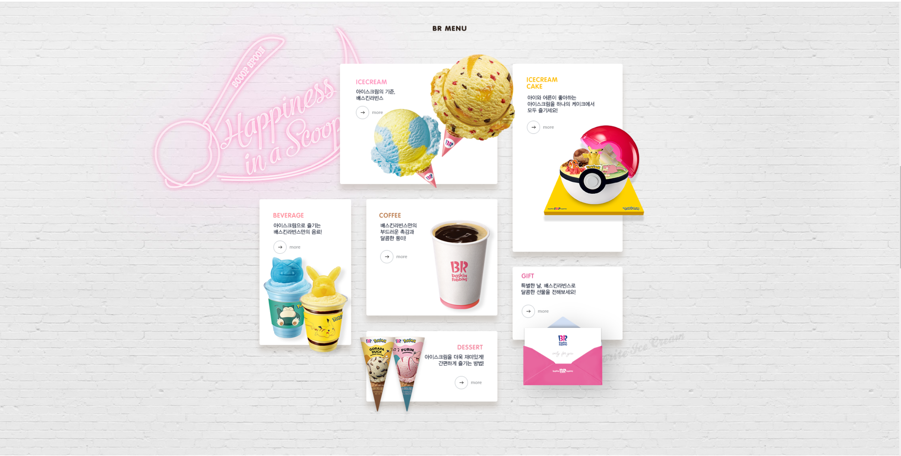

# 22.05.14_신지섭
## React Dom


## 구현 소스코드
### index.js 
```js
import React from 'react';
import ReactDOM from 'react-dom/client';
import App from './App';
import { BrowserRouter } from 'react-router-dom';
import Global from './Globalstyles'
import Meta from "./Meta"

const root = ReactDOM.createRoot(document.getElementById('root'));
root.render(
  <React.StrictMode>
    <Meta/>
    <Global/>
    <BrowserRouter>
      <App />
    </BrowserRouter>
  </React.StrictMode>
);
```
### Globalstyles.js
```js
/**
* @filename Main.js
* @description body에 CSS 적용하기 위해 createGlovalStyle 사용
* @author: 신지섭 (pon0304616@gmail.com)
*/
import { createGlobalStyle } from "styled-components";

const Global = createGlobalStyle`
    /* http://meyerweb.com/eric/tools/css/reset/ 
    v2.0 | 20110126
    License: none (public domain)
    */

    html, body, div, span, applet, object, iframe,
    h1, h2, h3, h4, h5, h6, p, blockquote, pre,
    a, abbr, acronym, address, big, cite, code,
    del, dfn, em, img, ins, kbd, q, s, samp,
    small, strike, strong, sub, sup, tt, var,
    b, u, i, center,
    dl, dt, dd, ol, ul, li,
    fieldset, form, label, legend,
    table, caption, tbody, tfoot, thead, tr, th, td,
    article, aside, canvas, details, embed, 
    figure, figcaption, footer, header, hgroup, 
    menu, nav, output, ruby, section, summary,
    time, mark, audio, video {
        margin: 0;
        padding: 0;
        border: 0;
        font-size: 100%;
        font: inherit;
        vertical-align: baseline;
    }
    /* HTML5 display-role reset for older browsers */
    article, aside, details, figcaption, figure, 
    footer, header, hgroup, menu, nav, section {
        display: block;
    }
    body {
        box-sizing: border-box;
        color: #483834;
        font-size: 13px;
        font-family: "Nanum Barun Gothic", "나눔고딕", "Nanum Gothic", "돋움", "Dotum", sans-serif;
        line-height: 1.5;
        letter-spacing: -.05em;
    }
    a {
        text-decoration: none;
    }
    ul, li {
        list-style: none;
    }
    .clear:after {
        float: none;
        display: block;
        clear: both;
        content: '';
    }
`

export default Global
```

### Meta.js
```js
/**
 * @filename: Meta.js
 * @description: <head>태그 내의 SEO 처리 및 기본 참조 리소스 명시
 * @author: 신지섭
 */

/** 패키지 참조 */
// 기본 참조 객체
import React from 'react';
// SEO 처리 기능 패키지
import { Helmet, HelmetProvider } from 'react-helmet-async';

/**
 * SEO 처리 컴포넌트
 * @param props
 * @returns {JSX.Element}
 */
const Meta = (props) => {
    return (
        <HelmetProvider>
            <Helmet>
                <meta charSet='utf-8' />
                {/* SEO 태그 */}
                <title>{props.title}</title>
                <meta name='description' content={props.description} />
                <meta name='keywords' content={props.keywords} />
                <meta name='author' content={props.author} />
                <meta property='og:type' content='website' />
                <meta property='og:title' content={props.title} />
                <meta property='og:description' content={props.description} />
                <meta property='og:url' content={props.url} />
                {/* <meta property='og:image' content={props.image} /> */}
                <link rel="preconnect" href="https://fonts.googleapis.com"/>
                <link rel="preconnect" href="https://fonts.gstatic.com" crossorigin/>
                <link href="https://fonts.googleapis.com/css2?family=Nanum+Gothic:wght@400;700;800&display=swap" rel="stylesheet"/>
            </Helmet>
        </HelmetProvider>
    );
};

/**
 * props에 대한 기본값 설정
 * @type {{keywords: string, author: string, description: string, title: string, url: string}}
 */
Meta.defaultProps = {
    title: 'React baskin robbins clone',
    description: 'React.js로 구현한 baskin robbins 홈페이지입니다.',
    keywords: 'React,clone',
    author: '신지섭',
    // image: '기본이미지변수적용',
    url: window.location.href
};

export default Meta;
```

### App.js
```js
import React from "react";
import Footer from "./components/Footer";
import Header from "./pages/Header";
import Main from "./pages/Main";
function App() {
  return (
    <div>
      <Header/>
      <Main/>
      <Footer/>
    </div>
  );
}

export default App;
```
### Header.js
```js
/**
* @filename Header.js
* @description 홈페이지 Header 부분 구현
* @author: 신지섭 (pon0304616@gmail.com)
*/
//패키지 불러오기
import React from 'react';
import styled from 'styled-components'

//JS파일 불러오기
import Menu from '../components/Menu';
import HeaderSns from '../components/HeaderSns';
//img 불러오기
import Logo from "../img/logo_baskinrobbins.png"
import search from "../img/icon_search.png"
import close from '../img/btn_search_close.gif'

const HeaderBox = styled.div`
    width: 100%;
    height: 182px;
    border-top: 3px solid #ff7c98;
    border-bottom: 1px solid #3f291a;
    background: url("http://www.baskinrobbins.co.kr/assets/images/common/bg_header.gif") no-repeat;
    background-size: cover;

    .inner_header {
        width: 100%;
        height: 100%;
    }
    .header_top {
        width: 100%;
        height: 135px;
        border-bottom: 1px solid #e2d9d6;
    }
    .header_top_inner {
        width: 1200px;
        height: 135px;
        margin: 0 auto;
    }

    .top_inner {
        position: relative;
        width: 100%;
        height: 114px;
        padding-top: 21px;
    }
    
    .logo {
        width: 92px;
        height: 92px;
        margin: auto;
        a{
            display: block;
            text-indent: -20000px;
            background: url(${Logo}) no-repeat;
            background-size: cover;
            height: 100%;
        }
    }  
    .etc {
        position: absolute;
        top: 39px;
        right: 0;
        li {
            display: inline-block;
            padding-left: 20px;
            line-height: 54px;
            height: 54px;
            a {
                display: block;
                font-size: 11px;
                color: #4a3d39;
            }
            &:last-child {
                padding-left: 26px;
                a {
                    height: 54px;
                    width: 54px;
                    text-indent: -20000px;
                    background: url(${search}) no-repeat;
                }
            }
        }
    }
    .search {
        width: 100%;
        height: 0;
        position: absolute;
        z-index: 1000;
        top: 0;
        .dim {
            width: 100%;
            height: 100%;
            position: absolute;
            top: 186px;
            background: #000;
            opacity: 0.5;
        }
        .container {
            position: relative;
            width: 100%;
            margin-top: 186px;
            background: #fff;
            overflow: hidden;
            opacity: 0;
            transition: all 0.5s ease-in-out;
            .content {
                position: relative;
                width: 1200px;
                padding: 25px 0;
                margin: 0 auto;
            }
        }
        form {
            text-align: left;
            font-size: 14px;
            color: #2f231c;
            font-weight: normal;
            .title {
                padding-top: 8px;
                width: 87px;
                float: left;
            }
            input {
                padding: 8px 1px 8px 10px;
                height: 16px;
                background: #efefef;
                border: none;
                font-size: 13px;
                line-height: 16px;
                &:focus {
                    outline: 0;
                }
            }
            .upline {
                float: left;
                width: 486px;
                select {
                    background: #fff;
                    border: 1px solid #d1cecc;
                    border-radius: 4px;
                    width: 128px;
                    color: #636363;
                    margin-right: 14px;
                    height: 32px;
                    font-size: 13px;
                    padding: 0 1px 0 10px;
                    &:focus {
                        outline: 0;
                    }
                }
                input {
                    width: 249px;
                }
            }
            .hashtag {
                width: 540px;
                float: left;
                input {
                    width: 529px;
                }
                p {
                    font-size: 12px;
                    color: #9c9c9c;
                    &:before{
                        font-size: 8px;
                        content: "＊";
                    }
                }
                .tags {
                    margin: 10px 0 0 14px;
                    a {
                        font-size: 13px;
                        margin-right: 8px;
                        color: #ff7c98;
                        display: inline-block
                    }
                }
            }
            .allergy {
                .allergie {
                    float: left;
                    width: 280px;
                    label {
                        position: relative;
                        float: left;
                        display: block;
                        margin-top: 8px;
                        width: 70px;
                        height: 17px;
                        cursor: pointer;
                        input {
                            width: 17px;
                            height: 17px;
                            margin-right: 5px;
                        }
                        span {
                            position: absolute;
                            top: 2px;
                            display: inline-block;
                            height: 17px;
                            font-size: 12px;
                        }
                    }
                }
            }
        }
        .submit {
            text-align: center;
            padding-top: 25px;
            button {
                width: 147px;
                height: 37px;
                background: #ff7c98;
                color: #fff;
                font-size: 15px;
                line-height: 37px;
                border-radius: 18px;
                cursor: pointer;
                border: none;
            }
        }
        .closeButton {
            display: none;
            position: absolute;
            right: -103px;
            z-index: 1000;
            width: 54px;
            height: 54px;
            top: 42px;
            margin-left: 546px;
            left: 50%;
            img {
                width: 54px;
                height: 54px;
            }
        }
        transition: opacity 0.5s ease-in-out
    }
`
const Header = () => {
    const closeBox = React.useRef();
    const closeContainer = React.useRef();
    const closeBtn = React.useRef();
    const onClick = (e) => {
        e.preventDefault();
        closeContainer.current.style.height = 264.2 + "px";
        closeContainer.current.style.opacity = 1
        closeBtn.current.style.display = "block";
        closeBox.current.style.height = 100 + "%";
        closeBox.current.style.opacity = 1
    }

    const onCloseClick = (e) => {
        e.preventDefault();
        closeContainer.current.style.height = 0;
        closeContainer.current.style.opacity = 0;
        closeBtn.current.style.display = "none";
        closeBox.current.style.height = 0;
        closeBox.current.style.opacity = 0
    }
    return (
        <HeaderBox>
            <div className="inner_header">
                <div className="header_top">
                    <div className="header_top_inner">
                        <div className="top_inner">
                            <h1 className='logo'>
                                <a href="/">baskin robbins</a>
                            </h1>
                            <HeaderSns/>
                            <nav className="etc">
                                <ul>
                                    <li>
                                        <a href="/">고객센터</a>
                                    </li>
                                    <li>
                                        <a href="/">CONTACTUS</a>
                                    </li>
                                    <li>
                                        <a href="/" onClick={onClick}>search</a>
                                    </li>
                                </ul>
                            </nav>
                        </div>
                    </div>
                </div>
                <Menu/>
            </div>
            <div className="search" ref={closeBox}>
                <div className="dim"></div>
                <div className="container" ref={closeContainer}>
                    <div className="content" >
                        <div className="contentProduct">
                            <form className='clear'>
                                <div className="productName clear">
                                    <span className='title'>제품명</span>
                                    <div className="upline">
                                        <select>
                                            <option value>전체</option>
                                            <option value="A">아이스크림</option>
                                            <option value="B">아이스크림케이크</option>
                                            <option value="C">음료</option>
                                            <option value="D">커피</option>
                                            <option value="E">디저트</option>
                                            <option value="F">block pack</option>
                                            <option value="G">ready pack</option>
                                        </select>
                                        <label htmlFor="product_name"></label>
                                        <input id="product_name" type="text"/>
                                    </div>
                                    <span className='title'>해시태그</span>
                                    <div className="hashtag">
                                        <div>
                                            <label htmlFor="hashtag"></label>
                                            <input id="hashtag" type="text"/>
                                        </div>
                                        <div className="tags">
                                            <div>
                                                <p>자주 찾는 해시태그</p>
                                            </div>
                                            <div>
                                                <a href="/">#피카피카피카츄</a>
                                                <a href="/">#피카츄초코바나나블라스트</a>
                                                <a href="/">#쿨쿨잠만보밀키소다블라스트</a>
                                                <a href="/">#고라파덕아이스크림콘</a>
                                                <a href="/">#푸린아이스크림콘</a>
                                                <a href="/">#포켓몬스터</a>
                                            </div>
                                        </div>
                                    </div>
                                </div>
                                <div className="allergy clear">
                                    <span className='title'>알레르기 성분</span>
                                    <div className="allergie clear">
                                        <label>
                                            <input type="checkbox"/>
                                            <span>계란</span>
                                        </label>
                                        <label>
                                            <input type="checkbox"/>
                                            <span>대두</span>
                                        </label>
                                        <label>
                                            <input type="checkbox"/>
                                            <span>돼지고기</span>
                                        </label>
                                        <label>
                                            <input type="checkbox"/>
                                            <span>땅콩</span>
                                        </label>
                                        <label>
                                            <input type="checkbox"/>
                                            <span>밀</span>
                                        </label>
                                        <label>
                                            <input type="checkbox"/>
                                            <span>복숭아</span>
                                        </label>
                                        <label>
                                            <input type="checkbox"/>
                                            <span>우유</span>
                                        </label>
                                        <label>
                                            <input type="checkbox"/>
                                            <span>없음</span>
                                        </label>
                                    </div>
                                </div>
                            </form>
                            <div className="submit">
                                <button type="button">검색</button>
                            </div>
                        </div>
                    </div>
                </div>
                <div className="closeButton" ref={closeBtn}>
                    <a href="/">
                        
                    </a>
                </div>
            </div>
        </HeaderBox>
    );
};

export default Header;
```

#### 돋보기 클릭시


### HeaderSns.js
```js
/**
* @filename Sns.js
* @description 상단 SNS 아이콘 구현
* @author: 신지섭 (pon0304616@gmail.com)
*/
//패키지
import React from 'react';
import styled from "styled-components"
//이미지
import facebook from "../img/icon_facebook.png"
import twitter from "../img/icon_twitter.png"
import blog from "../img/icon_blog.png"
import instagram from "../img/icon_instgram.png"
import youtube from "../img/icon_youtube.png"

const HeaderSnsBox = styled.nav`
    position: absolute;
    top: 50px;
    left: 0;
    li {
        display: inline-block;
        padding-right: 10px;
        img {
            width: 35px;
            height: 35px;
            vertical-align: top;
        }
    }
`

const HeaderSns = () => {
    return (
        <HeaderSnsBox>
            <ul>
                <li>
                    <a href="/" target="_blank">
                        
                    </a>
                </li>
                <li>
                    <a href="/" target="_blank">
                        
                    </a>
                </li>
                <li>
                    <a href="/" target="_blank">
                        
                    </a>
                </li>
                <li>
                    <a href="/" target="_blank">
                        
                    </a>
                </li>
                <li>
                    <a href="/" target="_blank">
                        
                    </a>
                </li>
            </ul>
        </HeaderSnsBox>
    );
};

export default HeaderSns;
```


### Menu.js
```js
/**
* @filename Menu.js
* @description 이미지 슬라이드 위의 이미지 구현
* @author: 신지섭 (pon0304616@gmail.com)
*/
//패키지 불러오기
import React from 'react';
import styled from 'styled-components'
//JS 파일
import Member from './Member';
import MenuBar from './MenuBar'
const MenuBox = styled.div`
    width: 100%;
    height: 46px;
    .inner {
        width: 1200px;
        height: 100%;
        margin: 0 auto;
    }
`
const Menu = () => {
    return (
        <MenuBox>
            <div className="inner clear">
                <Member/>
                <MenuBar/>
            </div>
        </MenuBox>
    );
};

export default Menu;
```

### Member.js
```js
/**
* @filename Member.js
* @description 상단 메뉴에 있는 login과 join 구현
* @author: 신지섭 (pon0304616@gmail.com)
*/
//패키지
import React from 'react';
import styled from 'styled-components'
//이미지
import MenuImg from '../img/gnb_menu.png'
const MemberBox = styled.nav`
    float: left;
    height: 46px;
    span {
        display: block;
        width: 35px;
        height: 46px;
        line-height: 46px;
        text-indent: -20000px;
        background: url(${MenuImg}) no-repeat;
        background-position: 0px -1px;
        margin: auto;
    }
    ul {
        height: 100%;
        width: 100%;
        li {
            float: left;
            height: 100%;
            width: 58px;
            a {
                display: block;
                padding-right: 23px;
                height: 46px;
            }
            &:last-child{
                width: 73px;
                a {
                    width: 27px;
                    height: 46px;
                    padding: 0 23px;
                }
                span{
                    width: 27px;
                    background-position: -97px -1px;
                }
            }
        }
    }
`

const Member = () => {
    return (
        <MemberBox>
            <ul>
                <li>
                    <a href="/">
                        <span>LOGIN</span>
                    </a>
                </li>
                <li>
                    <a href="/">
                        <span>JOIN</span>
                    </a>
                </li>
            </ul>
        </MemberBox>
    );
};

export default Member;
```


### menuBar.js
```js
/**
* @filename Main.js
* @description Menu Bar에 대한 구현 및 이벤트 처리
* @author: 신지섭 (pon0304616@gmail.com)
*/
//패키지
import React from 'react';
import styled from 'styled-components'
//이미지
import Monthly from "../img/img_monthly_fom_220429.png"
import MenuImg from '../img/gnb_menu.png'
import haapyImg from "../img/img_happypoint_app.jpg"

const MenuBarBox = styled.nav`
    float: right;
    .menuIcon {
        width: 100%;
        height: 46px;
        & > ul >li {
            float: left;
        }
        div:first-child {
            width: 160px;
            height: 46px;
            a {
                display: block;
                height: 46px;
            }
            span {
                display: block;
                width: 35px;
                height: 46px;
                line-height: 46px;
                text-indent: -20000px;
                background: url(${MenuImg}) no-repeat;
                background-position: 0px -1px;
                margin: auto;
            }
        }
        & > ul > li > ul > li {
            text-align: center;
            padding-bottom: 12px;
            &:first-child {
                padding-top: 40px;
            }
            a {
                font-size: 14px;
                font-weight: 300;
                color: #7b7b7b;
                line-height: 1.2;
                &:hover {
                    color: #ff75ac;
                }
            }
        }
        .mouseEvent {
            position: absolute;
            height: 0px; //275px
            overflow: hidden;
            transition: height 0.5s ease-in-out;
            z-index: 999;
        }
        .flavor {
            .flavorName {
                width: 223px;
                a {
                    padding-right: 59px;
                }
                span {
                    width: 164px;
                    background-position: -133px -3px;
                }
            }
            .mouseEvent {
                margin-left: -44px;
                a {
                    display: block;
                    height: 100%;
                }
                img {
                    margin-left: 37px;
                    opacity: 0;
                    transition: opacity 0.15s ease-in-out;
                    transition-delay: 0.3s;
                }
            }
        }
        .menu {
            .menuName {
                a {
                    padding: 0 59px;
                }
                span {
                    width: 42px;
                    background-position: -415px -3px;
                }
            }
            ul {
                margin-left: 35px
            }
        }
        .nutri {
            .nutriName{
                a {
                    padding: 0 27.5px;
                }
                span {
                    width: 105px;
                    background-position: -545px -3px;
                }
            }
            ul {
                margin-left: 50px
            }
        }
        .event {
            .eventName {
                a {
                    padding: 0 59px;
                }
                span {
                    width: 42px;
                    background-position: -737px -3px;
                }
            }
            ul {
                margin-left: 43px
            }
        }
        .store {
            width: 167px;
            .storeName {
                a {
                    padding: 0 59px;
                }
                span {
                    width: 49px;
                    background-position: -897px -3px;
                }
            }
            ul {
                margin-left: 57px
            }
        }
        .about {
            .aboutName {
                width: 108px;
                a {
                    padding-left: 59px;
                }
                span {
                    width: 49px;
                    background-position: -1057px -3px;
                }
            }
            ul {
                padding-left: 30px
            }
        }
    }
    .backboard {
        position: absolute;
        z-index: 998;
        overflow: hidden;
        height: 0;
        top: 186px;
        left:0;
        min-width: 100%;
        border-bottom: 1px solid #693337;
        background: #fff;
        .img {
            margin: 0 auto;
            width: 1200px;
            height: 204px;
            background: url(${haapyImg}) no-repeat 0 65px;
            transition: height 0.5s ease-in-out;
        }
        transition: height 0.5s ease-in-out;
    }
`
const MenuBar = () => {
    const mouseFlavor = React.useRef();
    const mouseMenu = React.useRef();
    const mouseNutri = React.useRef();
    const mouseStore = React.useRef();
    const mouseEvent = React.useRef();
    const mouseAbout = React.useRef();
    const mouseMonthly = React.useRef();
    const mouseHappy = React.useRef();
    const mouseHappyImg = React.useRef();
    const mouseOver = (e) => {
        mouseFlavor.current.style.height = 274 + 'px'
        mouseMenu.current.style.height = 274 + 'px'
        mouseNutri.current.style.height = 274 + 'px'
        mouseStore.current.style.height = 274 + 'px'
        mouseEvent.current.style.height = 274 + 'px'
        mouseAbout.current.style.height = 274 + 'px'
        mouseHappy.current.style.height = 274 + 'px'
        mouseHappyImg.current.style.height = 204 + 'px'
        mouseMonthly.current.style.opacity = 1
    }
    const mouseOut = (e) => {
        mouseFlavor.current.style.height = 0
        mouseMenu.current.style.height = 0
        mouseNutri.current.style.height = 0
        mouseStore.current.style.height = 0
        mouseEvent.current.style.height = 0
        mouseAbout.current.style.height = 0
        mouseHappy.current.style.height = 0
        mouseHappyImg.current.style.height = 0
        mouseMonthly.current.style.opacity = 0
    }
    return (
        <MenuBarBox>
            <div className="menuIcon" onMouseOver={mouseOver} onMouseOut={mouseOut}>
                <ul className='clear'>
                    <li className="flavor">
                        <div className="flavorName" >
                            <a href="/"><span>FLAVOR OF THE MONTH</span></a>
                        </div>
                        <div className="mouseEvent" ref={mouseFlavor}>
                            <a href="/"></a>
                        </div>
                    </li>
                    <li className="menu">
                        <div className="menuName">
                            <a href="/"><span>Menu</span></a>
                        </div>
                        <ul className="mouseEvent" ref={mouseMenu}>
                            <li>
                                <a href="/"><span>아이스크림</span></a>
                            </li>
                            <li>
                                <a href="/"><span>아이스크림케이크</span></a>
                            </li>
                            <li>
                                <a href="/"><span>음료</span></a>
                            </li>
                            <li>
                                <a href="/"><span>커피</span></a>
                            </li>
                            <li>
                                <a href="/"><span>디저트</span></a>
                            </li>
                        </ul>
                    </li>
                    <li className="nutri">
                        <div className="nutriName">
                            <a href="/"><span>영양성분 및 알레르기</span></a>
                        </div>
                        <ul className="mouseEvent" ref={mouseNutri}>
                            <li>
                                <a href="/"><span>아이스크림</span></a>
                            </li>
                            <li>
                                <a href="/"><span>음료</span></a>
                            </li>
                            <li>
                                <a href="/"><span>커피</span></a>
                            </li>
                        </ul>
                    </li>
                    <li className="event">
                        <div className="eventName">
                            <a href="/"><span>Event</span></a>
                        </div>
                        <ul className="mouseEvent" ref={mouseEvent}>
                            <li>
                                <a href="/"><span>진행중인이벤트</span></a>
                            </li>
                            <li>
                                <a href="/"><span>당첨자발표</span></a>
                            </li>
                        </ul>
                    </li>
                    <li className="store">
                        <div className="storeName">
                            <a href="/"><span>Store</span></a>
                        </div>
                        <ul className="mouseEvent" ref={mouseStore}>
                            <li>
                                <a href="/"><span>매장찾기</span></a>
                            </li>
                            <li>
                                <a href="/"><span>고객센터</span></a>
                            </li>
                            <li>
                                <a href="/"><span>단체주문</span></a>
                            </li>
                        </ul>
                    </li>
                    <li className="about">
                        <div className="aboutName">
                            <a href="/"><span>About</span></a>
                        </div>
                        <ul className="mouseEvent" ref={mouseAbout}>
                            <li>
                                <a href="/"><span>공지사항</span></a>
                            </li>
                            <li>
                                <a href="/"><span>보도자료</span></a>
                            </li>
                            <li>
                                <a href="/"><span>채용정보</span></a>
                            </li>
                            <li>
                                <a href="/"><span>점포개설문의</span></a>
                            </li>
                            <li>
                                <a href="/"><span>CONTATCUS</span></a>
                            </li>
                        </ul>
                    </li>
                </ul>
            </div>
            <div className="backboard" onMouseOver={mouseOver} onMouseOut={mouseOut} ref={mouseHappy}>
                <div className="img" ref={mouseHappyImg}></div>
            </div>
        </MenuBarBox>
    );
};

export default MenuBar;
```


### Main.js
```js
/**
* @filename Main.js
* @description 홈페이지 Main 부분 구현
* @author: 신지섭 (pon0304616@gmail.com)
*/
//패키지
import React from 'react';
//components 파일
import SwiperBanner from '../components/SwiperBanner';
import FlavorMonth from '../components/FlavorMonth';
import BREvent from '../components/BREvent';
import BRMenu from '../components/BRMenu';
import StoreDelivery from '../components/StoreDelivery';
import Sns from '../components/Sns';

const Main = () => {
    return (
        <div>
            <FlavorMonth/>
            <SwiperBanner/>
            <BREvent/>
            <BRMenu/>
            <StoreDelivery/>
            <Sns/>
        </div>
    );
};

export default Main;
```

### FlavorMonth.js
```js
/**
* @filename FlavorMonth.js
* @description 이미지 슬라이드 위의 이미지 구현
* @author: 신지섭 (pon0304616@gmail.com)
*/
//패키지
import React from 'react';
import styled from 'styled-components'
//이미지
import pika from '../img/1714824579.jpg'

const FlavorMonthBox = styled.div`
    .flavor_month {
        display: block;
        width: 100%;
        height: 150px;
        background: #FFD825 url(${pika}) 50% 0 no-repeat;
        text-indent: -20000px;
    }
`

const FlavorMonth = () => {
    return (
        <FlavorMonthBox>
            <a href="/" className="flavor_month" alt="flavor Month">
                flavor of the month
            </a>
        </FlavorMonthBox>
    );
};

export default FlavorMonth;
```


### SwiperBanner.js
```js
/**
* @filename SwiperBanner.js
* @description openAPI인 Swiperjs 를 사용하여 이미지 슬라이드 구현
* @author: 신지섭 (pon0304616@gmail.com)
*/
//패키지
import React from 'react';
import styled from "styled-components";
import axios from "axios";
//이미지
import prev from "../img/btn_banner_prev.png"
import next from "../img/btn_banner_next.png"
// Import Swiper React components
import { Swiper, SwiperSlide } from "swiper/react";

// Import Swiper styles
import "swiper/css";
import "swiper/css/pagination";
import "swiper/css/navigation";
import 'swiper/css/autoplay';

// import required modules
import { Autoplay, Pagination, Navigation } from "swiper";

const SwiperBox = styled.div`
    .imgslide {
        display: block;
        width: 100%;
        height: 697px;
        img {
            display: block;
            margin: 0 auto;
            height: 697px;
        }
    }
    .swiper-button-prev,
    .swiper-button-next {
        width: 109px;
        height: 109px;
        &:after {
            display: none;
        }
    }
    .swiper-button-prev {
        background: url(${prev}) no-repeat;
    }
    .swiper-button-next {
        background: url(${next}) no-repeat;
    }
    .swiper-pagination-bullet {
        background: #fff;
        height: 10px;
        width: 10px;
        opacity: 1;
        margin: 0 10px !important;
        &:hover {
            transform: scale(1.3, 1.3);
            background: #301d17;
            transition: all 0.1s ease-in-out
        }
    }
    .swiper-pagination-bullet-active {
        background: #301d17;
        width: 13px;
        height: 13px;
    }
`
const SwiperBanner = () => {
    const [imgData, setImgData] = React.useState();
    React.useEffect(() => {
        (async() => {
            try {
                const response = await axios.get("http://localhost:3001/img")
                setImgData(response.data)
            } catch(e) {
                console.error(e)
                alert("서버 연결 실패")
            }
        })();
    }, [])
    return (
        <SwiperBox>
            <Swiper
                slidesPerView={1}
                spaceBetween={30}
                loop={true}
                pagination={{
                    clickable: true,
                }}
                navigation={true}
                autoplay={{ delay: 3000 }}
                modules={[Autoplay, Pagination, Navigation]}
                className="mySwiper"
            >
            { 
                imgData && (
                    imgData.map((v, i) => {
                        return(
                        <SwiperSlide key={i}>
                            <a href="/" className="imgslide" style={{background: `${v.background}`}}>
                                
                            </a>
                        </SwiperSlide>
                        )
                    })
                )
            }
        </Swiper>
      </SwiperBox>
    );
};

export default SwiperBanner;
```


### BREvent.js
```js
/**
* @filename Main.js
* @description BR Event 부분을 openAPI인 swiperjs를 사용하여 구현.
* @author: 신지섭 (pon0304616@gmail.com)
*/
//패키지
import React from 'react';
import axios from 'axios'
import styled from "styled-components"
//이미지
import event from '../img/h_event.png'
// Import Swiper React components
import { Swiper, SwiperSlide } from "swiper/react";

// Import Swiper styles
import "swiper/css";
import "swiper/css/pagination";

// import required modules
import { Pagination } from "swiper";
const BREventBox = styled.section`
    width: 1200px;
    height: 721px;
    margin: 0 auto;
    h3 {
        width: 1200px;
        height: 23px;
        padding: 100px 0 50px 0;
        img {
            display: block;
            margin: 0 auto;
        }
    }
    .swiper {
        height: 484px;
    }
    .eventImg {
        display: block;
        width: 286px;
    }
    a {
        display: block;
        &:last-child {
            p {
                width: 288px;
                &:first-child {
                    margin: 22px 0 8px 0;
                }
                &:nth-child(2) {
                    font-size: 17px;
                    color: #2f231c;
                    line-height: 23px;
                    font-weight: 600;
                }
                &:last-child {
                    margin: 11px 0;
                    font-weight: 300;
                    color: #948780;
                }
            }
        }
    }
    .swiper-pagination-bullet {
        background: #948780;
        height: 8px;
        width: 8px;
        opacity: 1;
        margin: 0 10px !important;
        &:hover {
            transform: scale(1.25, 1.25);
            background: #301d17;
            transition: all 0.1s ease-in-out
        }
    }
    .swiper-pagination-bullet-active {
        background: #301d17;
        width: 10px;
        height: 10px;
        &:hover{
            transform: scale(1, 1);
        }
    }
`

const BREvent = () => {
    const [eventImg, setEventImg] = React.useState();
    React.useEffect(() => {
        (async () => {
            try{
                const response = await axios.get("http://localhost:3001/order")
                setEventImg(response.data)
            } catch(e) {
                console.error(e);
                alert('서버 요청 실패')
            }
        })();
    },[])
    return (
        <BREventBox>
            <h3>
                
            </h3>
            <Swiper
                slidesPerView={4}
                spaceBetween={17}
                slidesPerGroup={4}
                pagination={{
                    clickable: true,
                }}
                modules={[Pagination]}
                className="mySwiper"
            >
            { 
                eventImg && (
                    eventImg.map((v, i) => {
                        return(
                        <SwiperSlide key={i}>
                            <a href="/" className="eventImg">
                                
                            </a>
                            <a href="/">
                                <p>
                                    
                                </p>
                                <p>{v.comment}</p>
                                <p>상시진행</p>
                            </a>
                        </SwiperSlide>
                        )
                    })
                )
            }
        </Swiper>
        </BREventBox>
    );
};

export default BREvent;
```


### BRMenu.js
```js
/**
* @filename Main.js
* @description BR Menu 구현
* @author: 신지섭 (pon0304616@gmail.com)
*/
//패키지
import React from 'react';
import styled from 'styled-components'
const BRMenuBox = styled.section`
    position: relative;
    height: 1157px;
    background: url("http://www.baskinrobbins.co.kr/assets/images/main/bg_menu.jpg") 50% 0 no-repeat;
    h3 {
        padding-top: 78px;
        height: 22px;
        img {
            display:block;
            margin: 0 auto;
        }
    }
    .menu_list {
        position: relative;
        background: url("http://www.baskinrobbins.co.kr/assets/images/main/img_menu_list_220429.png?v=220429") 50% 0 no-repeat;
        height: 1066px;
        width: 1200px;
        margin: 50px auto 0 auto;
        a {
            display: block;
        }
        p {
            width: 0;
            overflow: hidden;
        }
        .icecream {
            position: absolute;
            top: 25px;
            left: 324px;
            a {
                width: 400px;
                height: 305px;
            }
        }
        .icecreamcake {
            position: absolute;
            top: 25px;
            left: 755px;
            a {
                height: 472px;
                width: 280px;
            }
        }
        .beverage {
            position: absolute;
            top: 365px;
            left: 121px;
            a {
                height: 366px;
                width: 230px;
            }
        }
        .coffee {
            position: absolute;
            top: 365px;
            left: 390px;
            a {
                width: 329px;
                height: 292px;
            }
        }
        .dessert {
            position: absolute;
            top: 695px;
            left:390px;
            a {
                width: 329px;
                height: 177px;
            }
        }
        .gift {
            position: absolute;
            top: 535px;
            left: 757px;
            a {
                width: 276px;
                height: 183px;
            }
        }
    }
`

const BRMenu = () => {
    return (
        <BRMenuBox>
            <h3>
                
            </h3>
            <div className="menu_list">
                <div className="icecream">
                    <a href="/">
                        <p>ICECREAM</p>
                        <p>아이스크림의 기준, 베스킨라빈스</p>
                    </a>
                </div>
                <div className="icecreamcake">
                    <a href="/">
                        <p>ICECREAMCAKE</p>
                        <p>아이와 어른이 좋아하는 아이스크림을 하나의 케이크에서 모두 즐기세요!</p>
                    </a>
                </div>
                <div className="beverage">
                    <a href="/">
                        <p>BEVERAGE</p>
                        <p>아이스크림으로 즐기는 베스킨라빈스만의 음료!</p>
                    </a>
                </div>
                <div className="coffee">
                    <a href="/">
                        <p>COFFEE</p>
                        <p>베스킨라빈스만의 부드러운 촉감과 달콤한 풍미</p>
                    </a>
                </div>
                <div className="dessert">
                    <a href="/">
                        <p>DESSERT</p>
                        <p>아이스크림을 더욱 재미있게! 간편하게 즐기는 방법!</p>
                    </a>
                </div>
                <div className="gift">
                    <a href="/">
                        <p>GIFT</p>
                        <p>특별한 날, 베스킨라빈스로 달콤한 선물을 전해보세요!</p>
                    </a>
                </div>
            </div>
        </BRMenuBox>
    );
};

export default BRMenu;
```


### StoreDelivery.js
```js
/**
* @filename Main.js
* @description store와 happy order delivery부분 구현.
* @author: 신지섭 (pon0304616@gmail.com)
*/
//패키지
import React from 'react';
import styled from 'styled-components'
const StoreDeliveryBox = styled.div`
    height: 547px;
    position: relative;
    width: 1200px;
    margin: 0 auto;
    h3 {
        padding: 95px 0 50px 0;
        img {
            display: block;
            margin: 0 auto;
        }
    }
    .store {
        float: left;
        width: 50%;
    }
    .delivery {
        float: left;
        width: 50%;
    }
`

const StoreDelivery = () => {
    return (
        <StoreDeliveryBox>
            <section className="store">
                <h3>
                    
                </h3>
                <div>
                    <a href="/">
                        
                    </a>
                </div>
            </section>
            <section className="delivery">
                <h3>
                    
                </h3>
                <div>
                    <a href="/">
                        
                    </a>
                </div>
            </section>
        </StoreDeliveryBox>
    );
};

export default StoreDelivery;
```


### Sns.js
```js
/**
* @filename Sns.js
* @description sns 아이콘 이미지와 ajax를 사용하여 instagram 사진
* @author: 신지섭 (pon0304616@gmail.com)
*/
//패키지
import React from 'react';
import styled from 'styled-components'
import axios from "axios"
const SnsBox  = styled.section`
    width: 1200px;
    margin: 0 auto;
    position: relative;
    padding-bottom: 170px;
    h3 {
        padding-bottom: 26px;
        img {
            display: block;
            margin: 0 auto;
        }
    }
    .sns_img {
        width: 400px;
        padding-bottom: 35px;
        margin: 0 auto;
        li {
            height: 62px;
            display: inline-block;
            img {
                padding: 0 9px;
            }
        }
    }
    h4 {
        padding: 26px 0;
        margin-bottom: -14px;
        height: 0;
        &:before{
            width: 1200px;
            position: absolute;
            z-index: -1;
            top: 174px;
            height: 1px;
            content: '';
            text-align: center;
            background: #dcd7d1;
        }
        img {
            display: block;
            margin: 0 auto;
        }
    }
    .insta_img {
        width: 1200px;
        height: 785px;
        margin-top: 50px;
        a {
            &:nth-child(5n) {
                img {
                    padding-right: 0px;
                }
            }
            img {
                display: block;
                float: left;
                width: 19.6%;
                height: 32%;
                padding: 0 5px 5px 0;
            }
        }
    }
`

const Sns = () => {
    const [instaImg, setInstaImg] = React.useState();
    React.useEffect(() => {
        (async () => {
            try {
                const response = await axios.get("http://localhost:3001/insta")
                setInstaImg(response.data)
            } catch(e) {
                console.error(e)
                alert("서버 연결 실패")
            }
        })()
    },[])
    return (
        <SnsBox>
            <h3>
                
            </h3>
            <nav className="sns_img">
                <ul>
                    <li>
                        <a href="/">
                            
                        </a>
                    </li>
                    <li>
                        <a href="/">
                            
                        </a>
                    </li>
                    <li>
                        <a href="/">
                            
                        </a>
                    </li>
                    <li>
                        <a href="/">
                            
                        </a>
                    </li>
                    <li>
                        <a href="/">
                            
                        </a>
                    </li>
                </ul>
            </nav>
            <h4>
                <a href="/">
                    
                </a>
            </h4>
            <div className="insta_img clear">
                {
                    instaImg &&
                    instaImg.map((v, i) => {
                        return(
                            <a href="/" key={i}>
                                
                            </a>
                        )
                    })
                }
            </div>
        </SnsBox>
    );
};

export default Sns;
```


### Footer.js
```js
/**
* @filename Footer.js
* @description Footer 부분 구현.
* @author: 신지섭 (pon0304616@gmail.com)
*/
import React from 'react';
import styled from 'styled-components'
const FooterBox = styled.footer`
    min-width: 1200px;
    border-top: 1px solid #feaf2b;
    padding-bottom: 60px;
    .footer_inner{
        .policy {
            width: 1040px;
            padding: 0 80px;
            margin: 0 auto;
            li {
                display: block;
                float: left;
                width: 12%;
                font-size: 14px;
                text-align: center;
                line-height: 77px;
                a {
                    color: #483834;
                }
                &:nth-child(5) {
                    width: 15%;
                    a{
                        color: #ff7c98;
                        font-weight: bold;
                    }
                }
                &:nth-child(6) {
                    width: 20%;
                }
                &:last-child {
                    width: 17%;
                }
            }
        }
        .brand_family {
            width: 100%;
            background: #f9f8f7;
            height: 75px;
            .brand_inner{
                position: relative;
                width: 1200px;
                height: 75px;
                margin: 0 auto;
                ul {
                    padding: 22px 0 0 222px;
                    li {
                        display: block;
                        float: left;
                        width: 111px;
                        height: 31px
                    }
                }
                .familysite {
                    position: absolute;
                    top: 21px;
                    right: 196px;
                    width: 150px;
                    background-color: #fff;
                    button {
                        cursor: pointer;
                        width: 100%;
                        height: 32px;
                        background: url("http://www.baskinrobbins.co.kr/assets/images/common/family_size_off.png") 100% 0 no-repeat;
                        padding-left: 11px;
                        border-radius: 5px;
                        border: 1px solid #d1cecc;
                        font-size: 11px;
                        color: #b1ab9f;
                        text-align: left;
                    }
                    ul {
                        display: none;
                        position: absolute;
                        left: 0;
                        bottom: 28px;
                        width: 100%;
                        padding: 5px 0;
                        border: 5px 5px 0 0;
                        border: 1px solid #d1cecc;
                        background: #fff;
                        border-radius: 5px 5px 0 0;
                        li {
                            height: 25px;
                            width: 100%;
                            a {
                                display: block;
                                color: #726454;
                                padding-left: 15px;
                                line-height: 25px;
                                &:hover {
                                    background: #f1f1f1;
                                }
                            }
                        }
                    }
                    .on {
                        background: url("http://www.baskinrobbins.co.kr/assets/images/common/family_size_on.png") 100% 0 no-repeat;
                    }
                }
            }
        }
        .info {
            width: 1200px;
            margin: 0 auto;
            padding-top: 48px;
            font-size: 11px;
            text-align: center;
            h1 {
                height: 27px;
                padding-bottom: 35px;
            }
            div {
                p {
                    display: inline-block;
                    padding: 0 15px 3px 0;
                    &:nth-child(3) {
                        padding-right: 0;
                    }
                }
            }
            address {
                padding: 12px;
                color: #b1adab;
                font-size: 11px;
            }
        }
    }

`
const Footer = () => {
    const [isActive, setIsActive] = React.useState(false);
    const btn = React.useRef();
    const onClick = (e) => {
        setIsActive(!isActive);
        isActive ? btn.current.style.display = "none" : btn.current.style.display ="block"
    }
    return (
        <FooterBox>
            <div className="footer_inner">
                <div className="policy clear">
                    <ul>
                        <li><a href="/">점포개설문의</a></li>
                        <li><a href="/">채용문의</a></li>
                        <li><a href="/">윤리신고센터</a></li>
                        <li><a href="/">이용약관</a></li>
                        <li><a href="/">개인정보처리방침</a></li>
                        <li><a href="/">영상정보처리기기운영관리방침</a></li>
                        <li><a href="/">거래희망회사 사전등록</a></li>
                    </ul>
                </div>
                <div className="brand_family clear">
                    <div className="brand_inner">
                        <ul>
                            <li>
                                <a href="/">
                                    
                                </a>
                            </li>
                            <li>
                                <a href="/">
                                    
                                </a>
                            </li>
                            <li style={{width: "182px"}}>
                                <a href="/">
                                    
                                </a>
                            </li>
                            <li style={{width: "55px", paddingRight: "9px"}}>
                                <a href="/">
                                    
                                </a>
                            </li>
                            <li style={{width: "31px", paddingRight: "9px"}}>
                                <a href="/">
                                    
                                </a>
                            </li>
                            <li style={{width: "29px"}}>
                                <a href="/">
                                    
                                </a>
                            </li>
                        </ul>
                        <div className="familysite" >
                            <button type="button" onClick={onClick} className={isActive && "on"}>FAMILY SITE</button>
                            <ul ref={btn}>
                                <li>
                                    <a href="/">배스킨 스쿨</a>
                                </li>
                                <li>
                                    <a href="/">SPC그룹사이트</a>
                                </li>
                                <li>
                                    <a href="/">SPC MAGAZINE</a>
                                </li>
                                <li>
                                    <a href="/">BR코리아</a>
                                </li>
                                <li>
                                    <a href="/">해피포인트카드</a>
                                </li>
                                <li>
                                    <a href="/">파스쿠찌</a>
                                </li>
                                <li>
                                    <a href="/">삼립</a>
                                </li>
                                <li>
                                    <a href="/">파리바게트</a>
                                </li>
                                <li>
                                    <a href="/">던킨도너츠</a>
                                </li>
                            </ul>
                        </div>
                    </div>
                </div>
                <div className="info">
                    <h1>
                        
                    </h1>
                    <div>
                        <p>
                            사업자 등록번호 : 303-81-09535
                        </p>
                        <p>
                            비알코리아(주) 대표이사 도세호
                        </p>
                        <p>
                            서울특별시 서초구 남부순환로 2620(양재동 11-149번지)
                        </p>
                    </div>
                    <div>
                        <p>
                            TEL : 080-555-3131
                        </p>
                        <p>
                            개인정보관리책임자 : 김경우
                        </p>
                    </div>
                    <address>
                        Copyright &copy; 2016 BRKOREA Company. All Rights Reserved.
                    </address>
                </div>
            </div>
        </FooterBox>
    );
};

export default Footer;
```


### imgData.json
```js
{
    "img": [
        {
        "src" : "http://www.baskinrobbins.co.kr/upload/main/1714824551.jpg",
        "background" : "#ffd825"
        },
        {
        "src" : "http://www.baskinrobbins.co.kr/upload/main/1649133684.png",
        "background" : "#dbeffd"
        },
        {
        "src" : "http://www.baskinrobbins.co.kr/upload/main/1714816944.png",
        "background" : "#edb1ad"
        },
        {
        "src" : "http://www.baskinrobbins.co.kr/upload/main/1714808856.png",
        "background" : "#5eb640"
        },
        {
        "src" : "http://www.baskinrobbins.co.kr/upload/main/1667440402.png",
        "background" : "#f6f7f7"
        },
        {
        "src" : "http://www.baskinrobbins.co.kr/upload/main/1667383155.png",
        "background" : "#ffe103"
        },
        {
        "src" : "http://www.baskinrobbins.co.kr/upload/main/1643869369.png",
        "background" : "#fc637f"
        },
        {
        "src" : "http://www.baskinrobbins.co.kr/upload/main/1664934495.png",
        "background" : "#fff"
        },
        {
        "src" : "http://www.baskinrobbins.co.kr/upload/main/1649140992.png",
        "background" : "#060b33"
        },
        {
        "src" : "http://www.baskinrobbins.co.kr/upload/main/1670146295.png",
        "background" : "#e5e5e5"
        },
        {
        "src" : "http://www.baskinrobbins.co.kr/upload/main/1667539209.png",
        "background" : "#f16c83"
        }
    ],
    "order" : [
        {
        "src" : "http://www.baskinrobbins.co.kr/upload/event/image/banner_delivery.png",
        "stit" : "http://www.baskinrobbins.co.kr/assets/images/event/stit_store.gif",
        "comment" : "해피오더 딜리버리로 간편하게 주문하세요!"
        },
        {
        "src" : "http://www.baskinrobbins.co.kr/upload/event/image/banner_delivery_bm.png",
        "stit" : "http://www.baskinrobbins.co.kr/assets/images/event/stit_store.gif",
        "comment" : "배달의 민족에서 빠르게 주문하세요!"
        },
        {
        "src" : "http://www.baskinrobbins.co.kr/upload/event/image/banner_delivery_ygy.png",
        "stit" : "http://www.baskinrobbins.co.kr/assets/images/event/stit_store.gif",
        "comment" : "요기요에서 손쉽게 주문하세요!"
        },
        {
        "src" : "http://www.baskinrobbins.co.kr/upload/event/image/banner_delivery_kakao.png",
        "stit" : "http://www.baskinrobbins.co.kr/assets/images/event/stit_store.gif",
        "comment" : "카카오톡 주문하기에서 편리하게 주문하세요!"
        },
        {
        "src" : "http://www.baskinrobbins.co.kr/upload/event/image/1670146074.png",
        "stit" : "http://www.baskinrobbins.co.kr/assets/images/event/stit_online.gif",
        "comment" : "기아 멤버스 최대 50% 제휴 혜택!"
        },
        {
        "src" : "http://www.baskinrobbins.co.kr/upload/event/image/1667538956.png",
        "stit" : "http://www.baskinrobbins.co.kr/assets/images/event/stit_online.gif",
        "comment" : "2022 배스킨라빈스 특별한 제휴혜택"
        },
        {
        "src" : "http://www.baskinrobbins.co.kr/upload/event/image/1659436130.png",
        "stit" : "http://www.baskinrobbins.co.kr/assets/images/event/stit_store.gif",
        "comment" : "고소한 오크밀크와 깔끔한 콜드브루의만남,콜드브루 오트라떼 출시!"
        },
        {
        "src" : "http://www.baskinrobbins.co.kr/upload/event/image/1643869329.png",
        "stit" : "http://www.baskinrobbins.co.kr/assets/images/event/stit_store.gif",
        "comment" : "KY 멤버쉽 고객이라면 누구나 파인트 30% 할인!"
        },
        {
        "src" : "http://www.baskinrobbins.co.kr/upload/event/image/1667382917.png",
        "stit" : "http://www.baskinrobbins.co.kr/assets/images/event/stit_store.gif",
        "comment" : "현대카드 M포인트 50% 사용"
        },
        {
        "src" : "http://www.baskinrobbins.co.kr/upload/event/image/1639297260.png",
        "stit" : "http://www.baskinrobbins.co.kr/assets/images/event/stit_store.gif",
        "comment" : "제휴 할인 카드 혜택 안내"
        },
        {
        "src" : "http://www.baskinrobbins.co.kr/upload/event/image/1570702843.png",
        "stit" : "http://www.baskinrobbins.co.kr/assets/images/event/stit_online.gif",
        "comment" : "2018 한글날 기념 무료 글꼴 공개! 베스킨라빈스체"
        },
        {
        "src" : "http://www.baskinrobbins.co.kr/upload/event/image/1578277305.png",
        "stit" : "http://www.baskinrobbins.co.kr/assets/images/event/stit_store.gif",
        "comment" : "1회용 컵 사용 줄이기 안내"
        },
        {
        "src" : "http://www.baskinrobbins.co.kr/upload/event/image/banner_praise_2022-1.png",
        "stit" : "http://www.baskinrobbins.co.kr/assets/images/event/stit_store.gif",
        "comment" : "2022년 1분기 고객 BEST 칭찬점포 안내"
        }
    ],
    "insta": [
        {
            "src" : "https://cdn.attractt.com/contents/2021/08/04/233589038_1056915264845614_8121027646448090969_n.jpg"
        }, 
        {
            "src" : "https://cdn.attractt.com/contents/2021/04/26/CazBA5EF9w2_carousel_01.jpg"
        }, 
        {
            "src" : "https://cdn.attractt.com/contents/2021/04/26/CayeHqml_28_image.jpg"
        }, 
        {
            "src" : "https://cdn.attractt.com/contents/2021/04/26/Capx4LMh2qR_carousel_01.jpg"
        }, 
        {
            "src" : "https://cdn.attractt.com/contents/2021/04/26/CalaN6YJRJD_carousel_01.jpg"
        }, 
        {
            "src" : "https://cdn.attractt.com/contents/2021/04/26/CajyHTwBUNh_image.jpg"
        }, 
        {
            "src" : "https://cdn.attractt.com/contents/2021/04/26/CbIiJOZhE3s_image.jpg"
        }, 
        {
            "src" : "https://cdn.attractt.com/contents/2021/04/26/CbSZp4EJn3S_image.jpg"
        }, 
        {
            "src" : "https://cdn.attractt.com/contents/2021/04/26/CbSJXt8lUwZ_carousel_01.jpg"
        }, 
        {
            "src" : "https://cdn.attractt.com/contents/2021/04/26/CbRnKWtpyhd_image.jpg"
        }, 
        {
            "src" : "https://cdn.attractt.com/contents/2021/04/26/Cay9VWZJhOI_image.jpg"
        }, 
        {
            "src" : "https://cdn.attractt.com/contents/2021/04/26/Ca1KEzirhm6_image.jpg"
        }, 
        {
            "src" : "https://cdn.attractt.com/contents/2021/04/26/Cay-FJQFnhu_image.jpg"
        }, 
        {
            "src" : "https://cdn.attractt.com/contents/2021/04/26/Ca0hML6BQPk_carousel_01.jpg"
        }, 
        {
            "src" : "https://cdn.attractt.com/contents/2021/04/26/CazTSvIlCqQ_carousel_01.jpg"
        } 
    ]
}
```

## 구현 결과
.png) 

## 소감 및 소요시간
React로 처음부터 클론코딩을 해보니 생각보다 어려웠고, 기능들을 많이 못 사용한 것 같습니다. 결과물은 비슷해 보이지만 제대로 했는지 잘 모르겠네요. 
<br/>
소요시간: 약 15시간