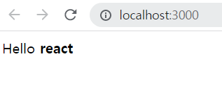
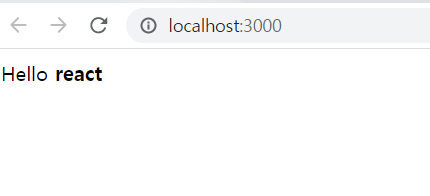
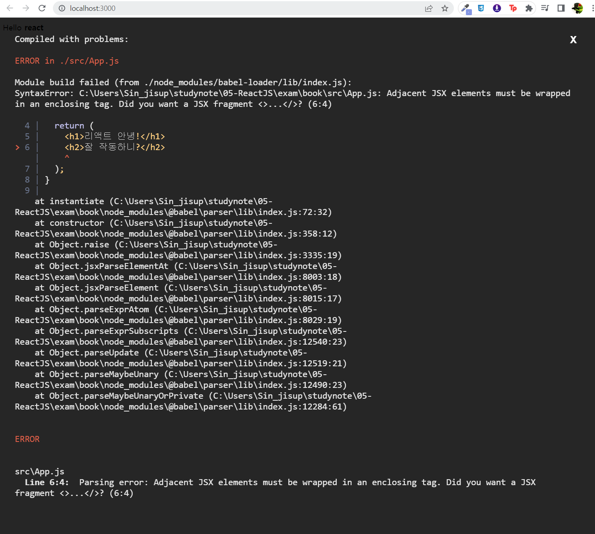
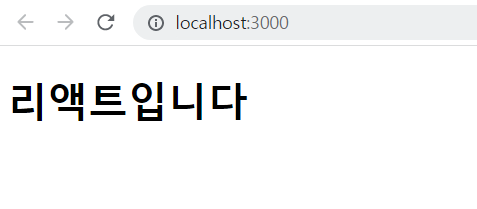
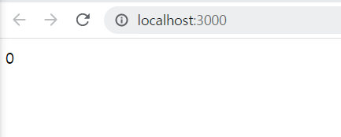
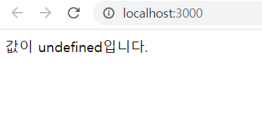
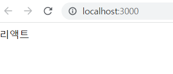
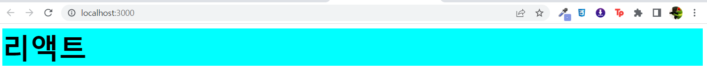
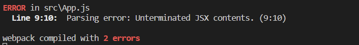

# 22.05.04 정리
## 1. 리엑트 시작

### 1.1 리엑트란 무엇인가?
자바 스크립트만으로 대규모 애플리케이션을 만들수 있는 시대가 왔다.
대표적인 프레임 워크: 리엑트(facebook), Angular(구글), vue.js, Svelte(요즘 뜨고 있음)
이러한 프레임워크들은 MVC아키텍처, MVVM아키텍처 등을 사용한다.
여기서 M은 Model이며 data(DB)를 뜻한다. V는 View이며 화면을 뜻하고, C는 Controller이며 data를 화면에 출력해주는 것을 뜻한다.
리액트는 오직 View에만 신경는 라이브러리이다.
#### 1.1.1 리액트 이해
특정부분이 어떻게 생길지 정하는 선언체를 컴포넌트라고 하며 재사용이 가능한 API이다.
사용자 화면에 뷰를 보여주는 것을 렌더링이라고 한다.

##### 1.1.1.1 초기 렌더링
맨 처음 어떻게 보일지를 정하는 초기 렌더링이 필요하다. 리액트에서는 render함수가 있다.
이 함수는 HTML 형식의 문자열을 반환하는것이 아니라, 뷰가 어떻게 생겼고 어떻게 작동하는지에 대한 정보를 지닌 객체를 반환한다. 컴포넌트 내부에는 또 다른 컴포넌트 들이 들어갈 수 있다. 렌더링이 끝나면 HTML 마크업을 만들고 이를 실제 페이지 DOM요소 안에 주입한다.

##### 1.1.1.2 조화 과정
리액트에서 중요한 부분은 업데이트(화면 갱신/ 조화 과정이라고 부름)이다. 컴포넌트에서 데이터 변화가 있을 때 우리가 보기에는 변화에 따라 뷰가 변형되는 것 처럼 보이지만, 사실은 새로운 요소로 갈아 끼우는 것이다. 이것을 render함수가 맡아서 한다. 기존과 바뀐것의 정보를 비교하여 바뀐것 만 DOM트리를 업데이트 한다. 

### 1.2 리액트의 특징

#### 1.2.1 Virtual DOM
리액트의 주요 특징 중 하나는 Virtural DOM을 사용하는 것이다.

##### 1.2.1.1 DOM이란?
DOM은 Document Object Model의 약어이다. 객체로 문서 구조(TAG)를 표현하는 방법으로 XML이나 HTML로 작성한다. DOM은 정적이다. 자바스크립트를 사용하여 동적으로 만들 수 있다. 규모가 큰 웹 애플리케이션에서 DOM에 직접 접근하여 변화를 주다 보면 성능 이슈가 조금씩 발생한다. 그 이유는 변화가 일어나면 CSS를 다시 연산하고, 레이아웃을 구성한 후 페이지를 리페인트 한다. 이 과정에서 시간이 허비된다. DOM이 느린게 아니다.
DOM을 최소한으로 조작하여 작업을 처리하는 방식으로 개선할 수 있다. 리액트에서는 virtual DOM 방식을 사용하여 처리횟수를 효율적으로 진행한다.

##### 1.2.1.2 Virtual DOM
Virtual DOM을 사용하면 실제 DOM(브라우저에 노출되는 Element들)에 접근하여 조작하는 대신, 이를 추상화한 자바스크립트 객체(DOM을 메모리에 복사한 것)를 구성하여 사용한다.

실제DOM 업데이트 절차
1. 데이터를 업데이트하면 전체 UI를 Virtual DOM에 리렌더링한다.
2. 이전 Virtual DOM에 있던 내용과 현재 내용을 비교한다.
3. 바뀐 부분만 실제 DOM에 적용한다.

Virtual DOM을 사용한다고 무조건 좋은 것은 아니다. 리엑트는 지속적으로 데이터가 변화하는 대규모 애플리케이션 구축을 위해 만들어졌다. 작업이 간단할 때에는 오히려 리엑트를 사용하지 않는편이 더 좋을 수 있다.

#### 1.2.2 기타 특징
리엑트는 오직 뷰만 담당하기 때문에, ajax, 데이터모딜링, 라우팅 등을 직접 구현해야 한다. 하지만 다양한 라이브러리들을 사용하여 구현할 수 있다. 하지만 너무 다양한 라이브러리가 있다는 것이 단점이다.

### 1.3 작업 환경 설정
Node.js(LTS버전), npm, yarn($ npm install -g yarn), VS Code 설치
yarn create react-app 프로젝트 이름

<hr/>

## 2.JSX

### 2.1 코드 이해하기
src > App.js
```js
import logo from './logo.svg';
import './App.css';

function App() {
  return (
    <div className="App">
      <header className="App-header">
        
        <p>
          Edit <code>src/App.js</code> and save to reload.
        </p>
        <a
          className="App-link"
          href="https://reactjs.org"
          target="_blank"
          rel="noopener noreferrer"
        >
          Learn React
        </a>
      </header>
    </div>
  );
}

export default App;
```
import(다른 js 불러오기)를 사용하여 다른 파일들을 불러와 사용할 수 있다. Node.js에서도 import 사용 가능하다.
이러한 기능을 브라우저에서도 사용하기 위해 번들러(분할된 js를 inport해서 조립하여 실행)를 사용해야 한다. 번들은 묶는다 라는 뜻이므로 파일을 묶듯이 연결하는 것이다. 대표적인 번들러로 웹팩, Parcel, browserify라는 도구가 있다. 
babel-loader는 최신 자바스크립트 문법으로 작성된 코드를 바벨이라는 도구를 사용하여 ES5 문법으로 변환 해 준다.
<br/>

작성(ES6) ----> 병합 ----> 변환(ES5)
<br/>
Node용&nbsp;&nbsp;&nbsp;&nbsp;웹팩&nbsp;&nbsp;&nbsp;&nbsp;&nbsp;&nbsp;&nbsp;&nbsp;&nbsp;&nbsp;바벨&nbsp;&nbsp;&nbsp;&nbsp;웹브라우저
<br/>
이러한 과정들은 create-react-app이 대신 작업해 준다.
위에서 function키워드르 사용하여 컴포넌트를 만들었다. 이것을 함수 컴포넌트라고 한다. 코드를 보면 HTML을 작성한 것 같지만 HTML 코드가 아니다. 이런 코드를 JSX라고 한다.

### 2.2 JSX란?
JSX는 자바스크립트의 확장 문법이다. 코드가 번들링되는 과정에서 바벨을 사용하여 일반 자바스크립트 형태의 코드로 변환한다.
<br/>
JSX
```js
import React from "react";

function App() {
  return (
    <div>
      Hello <b>react</b>
    </div>
  );
}

export default App;
```
React.createElement
```js
import React from "react";

function App() {
  return React.createElement('div',null,"Hello ", React.createElement("b",null,"react"))
}

export default App;
```

<br/>
JSX와 React.createElement는 같지만 JSX가 더 편하다.

### 2.3 JSX 장점
JSX로 작성하여 HTML 코드를 작성한 것과 비슷해보이므로 보기 쉽고 익숙하다. 그리고 위에서 App.js에서 App 컴포넌트를 만들었다. index.js를 보면 App 컴포넌트를 HTML 태그 쓰듯이 작성하여 활용도가 높아진다.
<br/>

src > index.js
```js
import React from 'react';
import ReactDOM from 'react-dom/client';
import App from './App';

const root = ReactDOM.createRoot(document.getElementById('root'));
root.render(
  <React.StrictMode>
    <App />
  </React.StrictMode>
);
```

### 2.4 JSX 문법

#### 2.4.1 감싸인 요소
컴포넌트에 여로 요소가 있따면 반드시 부모 요소 하나로 감싸야 한다.
```js
import React from "react";

function App() {
  return (
    <h1>리액트 안녕!</h1>
    <h2>잘 작동하니?</h2>
  );
}

export default App;
```

<br/>
감싸지 않으면 오류가 난다. div를 사용하여 감싸면 오류를 해결할 수 있다.

```js
import React from "react";

function App() {
  return (
    <div>
      <h1>리액트 안녕!</h1>
      <h2>잘 작동하니?</h2>
    </div>
  );
}

export default App;
```
<br/>

div를 사용하고 싶지 않다면 Fragment 또는 빈 <></>를 사용한다.
```js
import React, {Fragment} from "react";

function App() {
  return (
    <Fragment>
      <h1>리액트 안녕!</h1>
      <h2>잘 작동하니?</h2>
    </Fragment>
  );
}

export default App;
```

```js
import React from "react";

function App() {
  return (
    <>
      <h1>리액트 안녕!</h1>
      <h2>잘 작동하니?</h2>
    </>
  );
}

export default App;
```


#### 2.4.2 자바스크립트 표현
JSX안에서는 자바스크립트 표현식을 { }로 감싸서 사용할 수 있다.
```js
import React from "react";

function App() {
  const name = "리액트";
  return (
    <>
      <h1>{name} 안녕!</h1>
      <h2>잘 작동하니?</h2>
    </>
  );
}

export default App;
```
ES6에서는 var(전역변수) 대신 let(지역변수), const(상수)를 사용한다. let은 값이 변화할 수 있고 const는 불가능하다.

#### 2.4.3 If문 대신 조건부 연산자
JSX 내부의 자바스크립트 표현식에서 if 문을 사용할 수 없다. 하지만 JSX 밖에서 if문을 사용하여 사전에 값을 설정하거나, { }안에 조건부 연산자(삼항 연산자)를 사용하면 된다.
삼항 연산자는 값이 ture이면 앞의 내용을 false 이면 뒤의 내용을 출력한다.
```js
import React from "react";

function App() {
  const name = "리액트";
  return (
    <div>
      {name === '리액트' ? (
        <h1>리액트입니다.</h1>
      ) : (
        <h2>리액트가 아닙니다.</h2>
      )}
    </div>
  );
}

export default App;
```

```js
import React from "react";

function App() {
  const name = "리액트아님";
  return (
    <div>
      {name === '리액트' ? (
        <h1>리액트입니다.</h1>
      ) : (
        <h2>리액트가 아닙니다.</h2>
      )}
    </div>
  );
}

export default App;
```


#### 2.4.4 AND 연산자(&&)를 사용한 조건부 렌더링
개발하다 보면 특정 조건을 만족할 때 내용을 보여주고, 만족하지 않을 때 아예 아무것도 렌더링하지 않아야 하는 상황이 올 수 있다. 이럴 때 삼항 연산자를 통해 구현 할 수 있다.
```js
import React from "react";

function App() {
  const name = "리액트1";
  return (
    <div>
      {name === '리액트' ? <h1>리액트입니다</h1>:null}
    </div>
  );
}

export default App;
```
&&(AND)연산자를 사용하면 위 코드와 동일한 결과를 보여주지만, 더 짧은 코드로 구현 할 수있다.
```js
import React from "react";

function App() {
  const name = "리액트";
  return (
    <div>
      {name === '리액트' && <h1>리액트입니다</h1>}
    </div>
  );
}

export default App;
```
true일때 
<br/>
false일때 
<br/>

0은 예외적으로 화면에 나타난다.
```js
import React from "react";

function App() {
  const number = 0;
  return (
    <div>
      {number && <h1>리액트입니다</h1>}
    </div>
  );
}

export default App;
```

<br/>
괄호는 JSX를 여러줄로 작성할 때 사용하며, 한 줄로 표현할 때 사용하지 않는다. JSX를 괄호로 감싸는 것은 필수가 아니다. 

#### 2.4.5 undefined를 렌더링하지 않기
리액트 컴포넌트에서는 함수에서 undefined만 반환하여 렌더링하면 빈 화면만 렌더링되게 된다. 어떤 값이 undefined라면 ||(or) 연산자를 사용하여 내용을 출력할 수 있다.
```js
function App() {
  const name = undefined;
  return name || '값이 undefined입니다.';
}

export default App;
```

<br/>

반면 JSX내부에서 undefined를 렌더링하는 것은 괜찮다.
```js
function App() {
  const name = undefined;
  return <div>{name}</div>;
}

export default App;
```
name값이 undefined일 때 보여주고 싶은 문구가 있다면 다음과 같이 코드를 작성하면 된다.
```js
function App() {
  const name = undefined;
  return <div>{name || '리액트'}</div>;
}

export default App;
```


#### 2.4.6 인라인 스타일링
리액트에서 DOM 요소에 스타일을 적용할때는 객체 형태로 넣어 주어야 한다. 스타일 이름은 카멜표기법 (ex: backgroundColor)을 사용하여 작성해야한다.
```js
import React from "react";
function App() {
  const name = '리액트';
  const style = {
    //카멜표기법 사용
    backgroundColor: 'black',
    color: 'aqua',
    fontSize: '48px', 
    fontWeight: 'bold', // font-weight -> fontWeight
    padding: 16 //단위를 생략하면 px로 지정
  }
  return <div style={style}>{name}</div>;
}

export default App;
```

미리 선언하지 않고 style을 적용하려면 다음과 같이 작성한다.
```js
import React from "react";
function App() {
  const name = '리액트';
  return <div style={{    //카멜표기법 사용
    backgroundColor: 'black',
    color: 'aqua',
    fontSize: '48px', 
    fontWeight: 'bold', // font-weight -> fontWeight
    padding: 16 //단위를 생략하면 px로 지정
  }}>{name}</div>;
}

export default App;
```

#### 2.4.7 class 대신 className
App.css
```css
.react {
    background: aqua;
    color: black;
    font-size: 48px;
    font-weight: bold;
}
```
App.js
```js
import React from "react";
import './App.css';
function App() {
  const name = '리액트';
  return <div className="react">{name}</div>;
}

export default App;
```

class를 className으로 바꾸지 않아도 적용은 되지만 경고를 띄운다.

#### 2.4.8 꼭 닫아야 하는 태그
HTML에서는 br, input 태그 등을 닫지 않아도 작동이 된다.
하지만 JSX에서는 오류가 발생하므로 꼭 닫아주어야 한다.
```js
import React from "react";

function App() {
  const name = '리액트';
  return (
    <div>
      {name}
      <input>
    </div>
  );
}

export default App;
```

```js
import React from "react";

function App() {
  const name = '리액트';
  return (
    <div>
      {name}
      <input></input>
    </div>
  );
}

export default App;
```
태그 사이에 별도의 내용이 들어가지 않는 태그들을 self-closing태그 라고 부른다.
```js
import React from "react";

function App() {
  const name = '리액트';
  return (
    <div>
      {name}
      <input/>
    </div>
  );
}

export default App;
```

#### 2.4.9 주석
한줄만 작성할 때는 // 을 사용하고 여러줄 주석은 /* */을 사용한다.
```js
import React from "react";

function App() {
  const name = '리액트';
  return (
    <div
    // 시작 태그를 여러줄로 작성하면 여기서 주석 작성이 가능하다.
    >
      {/* 주석은 이렇게 작성한다. */}
      {name}
      //이런 주석이나
      /* 이런 주석은 페이지에 그대로 나타나게 된다.*/
    </div>
  );
}

export default App;
```


### 2.5 ESLint와 Prettier 적용하기
VS Code 확장 프로그램인 ESLint(문법 검사 도구)와 Prettier(코드 스타일 자동 정리 도구) 설치