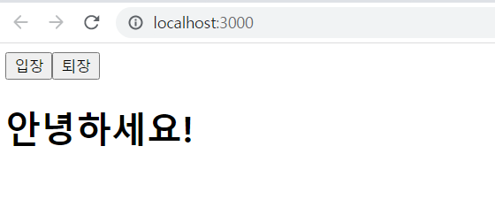

# 22.05.06

## 3.2 첫 컴포넌트 생성
class 문법
```js
class Dog {
    constructor(name) {
        this.name = name;
    }
    say() {
        console.log(this.name + '멍멍');
    }
}
```

```js

const dog = new Dog('흰둥이');
dog.say();
```
src 디렉터리에 MyComponent.js파일 생성
```js
import React from 'react';

const MyComponent = () => {
    return (
        <div>
            나의 새롭고 멋진 컴포넌트
        </div>
    );
};

export default MyComponent;
```
<br/>
function() 키워드와 () => {} 화살표 함수는 차이가 없다. 둘 중에 취향에 맞는 것을 선택해서 사용한다.

<br/>

위에서 작성한 코드를 export하여 App.js에서 import(불러오기) 하여 사용 가능하다.
```js
import React from "react";
import MyComponent from "./MyComponent";

function App() {
  return (
    <div>
      <MyComponent/>
    </div>
  );
}

export default App;
```


## 3.3 Props
properties의 줄ㅇ니말로 컴포넌트 속성을 설정할 때 사용하는 요소이다. props 값은 해당 컴포넌트를 불러와 사용하는 부모 컴포넌트(현 상황에서는 App 컴포넌트가 부모 컴포넌트)에서 설정할 수 있다.

### 3.3.1 JSX 내부에서 props렌더링
src > MyComponent
```js
import React from 'react';

const MyComponent = (props) => {
    return (
        <div>
            안녕하세요, 제 이름은 {props.name}
        </div>
    );
};

export default MyComponent;
```
### 3.3.2 컴포넌트를 사용할 때 props 값 지정하기
src > App.js
```js
import React from "react";
import MyComponent from "./MyComponent";

function App() {
  return (
    <div>
      <MyComponent name="React"/>
    </div>
  );
}

export default App;
```


### 3.3.3 props 기본값 설정: defaultProps
defaultProps를 설정하고 부모 컴포넌트에서 props를 설정 안한다면 defaultProps의 내용이 렌더링 된다.
```js
import React from 'react';

const MyComponent = (props) => {
    return (
        <div>
            안녕하세요, 제 이름은 {props.name}입니다
        </div>
    );
};

MyComponent.defaultProps ={
    name: '기본 이름'
}

export default MyComponent;
```

### 3.3.4 태그 사이의 내용을 보여주는 children
컴포넌트 태그 사이의 내용을 보여 주는 props는 children 이다.
src > App.js
```js
import React from "react";
import MyComponent from "./MyComponent";

function App() {
  return (
    <div>
      <MyComponent>리액트</MyComponent>
    </div>
  );
}

export default App;
```
src > MyComponent.js
```js
import React from 'react';

const MyComponent = (props) => {
    return (
        <div>
            안녕하세요, 제 이름은 {props.name}입니다. <br />
            children 값은 {props.children}
        </div>
    );
};

MyComponent.defaultProps ={
    name: '기본 이름'
}

export default MyComponent;
```


### 3.3.5 비구조화 할당 문법을 통해 props 내부 값 추출하기
비구조화 할당으로 간단하게 표현할 수 있다.
src > MyComponent.js
```js
import React from 'react';

const MyComponent = (props) => {
    const {name, children} = props
    return (
        <div>
            안녕하세요, 제 이름은 {name}입니다. <br />
            children 값은 {children}
        </div>
    );
};

MyComponent.defaultProps ={
    name: '기본 이름'
}

export default MyComponent;
```
여기서 더 간단하게 하려면 파라미터 자리에 바로 비구조화 할당을 하면된다.
```js
import React from 'react';

const MyComponent = ({name, children}) => {
    return (
        <div>
            안녕하세요, 제 이름은 {name}입니다. <br />
            children 값은 {children}
        </div>
    );
};

MyComponent.defaultProps ={
    name: '기본 이름'
}

export default MyComponent;
```
결과는 다 같다.

### 3.3.6 propTypes를 통한 props 검증
props의 타입을 지정할 때는 propTypes를 사용한다. 우선 propTypes를 사용하려면 import구문을 사용하여 불러와야 한다.
```js
import React from 'react';
import propTypes from 'prop-types'

const MyComponent = ({name, children}) => {
    return (
        <div>
            안녕하세요, 제 이름은 {name}입니다. <br />
            children 값은 {children}
        </div>
    );
};

MyComponent.defaultProps ={
    name: '기본 이름'
}

MyComponent.propTypes = {
    name: propTypes.string
}

export default MyComponent;
```
```js
import React from "react";
import MyComponent from "./MyComponent";

function App() {
  return (
    <div>
      <MyComponent name={3}>리액트</MyComponent>
    </div>
  );
}

export default App;
```
name을 3(number)로 지정하면 타입이 다르므로 콘솔에 오류문구가 나온다. 하지만 값은 그대로 출력된다.


#### 3.3.6.1 isRequired를 사용하여 필수 propTypes 설정
propTypes를 지정하지 않았을 때 경고 메시지를 띄워 주는 작업은 isRequired를 사용하면 된다.
```js
import React from 'react';
import propTypes from 'prop-types'

const MyComponent = ({name, favoriteNumber, children}) => {
    return (
        <div>
            안녕하세요, 제 이름은 {name}입니다. <br />
            children 값은 {children}
            입니다.
            <br />
            제가 좋아하는 숫자는 {favoriteNumber} 입니다.
        </div>
    );
};

MyComponent.defaultProps ={
    name: '기본 이름'
}

MyComponent.propTypes = {
    name: propTypes.string,
    favoriteNumber: propTypes.number.isRequired
}

export default MyComponent;
```

아직 favoriteNumber를 지정하지 않아서 오류메시지가 나온다.
```js
import React from "react";
import MyComponent from "./MyComponent";

function App() {
  return (
    <div>
      <MyComponent favoriteNumber={3}>리액트</MyComponent>
    </div>
  );
}

export default App;
```


#### 3.3.6.2 더 많은 PropTypes종류
propTypes는 여러 가지 종류가 있다. 중요한 것들은 다음과 같다.
1. array(배열)
2. bool: true or false
3. func(함수)
4. number(숫자)
5. object(객체)
6. string(문자열)
7. instanceOf(특정 클래스의 인스턴스)
8. oneOf(["...", "..."] (주어진 배열 안의 종류 중 하나))
9. any(아무 종류)

## 3.4 state

### 3.4.2 함수 컴포넌트에서 useState 사용하기
#### 3.4.2.1 배열 비구조화 할당
배열 안에 들어 있는 값을 쉽게 추출할 수 있도록 해 주는 문법이다.
```js
const array1 = [1, 2];
const one1 = array1[0];
const two1 = araay1[1];
//비구조화 할당
const array2 = [1, 2];
const [one2, two2] = array2
```

#### 3.4.2.2. useState 사용하기
src > Say.js
```js
import React from 'react';

const Say = () => {
    const [message, setMessage] = React.useState('');
    const onClickEnter = () => setMessage('안녕하세요!')
    const onClickLeave = () => setMessage('안녕히 가세요!');
    return (
        <div>
            <button onClick={onClickEnter}>입장</button>
            <button onClick={onClickLeave}>퇴장</button>
            <h1>{message}</h1>
        </div>
    );
};

export default Say;
```
useState함수의 인자는 초기값이다. mssage는 현재상태이며, setMessage는 변화하는 값을 담는 함수이다. 이벤트로 인해 변화하는 값을 setMessage에 넣으면 그 값을 message로 보낸다. 여기서 setMessage는 세터함수라고 부른다.
src > App.js
```js
import React from "react";
import Say from "./Say";

function App() {
  return (
    <div>
      <Say/>
    </div>
  );
}

export default App;
```



#### 3.4.2.3 한 컴포넌트에서 useState 여러번 사용하기
useState는 한 컴포넌트에서 여러 번 사용해도 상관없다.
```js
import React from 'react';

const Say = () => {
    const [message, setMessage] = React.useState('');
    const onClickEnter = () => setMessage('안녕하세요!')
    const onClickLeave = () => setMessage('안녕히 가세요!');

    const [color, setColor] = React.useState('black');
    return (
        <div>
            <button onClick={onClickEnter}>입장</button>
            <button onClick={onClickLeave}>퇴장</button>
            <h1 style={{ color }}>{message}</h1>
            <button style={{ color: 'red'}} onClick={() => setColor('red')}>빨간색</button>
            <button style={{ color: 'green'}} onClick={() => setColor('green')}>초록색</button>
            <button style={{ color: 'blue'}} onClick={() => setColor('blue')}>파란색</button>
        </div>
    );
};

export default Say;
```


## 3.5 State를 사용할 때 주의 사항
state 값을 바꾸어야 할 때는 setState 혹은 useState를 통해 전달받은 세터 함수를 사용해야 한다.
```js
const [object, setObject] = React.useState({a: 1, b: 1});
object.b = 2 //이러면 안됨
```
배열이나 객체를 업데이트해야 할 때는 배열이나 객체 사본을 만들고 그 사본에 값을 업데이트한 후, 그 사본의 상태를 setState 혹은 세터 함수를 통해 업데이트 해야한다.
```js
// 상태값을 가정한 객체
const object = {a: 1, b: 2, c: 3};
const nextObject = { ...object, b: 2}; //사본을 만들어서 b 값만 덮어쓰기 / ...object: object의 모든 내용을 복제

//배열 다루기
const array =[
    { id: 1, value: true },
    { id: 2, value: true },
    { id: 3, value: false },
];
let nextArray = array.concat({ id: 4 }); //새 항목 추가
nextArray.filter(item => item.id !== 2); //id가 2인 항목 제거
nextArray.map(item.id === 1 ? {...item, value: false} : item) // id가 1인 항목의 value를 false로 설정
```

## 3.6 정리
props는 부모 컴포넌트가 설정하고. state는 컴포넌트 자체적으로 지닌 값이다.<br/>
부모 컴포넌트의 state를 자식 컴포넌트 props로 전달하고, 자식 컴포넌트에서 특정 이벤트가 발상할 때 부모 컴포넌트의 메서드를 호출하면 props도 유동적으로 사용할 수 있다.<br/>
새로운 컴포넌트를 만들 때는 useState(함수형)를 사용할 것을 권장한다.

## 4.1 리액트의 이벤트 시스템 
리액트의 이벤트 시스템은 웹 브라우저의 HTML이벤트와 인터페이스(사용방법이 동일)가 동일하다.

### 4.1.1 이벤트를 사용할 때 주의 사항
1. 이벤트 이름은 카멜 표기법으로 작성한다(ex: onClick, onKeyUp)
2. 이벤트에 실행할 자바스크립트 코드를 전달하는 것이 아니라, 함수 형태의 값을 전달한다. 콜백형태 또는 별도 함수를 연결하는 방식이 있다.
3. DOM 요소에만 이벤트를 설정할 수 있다. 우리가 직접 만든 컴포넌트에는 이벤트를 설정할 수 없다.

## 4.2 예제로 이벤트 핸들링 익히기
### 4.2.1 컴포넌트 생성 및 불러오기
#### 4.2.1.1 컴포넌트 생성
src > EventPractice.js
```js
import React from 'react';

const EventPractice = () => {
    return (
        <div>
            <h1>이벤트 연습</h1>
        </div>
    );
};

export default EventPractice;
```
src > App.js
```js
import React from "react";
import EventPractice from "./EventPractice";
// import는 클래스형 함수형 동일
function App() {
  return (
    <div>
      <EventPractice/>
    </div>
  );
}

export default App;
```


### 4.2.2 onChange 이벤트 핸들링하기
#### 4.2.2.1 onChange 이벤트 설정
src > EventPractice.js
```js
import React from 'react';

const EventPractice = () => {
    return (
        <div>
            <h1>이벤트 연습</h1>
            <input
                type="text"
                name="message"
                placeholder='아무거나 입력해 보세요'
                onChange={(e) => {
                    console.log(e);
                }}
            />
        </div>
    );
};

export default EventPractice;
```
<br/>
e.target.value을 콘솔에 기록해 보기
```js
import React from 'react';

const EventPractice = () => {
    return (
        <div>
            <h1>이벤트 연습</h1>
            <input
                type="text"
                name="message"
                placeholder='아무거나 입력해 보세요'
                onChange={(e) => {
                    console.log(e.target.value);
                }}
            />
        </div>
    );
};

export default EventPractice;
```
<br/>
useState를 사용하여 state 업데이트하기
```js
import React from 'react';

const EventPractice = () => {
    const [message, setMessage] = React.useState('')
    return (
        <div>
            <h1>이벤트 연습</h1>
            <input
                type="text"
                name="message"
                placeholder='아무거나 입력해 보세요'
                value={message}
                onChange={(e) => {
                    setMessage(e.target.value)
                }}
            />
        </div>
    );
};

export default EventPractice;
```

텍스트가 잘 입력되므로, 성공한 것이다.

#### 4.2.2.3 버튼을 누를 때 comment 값을 공백으로 설정
```js
import React from 'react';

const EventPractice = () => {
    const [message, setMessage] = React.useState('')
    return (
        <div>
            <h1>이벤트 연습</h1>
            <input
                type="text"
                name="message"
                placeholder='아무거나 입력해 보세요'
                value={message}
                onChange={(e) => {
                    setMessage(e.target.value)
                }}
            />
            <button onClick={
                () => {
                    alert(message);
                    setMessage('')
                }
            }
            >확인</button>
        </div>
    );
};

export default EventPractice;
```


### 별도의 함수를 만들어 이벤트 적용
```js
import React from 'react';

const EventPractice = () => {
    const [message, setMessage] = React.useState('')

    const onChange = (e) => {
        setMessage(e.target.value)
    }
    function onClick(e){
        alert(message)
        setMessage('')
    }
    return (
        <div>
            <h1>이벤트 연습</h1>
            <input
                type="text"
                name="message"
                placeholder='아무거나 입력해 보세요'
                value={message}
                onChange={onChange}
            />
            <button onClick={onClick}>확인</button>
        </div>
    );
};

export default EventPractice;
```
위의 결과와 똑같은 결과가 나온다.

## 4.3 함수 컴포넌트로 구현해 보기
```js
import React from 'react';

const EventPractice = () => {
    const [username, setUsername] = React.useState('');
    const [message, setMessage] = React.useState('')
    const onChangeUsername = e => setUsername(e.target.value);
    const onChangeMessage = e => setMessage(e.target.value);
    function onClick(e){
        alert(username + ': ' + message);
        setUsername('')
        setMessage('')
    }
    const onKeyPress = e => {
        if (e.key === "Enter") {
            onClick();
        }
    }
    return (
        <div>
            <h1>이벤트 연습</h1>
            <input
                type="text"
                name="username"
                placeholder='사용자명'
                value={username}
                onChange={onChangeUsername}
            />
            <input
                type="text"
                name="message"
                placeholder='아무거나 입력해 보세요'
                value={message}
                onChange={onChangeMessage}
                onKeyPress={onKeyPress}
            />
            <button onClick={onClick}>확인</button>
        </div>
    );
};

export default EventPractice;
```


e.target.name 활용해보기
```js
import React from 'react';

const EventPractice = () => {
    const [form, setForm] = React.useState({
        username: '',
        message: '',
    })
    const {username, message} = form
    const onChange = e => {
        const nextForm = {
            ...form, //기존의 form 내용을 이자리에 복사한 뒤
            [e.target.name]: e.target.value //원하는 값 덮어 씌우기
        }
        setForm(nextForm)
    }
    function onClick(){
        alert(username + ': ' + message);
        setForm({
            username: '',
            message: ''
        })
    }
    const onKeyPress = e => {
        if (e.key === "Enter") {
            onClick();
        }
    }
    return (
        <div>
            <h1>이벤트 연습</h1>
            <input
                type="text"
                name="username"
                placeholder='사용자명'
                value={username}
                onChange={onChange}
            />
            <input
                type="text"
                name="message"
                placeholder='아무거나 입력해 보세요'
                value={message}
                onChange={onChange}
                onKeyPress={onKeyPress}
            />
            <button onClick={onClick}>확인</button>
        </div>
    );
};

export default EventPractice;
```
위의 결과와 동일한 결과가 나온다.