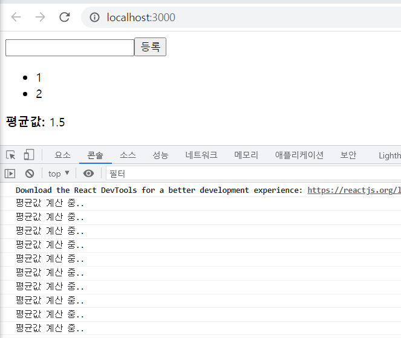

# 22.05.09 신지섭
## 5장 ref: DOM에 이름달기
id를 사용하여 DOM에 이름을 다는 것처럼 리액트 프로젝트 내부에서 DOM에 이름을 다는 방법이 있다. ref개념이다.
<br/>
id 사용을 권장하지 않는 이유는 리액트는 파일 하나하나의 개념에서는 id가 고유한 값이지만 리액트는 SPA이므로 모아서 보면 고유한 값이 아닐 수 있기 때문인다.

### 5.1 ref는 어떤 상황에서 사용해야 할까?
DOM을 꼭 직접적으로 건드려야 할 때 사용한다.
ValidationSample.css
```css
.success {
    background-color: lightgreen;
}

.failure {
    background-color: lightcoral;
}
```
ValidationSample.js
```js
import React from 'react';
import "./ValidationSample.css"
const ValidationSample = () => {
    const [password, setPassword] = React.useState('');
    const [clicked, setClicked] = React.useState(false);
    const [validated, setValidated] = React.useState(false);

    const handleChange = (e) => {
        setPassword(e.target.value)
    }

    const handleButtonClick = () => {
        setClicked(true);
        setValidated(password === "0000");
    }
    return (
        <div>
            <input type="password" value={password} onChange={handleChange} 
            className={clicked ? (validated ? 'success' : 'failure') : ''}/>
            <button onClick={handleButtonClick}>검증하기</button>
        </div>
    );
};

export default ValidationSample;
```
App.js
```js
import React from "react";
import ValidationSample from "./ValidationSample";

function App() {
  return (
    <div>
      <ValidationSample/>
    </div>
  );
}

export default App;
```


#### 5.1.3 DOM을 꼭 사용해야 하는 상황
1. 특정 input에 포커스 주기
2. 스크롤 박스 조작하기
3. Canvass요소에 그림 그리기 등
이때는 어쩔 수 없이 DOM에 직접적으로 접근해야 하는데, 이를 위해 바로 ref를 사용한다.

### 5.2 ref 사용
useRef를 사용하여 ref를 만들려면 우선 컴포넌트 내부에서 변수로 React.useRef()를 담아 주어야 한다. 그리고 해당 변수를 ref를 달고자 하는 요소에 ref props로 넣어 주면 ref 설정이 완료 된다.<br/>
설정한 뒤 나중에 ref를 설정해 준 DOM에 접근하려면 input.current를 조회하면 된다. 
```js
import React from 'react';

const RefSample = () => {
    const input = React.useRef();
    const handleFocus = () => {
        input.current.focus();
    }
    return (
        <div>
            <input ref={input} />
        </div>
    );
};

export default RefSample;
```

##### 5.2.3.2 버튼 onClick 이벤트 코드 수정
```js
import React from 'react';
import "./ValidationSample.css"
const ValidationSample = () => {
    const [password, setPassword] = React.useState('');
    const [clicked, setClicked] = React.useState(false);
    const [validated, setValidated] = React.useState(false);
    const input = React.useRef();
    const handleChange = (e) => {
        setPassword(e.target.value)
    }

    const handleButtonClick = () => {
        setClicked(true);
        setValidated(password === "0000");
        input.current.focus();
    }
    return (
        <div>
            <input ref={input} type="password" value={password} onChange={handleChange} 
            className={clicked ? (validated ? 'success' : 'failure') : ''}/>
            <button onClick={handleButtonClick}>검증하기</button>
        </div>
    );
};

export default ValidationSample;
```
React.useRef()를 사용하여 클릭시 input에 focus하기


### 5.3 컴포넌트에 ref 달기
컴포넌트에도 ref를 달 수 있다. 주로 컴포넌트 내부에 있는 DOM을 컴포넌트 외부에서 사용할 때 씁니다.<br/>
ScrollBox.js 컴포넌트 생성
```js
import React from 'react';

const ScrollBox = React.forwardRef((props, ref) => {
    const style = {
        border: '1px solid black',
        height: '300px',
        width: '300px',
        overflow: 'auto',
        position: 'relative'
    };

    const innerStyle = {
        width: '100%',
        height: '650px',
        background: 'linear-gradient(white, black)'
    }
    return (
        <div style={style} ref={ref}>
            <div style={innerStyle}/>
        </div>
    );
});

export default ScrollBox;
```
App.js에서 랜더링
```js
import React from "react";
import ScrollBox from "./ScrollBox";

function App() {
  return (
    <div>
      <ScrollBox/>
    </div>
  );
}

export default App;
```

컴포넌트에 ref 적용하기
```js
import React from "react";
import ScrollBox from "./ScrollBox";

function App() {
  const scrollBoxRef = React.useRef();
  return (
    <div>
      <ScrollBox ref={scrollBoxRef}/>
      <button onClick={() => {
        const {scrollHeight, clientHeight} = scrollBoxRef.current;
        scrollBoxRef.current.scrollTop = scrollHeight - clientHeight;
      }}>맨 밑으로</button>
    </div>
  );
}

export default App;
```


### 5.4 정리
컴포넌트 내부에서 DOM에 직접 접근해야 할 때는 ref를 사용해야 한다. 먼저 ref를 사용하지않고도 원하는 기능을 구현할 수 있는지 반드시 고려한 후에 활용해야 한다.
<br/>
서로 다른 컴포넌트끼리 데이터를 교류할 때 ref를 사용한다면 잘못 사용되는 것이다.
<br/>
컴포넌트끼리 데이터를 교류할 때는 데이터를 부모 자식 흐름으로 교류해야 한다. <br/>
리덕스를 사용하면 효율적으로 교류할 수 있따.

## 6장 컴포넌트 반복

### 6.1 자바스크립트 배열의 map()함수
arr.map(callback, [thisArg]) <br/>
* callback: 새로운 배열의 요소를 생성하는 함수로 파라미터는 세 가지이다.
  - currentValue: 현재 처리하고 있는 요소
  - index: 현재 처리하고 있는 요소의 index값
  - array: 현재 처리하고 있는 원본 배열
* thisArg(선택항목): callback 함수 내부에서 사용할 this 레퍼런스

### 6.2 데이터 배열을 컴포넌트 배열로 변환하기
IterationSample 컴포넌트 생성
```js
import React from 'react';

const IterationSample = () => {
    const names=['눈사람', '얼음', '눈', '바람'];
    const nameList = names.map(name => <li>{name}</li>)
    return (
        <ul>{nameList}</ul>
    );
};

export default IterationSample;
```

App.js에서 랜더링
```js
import React from "react";
import IterationSample from "./IterationSample";

function App() {
  return (
    <div>
      <IterationSample/>
    </div>
  );
}

export default App;
```


key값이 없다는 경고문이 발생한다.

### 6.3 key
key는 컴포넌트 배열을 렌더링했을 때 어떤 원소에 변동이 있었는지 알아내려고 사용한다.

#### 6.3.1 key 설정
key 값을 설정할 때는 map 함수의 인자로 전달되는 함수 내부에서 컴포넌트 props를 설정하듯이 설정하면 된다. key 값은 언제나 유일 해야한다. 데이터가 가진 고윳값을 key값으로 설정하면 된다.
```js
import React from 'react';

const IterationSample = () => {
    const names=['눈사람', '얼음', '눈', '바람'];
    const nameList = names.map((name, index) => <li key={index}>{name}</li>)
    return (
        <ul>{nameList}</ul>
    );
};

export default IterationSample;
```


### 6.4 응용
초기 상태 설정
```js
import React from 'react';

const IterationSample = () => {
    const [names, setNames] = React.useState([
        {id: 1, text: '눈사람'},
        {id: 2, text: '얼음'},
        {id: 3, text: '눈'},
        {id: 4, text: '바람'},
    ])
    const [inputText, setInputText] = React.useState('');
    const [nextId, setNextId] = React.useState(5);

    const nameList = names.map(name => <li key={name.id}>{name.text}</li>);
    return (
        <ul>{nameList}</ul>
    );
};

export default IterationSample;
```
<br/>

데이터 추가 기능 구현
```js
import React from 'react';

const IterationSample = () => {
    const [names, setNames] = React.useState([
        {id: 1, text: '눈사람'},
        {id: 2, text: '얼음'},
        {id: 3, text: '눈'},
        {id: 4, text: '바람'},
    ])
    const [inputText, setInputText] = React.useState('');
    const [nextId, setNextId] = React.useState(5);

    const onChange = e => setInputText(e.target.value)
    const onClick = () => {
        const nextNames = names.concat({
            id: nextId,
            text: inputText
        })
        setNextId(nextId + 1);
        setNames(nextNames);
        setInputText('');
    }

    const nameList = names.map(name => <li key={name.id}>{name.text}</li>);
    return (
        <div>
            <input value={inputText} onChange={onChange} />
            <button onClick={onClick}>추가</button>
            <ul>{nameList}</ul>
        </div>
    );
};

export default IterationSample;
```

배열에 새 항목을 추가할 때 배열의 push함수를 사용하지 않고 concat을 사용했다. push는 기존 배열을 변경하고, concat은 새로운 배열을 만들어 준다. 불변성 유지를 위해 리액트에서 상태를 업데이트 할 때는 기존 상태를 그대로 두면서 새로운 값을 상태로 설정해야 한다.
<br/>

데이터 제거기능 구현
```js
import React from 'react';

const IterationSample = () => {
    const [names, setNames] = React.useState([
        {id: 1, text: '눈사람'},
        {id: 2, text: '얼음'},
        {id: 3, text: '눈'},
        {id: 4, text: '바람'},
    ])
    const [inputText, setInputText] = React.useState('');
    const [nextId, setNextId] = React.useState(5);

    const onChange = e => setInputText(e.target.value)
    const onClick = () => {
        const nextNames = names.concat({
            id: nextId,
            text: inputText
        })
        setNextId(nextId + 1);
        setNames(nextNames);
        setInputText('');
    }
    const onRemove = id => {
        const nextNames = names.filter(name => name.id !== id);
        setNames(nextNames)
    };
    const nameList = names.map(name => (
        <li key={name.id} onDoubleClick={() => onRemove(name.id)}>{name.text}</li>
    ));
    return (
        <div>
            <input value={inputText} onChange={onChange} />
            <button onClick={onClick}>추가</button>
            <ul>{nameList}</ul>
        </div>
    );
};

export default IterationSample;
```

### 6.5 정리
컴포넌트 배열을 렌더링할 때는 key값 설정에 항상 주의해야 한다. <br/>
key값은 언제나 유일해야한다. key값이 중복된다면 렌더링 과정에서 오류가 발생한다.<br/>
상태 안에서 배열을 변형할 때는 배열에 직접 접근하여 수정하는 것이 아니라 concat, filter 등의 배열 내장 함수를 사용하여 새로운 배열을 반든 후 이를 새로운 상태로 설정 해야한다.

## 8장 Hooks
v16.8에 새로 도입된 기능으로 기존의 함수 컴포넌트에서 할 수 없었던 다양한 작업을 할 수 있게 해준다.<br/>

### 8.1 useState
가장 기본적인 Hook이며, 함수형 컴포넌트에서도 가변적인 상태를 지닐  수 있게 해준다. <br/>
Counter.js
```js
import React from 'react';

const Counter = () => {
    const [value, setValue] = React.useState(0);
    return (
        <div>
            <p>
                현재 카운터 값은 <b>{value}</b>입니다.
            </p>
            <button onClick={() => setValue(value + 1)}>+1</button>
            <button onClick={() => setValue(value - 1)}>-1</button>
        </div>
    );
};

export default Counter;
```
useState 함수의 파라미터에는 상태의 기본값을 넣어 준다. 함수가 호출되면 배열을 반환한다. 첫 번째 원소는 상태값, 두 번째 원소는 상태를 설정하는 함수다. 이 함수에 파라미터를 넣어서 호출하면 전달받은 파라미터로 값이 바뀌고 컴포넌트가 정상적으로 리렌더링 된다.
<br/>

App.js
```js
import React from "react";
import Counter from "./Hooks/Counter";

function App() {
  return (
    <div>
      <Counter/>
    </div>
  );
}

export default App;
```

#### 8.1.1 useState를 여러 번 사용하기
하나의 useState함수는 하나의 상태 값만 관리할 수 있다. 컴포넌트에서 관리해야 할 상태가 여러 개라면 useState를 여러 번 사용하면 된다.
Info.js
```js
import React from 'react';

const Info = () => {
    const [name,setName] = React.useState('');
    const [nickname, setNickname] = React.useState('');

    const onChangeName = e => {
        setName(e.target.value);
    };

    const onChangeNickname = e => {
        setNickname(e.target.value);
    }
    return (
        <div>
            <div>
                <input value={name} onChange={onChangeName} />
                <input value={nickname} onChange={onChangeNickname}/>
            </div>
            <div>
                <div>
                    <b>이름:</b> {name}
                </div>
                <div>
                    <b>닉네임:</b> {nickname}
                </div>
            </div>
        </div>
    );
};

export default Info;
```
App.js
```js
import React from "react";
import Info from "./Hooks/Info";

function App() {
  return (
    <div>
      <Info/>
    </div>
  );
}

export default App;
```


### 8.2 useEffect
useEffect는 리액트 컴포넌트가 렌더링(화면에 그림)될 때마다 특정 작업을 수행하도록 설정하는 Hook이다.
Info.js
```js
import React from 'react';

const Info = () => {
    const [name,setName] = React.useState('');
    const [nickname, setNickname] = React.useState('');
    React.useEffect(() => {
        console.log('렌더링이 완료되었습니다!');
        console.log({
            name,
            nickname
        });
    })
    const onChangeName = e => {
        setName(e.target.value);
    };

    const onChangeNickname = e => {
        setNickname(e.target.value);
    }
    return (
        <div>
            <div>
                <input value={name} onChange={onChangeName} />
                <input value={nickname} onChange={onChangeNickname}/>
            </div>
            <div>
                <div>
                    <b>이름:</b> {name}
                </div>
                <div>
                    <b>닉네임:</b> {nickname}
                </div>
            </div>
        </div>
    );
};

export default Info;
```


#### 8.2.1 마운트될 때만 실행하고 싶을 때
useEffect에서 설정한 함수를 컴포넌트가 화면에 맨 처음 렌더링 될 때만 실행하고, 업데이트될 때는 실행하지 않으려면 함수의 두번째 파라미터로 비어있는 배열을 넣어주면 된다.
```js
React.useEffect(() => {
    console.log('마운트될 때만 실행합니다.');
},[])
```


#### 8.2.2 특정 값이 업데이트될 때만 실행하고 싶을때
useEffect 두 번째 파라미터로 전달되는 배열안에 검사하고 싶은 값을 넣어 주면 된다. 두 번째 파라미터로 지정할 수 있는 값은 상태값, props로 전달받은 값이 있다.
```js
React.useEffect(() => {
    console.log(name);
},[name]);
```


#### 8.2.3 뒷정리하기
컴포넌트가 언마운트되기 전이나 업데이트되기 직전에 어떠한 작업을 수행하고 싶다면 useEffect에서 뒷정리 함수를 반환하면 된다.
```js
import React from 'react';

const Info = () => {
    const [name,setName] = React.useState('');
    const [nickname, setNickname] = React.useState('');

    React.useEffect(() => {
        console.log('effect');
        console.log(name);
        return() => {
            console.log('cleanUp');
            console.log(name);
        }
    });
    const onChangeName = e => {
        setName(e.target.value);
    };

    const onChangeNickname = e => {
        setNickname(e.target.value);
    }
    return (
        <div>
            <div>
                <input value={name} onChange={onChangeName} />
                <input value={nickname} onChange={onChangeNickname}/>
            </div>
            <div>
                <div>
                    <b>이름:</b> {name}
                </div>
                <div>
                    <b>닉네임:</b> {nickname}
                </div>
            </div>
        </div>
    );
};

export default Info;
```
App.js
```js
import React from "react";
import Info from "./Hooks/Info";

function App() {
  const [visible, setVisible] = React.useState(false);
  return (
    <div>
    {/*false일때 클릭시 true로 바뀜 false일때 클릭시 true*/}
      <button
        onClick={() => {
          setVisible(!visible);
        }}
      >
        {visible ? '숨기기' : '보이기'}
      </button>
      <hr />
      {visible && <Info/>}
    </div>
  );
}

export default App;
```
첫 번째 클릭시
 <br/>
두 번째 클릭시


### 8.3 useReducer
useReducer는 useState보다 더 다양한 컴포넌트 상황에 따라 다양한 상태를 다른 값으로 업데이트해 주고 싶을 때 사용하는 Hook이다.<br/>
리듀서는 현재 상태, 그리고 업데이트를 위해 필요한 정보를 담은 액션값을 전달받아 새로운 상태를 반환하는 함수이다. 리듀서 함수에서 새로운 상태를 만들 때는 반드시 불변성(복사본을 활용하여 상태값 갱신)을 지켜주어야 한다.
Counter.js
```js
import React from 'react';
function reducer(state, action) {
    // action.type에 따라 다른 작업 수행
    switch (action.type) {
        case 'INCREMENT':
            return { value: state.value + 1 };
        case 'DECREMENT':
            return { value: state.value - 1};
        default:
            //아무것도 해당되지 않을 때 기존 상태 반환
            return state; 
    }
}

const Counter = () => {
    const [state, dispatch] = React.useReducer(reducer, { value: 0 });
    return (
        <div>
            <p>
                현재 카운터 값은 <b>{state.value}</b>입니다.
            </p>
            <button onClick={() => dispatch({type: 'INCREMENT'})}>+1</button>
            <button onClick={() => dispatch({type: 'DECREMENT'})}>-1</button>
        </div>
    );
};

export default Counter;
```
App.js
```js
import React from "react";
import Counter from "./Hooks/Counter";

function App() {
  return (
    <div>
      <Counter/>
    </div>
  );
}

export default App;
```
useReducer의 첫 번째 파라미터에는 리듀서 함수를 넣고, 두 번째 파라미터에는 해당 리듀서의 기본값을 넣어 준다.<br/>
여기서 state는 현재 가리키고 있는 상태고, dispatch는 액션을 발생시키는 함수이다. dispatch(action)과 같은 형태로, 함수 안에 파라미터로 액션 값을 넣어 주면 리듀서 함수가 호출되는 구조이다. <br/>
useReducer를 사용했을 때의 가장 큰 장점은 컴포넌트 업데이트 로직을 컴포넌트 바깥으로 빼낼 수 있다는 것이다.
```js
import React from 'react';

function reducer(state, action) {
    return{
        ...state,
        [action.name]: action.value
    };
}

const Info = () => {
    const [state, dispatch] = React.useReducer(reducer, {
        name: '',
        nickname: '',
    });
    const {name, nickname} = state;
    const onChange = e => {
        dispatch(e.target);
    };

    return (
        <div>
            <div>
                <input name="name" value={name} onChange={onChange} />
                <input name="nickname" value={nickname} onChange={onChange}/>
            </div>
            <div>
                <div>
                    <b>이름:</b> {name}
                </div>
                <div>
                    <b>닉네임:</b> {nickname}
                </div>
            </div>
        </div>
    );
};

export default Info;
```
action은 어떤 값이든 가능하다.

### 8.4 useMemo
Average.js
```js
import React from 'react';

const getAverage = numbers => {
    console.log('평균값 계산 중..');
    if (numbers.length === 0) return 0;
    const sum = numbers.reduce((a,b) => a + b);
    return sum / numbers.length;
}

const Average = () => {
    const [list, setList] = React.useState([]);
    const [number, setNumber] = React.useState([]);
    
    const onChange = e => {
        setNumber(e.target.value);
    };
    const onInsert = e => {
        const nextList = list.concat(parseInt(number));
        setList(nextList);
        setNumber('');
    }
    return (
        <div>
            <input value={number} onChange={onChange}/>
            <button onClick={onInsert}>등록</button>
            <ul>
                {list.map((value, index) => (<li key={index}>{value}</li>))}
            </ul>
            <div>
                <b>평균값: </b> {getAverage(list)}
                {/*버튼을 클릭하여 상태값 list의 내용이 추가되면 변경된 배열을 사용하여 getAverage()함수의 리턴값을 출력함. 
                -> list배열의 변경에 따라 실시간 처리됨*/}
            </div>
        </div>
    );
};

export default Average;
```

입력값이 변경되는 것 만으로는 평균을 다시 계싼할 필요가 없음.<br/>
숫자를 등록할 때뿐만 아니랄 인풋 내용이 수정될 때도 우리가 만든 getAverage 함수가 호출된다. 인풋 내용이 바뀔 때 평균값을 계산하는건 낭비이다.<br/>
렌더링하는 과정에서 특정 값이 바뀌었을 때만 연산을 실행하고, 원하는 값이 바뀌지 않았다면 이전에 연산헀던 결과를 다시 사용하는 방식이다.
```js
import React from 'react';

const getAverage = numbers => {
    console.log('평균값 계산 중..');
    if (numbers.length === 0) return 0;
    const sum = numbers.reduce((a,b) => a + b);
    return sum / numbers.length;
}

const Average = () => {
    const [list, setList] = React.useState([]);
    const [number, setNumber] = React.useState([]);
    
    const onChange = e => {
        setNumber(e.target.value);
    };
    const onInsert = e => {
        const nextList = list.concat(parseInt(number));
        setList(nextList);
        setNumber('');
    }
    const avg = React.useMemo(() => getAverage(list), [list]);
    return (
        <div>
            <input value={number} onChange={onChange}/>
            <button onClick={onInsert}>등록</button>
            <ul>
                {list.map((value, index) => (<li key={index}>{value}</li>))}
            </ul>
            <div>
                <b>평균값: </b> {avg}
            </div>
        </div>
    );
};

export default Average;
```

### 8.5 useCallback
렌더링 성능을 최적화해야 하는 상황에서 사용한다. 이 Hook을 사용하면 이벤트 핸들러 함수를 필요할 때만 생성할 수 있다. 
<br/>

Average.js에서 onChange와 onInsert는 리렌더링될 때마다 이 함수들이 새로 생성된다. 문제는 없지만, 컴포넌트의 렌더링이 자주 발생하거나 렌더링해야 할 컴포넌트의 개수가 많아지면 이 부분은 최적화해 주는것이 좋다.
```js
import React from 'react';

const getAverage = numbers => {
    console.log('평균값 계산 중..');
    if (numbers.length === 0) return 0;
    const sum = numbers.reduce((a,b) => a + b);
    return sum / numbers.length;
}

const Average = () => {
    const [list, setList] = React.useState([]);
    const [number, setNumber] = React.useState([]);
    
    const onChange = React.useCallback(e => {
        setNumber(e.target.value);
    }, []);
    const onInsert = React.useCallback(() => {
        const nextList = list.concat(parseInt(number));
        setList(nextList);
        setNumber('');
    },[number, list])
    const avg = React.useMemo(() => getAverage(list), [list]);
    return (
        <div>
            <input value={number} onChange={onChange}/>
            <button onClick={onInsert}>등록</button>
            <ul>
                {list.map((value, index) => (<li key={index}>{value}</li>))}
            </ul>
            <div>
                <b>평균값: </b> {avg}
            </div>
        </div>
    );
};

export default Average;
```
useCallback의 첫 번째 파라미터에는 생성하고 싶은 함수를 넣고, 두 번째 파라미터에는 배열을 넣으면 됩니다. <br/>
비어 있는 배열은 렌더링시 단 한번만 함수가 생성되며, 배열안에 값이 있으면 그 값이 변화 할 때마다 함수가 생성된다.<br/>
함수 내부에서 상태 값에 의존해야 할 때는 그 값을 반드시 두 번째 파라미터 안에 포함시켜 주어야 한다.

### 8.6 useRef
```js
import React from 'react';

const getAverage = numbers => {
    console.log('평균값 계산 중..');
    if (numbers.length === 0) return 0;
    const sum = numbers.reduce((a,b) => a + b);
    return sum / numbers.length;
}

const Average = () => {
    const [list, setList] = React.useState([]);
    const [number, setNumber] = React.useState([]);
    const inputEl = React.useRef(null);
    
    const onChange = React.useCallback(e => {
        setNumber(e.target.value);
    }, []);
    const onInsert = React.useCallback(() => {
        const nextList = list.concat(parseInt(number));
        setList(nextList);
        setNumber('');
        inputEl.current.focus();
    },[number, list])
    const avg = React.useMemo(() => getAverage(list), [list]);
    return (
        <div>
            <input value={number} onChange={onChange} ref={inputEl}/>
            <button onClick={onInsert}>등록</button>
            <ul>
                {list.map((value, index) => (<li key={index}>{value}</li>))}
            </ul>
            <div>
                <b>평균값: </b> {avg}
            </div>
        </div>
    );
};

export default Average;
```
버튼을 클릭하면 input이 focus 된다. <br/>
렌더링과 관련되지 않은 값을 관리할 때만 이러한 방식으코 코드를 작성한다.
```js
import React from 'react';

const RefSample = () => {
    const id = useRef(1);
    const setId = (n) => {
        id.current = n;
    }
    const printId = () => {
        console.log(id.current);
    }
    return (
        <div>
            refsample
        </div>
    );
};

export default RefSample;
```

### 8.7 커스텀 Hooks 만들기
useInput.js
```js
import React from "react";

function reducer(state, action) {
    return {
        ...state,
        [action.name]: action.value
    };
}

export default function useInput(initialForm) {
    const [state, dispatch] = React.useReducer(reducer, initialForm);
    const onCahnge = e => {
        dispatch(e.target);
    }
    return [state, onCahnge];
}
```
Info.js
```js
import React from 'react';
import useInput from './useInput'

const Info = () => {
    const [state, onChange] = useInput ({
        name: '',
        nickname: '',
    });
    const {name, nickname} = state;

    return (
        <div>
            <div>
                <input name="name" value={name} onChange={onChange} />
                <input name="nickname" value={nickname} onChange={onChange}/>
            </div>
            <div>
                <div>
                    <b>이름:</b> {name}
                </div>
                <div>
                    <b>닉네임:</b> {nickname}
                </div>
            </div>
        </div>
    );
};

export default Info;
```