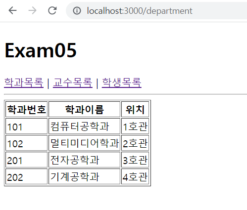
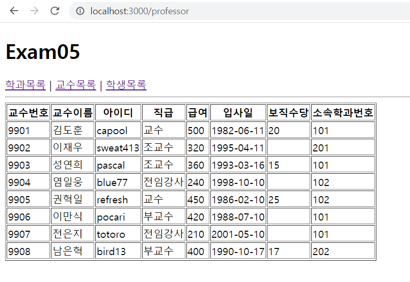
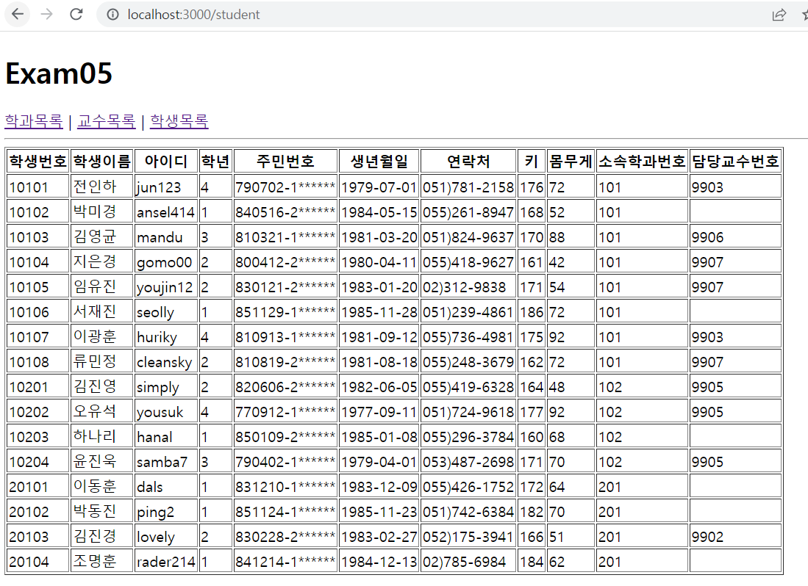

# 연습문제5

## App
```js
import React from "react";
import {Routes, Route} from 'react-router-dom'
import Department from "./pages/Department";
import Professor from "./pages/Professor";
import Student from "./pages/Student";

function App() {
  return (
    <div>
      <h1>Exam05</h1>
      <nav>
        <a href="/department">학과목록</a>&nbsp;|&nbsp;
        <a href="/professor">교수목록</a>&nbsp;|&nbsp;
        <a href="/student">학생목록</a>
      </nav>
      <hr/>
        <Routes>
          <Route path="/department" element={<Department/>} />
          <Route path="/professor" element={<Professor/>} />
          <Route path="/student" element={<Student/>} />
        </Routes>
    </div>
  );
}

export default App;
```

## pages > Department
```js
import React from "react";

import DepartmentSub from "../components/DepartmentSub";
import data from "../mySchool"; 

const Department = () => {
    return(
        <table border="1">
            <thead>
                <tr align="Center">
                    <th>학과번호</th>
                    <th>학과이름</th>
                    <th>위치</th>
                </tr>
            </thead>
            <tbody>
                {
                    data.department.map((v, i) => {
                        return(
                            <DepartmentSub id={v.id} dname={v.dname} loc={v.loc} />
                        )
                    })
                }
            </tbody>
        </table>
    )
}

export default Department;
```

## pages > Professor
```js
import React from "react";

import ProfessorSub from "../components/ProfessorSub";
import data from "../mySchool";

const Professor = () => {
    return(
        <table border="1">
            <thead align="center">
                <tr>
                    <th>교수번호</th>
                    <th>교수이름</th>
                    <th>아이디</th>
                    <th>직급</th>
                    <th>급여</th>
                    <th>입사일</th>
                    <th>보직수당</th>
                    <th>소속학과번호</th>
                </tr>
            </thead>
            <tbody>
                {
                    data.professor.map((v, i) => {
                        return (
                            <ProfessorSub id={v.id} name={v.name} userid={v.userid} position={v.position} sal={v.sal} hiredate={v.hiredate} comm={v.comm} deptno={v.deptno}/>
                        )
                    })
                }
            </tbody>
        </table>
    )
}

export default Professor;
```

## pages > Student
```js
import React from "react";

import ProfessorSub from "../components/ProfessorSub";
import data from "../mySchool";

const Professor = () => {
    return(
        <table border="1">
            <thead align="center">
                <tr>
                    <th>교수번호</th>
                    <th>교수이름</th>
                    <th>아이디</th>
                    <th>직급</th>
                    <th>급여</th>
                    <th>입사일</th>
                    <th>보직수당</th>
                    <th>소속학과번호</th>
                </tr>
            </thead>
            <tbody>
                {
                    data.professor.map((v, i) => {
                        return (
                            <ProfessorSub id={v.id} name={v.name} userid={v.userid} position={v.position} sal={v.sal} hiredate={v.hiredate} comm={v.comm} deptno={v.deptno}/>
                        )
                    })
                }
            </tbody>
        </table>
    )
}

export default Professor;
```

## components > DepartmentSub
```js
import React from "react";

const DepartmentSub = ({id, dname, loc}) => {
    return(
        <tr>
            <td >{id}</td>
            <td >{dname}</td>
            <td >{loc}</td>
        </tr>
    )
}
export default DepartmentSub
```

## components > ProfessorSub
```js
import React from "react";

const ProfessorSub = ({id, name, userid, position, sal, hiredate, comm, deptno}) => {
    return(
        <tr>
            <td>
                {id}
            </td>
            <td>
                {name}
            </td>
            <td>
                {userid}
            </td>
            <td>
                {position}
            </td>
            <td>
                {sal}
            </td>
            <td>
                {hiredate.substring(0,10)}
            </td>
            <td>
                {comm}
            </td>
            <td>
                {deptno}
            </td>
        </tr>
    )
}
export default ProfessorSub;
```

## Components > StudentSub
```js
import React from "react";

const StudentSub = ({id, name, userid, grade, idnum, birthdate, tel, height, weight, deptno,profno}) => {
    return(
        <tr>
            <td>
                {id}
            </td>
            <td>
                {name}
            </td>
            <td>
                {userid}
            </td>
            <td>
                {grade}
            </td>
            <td>
                {idnum.substring(0,6) + "-" + idnum.substring(6,7) + "******"}
            </td>
            <td>
                {birthdate.substring(0,10)}
            </td>
            <td>
                {tel}
            </td>
            <td>
                {height}
            </td>
            <td>
                {weight}
            </td>
            <td>
                {deptno}
            </td>
            <td>
                {profno}
            </td>
        </tr>
    )
}
export default StudentSub
```

## 결과


