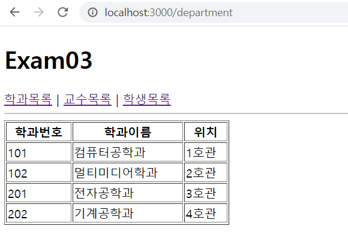
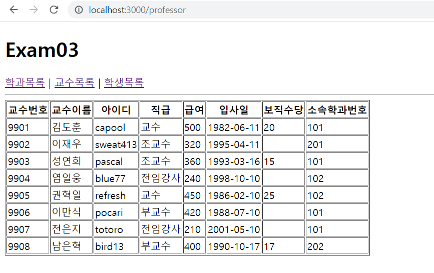
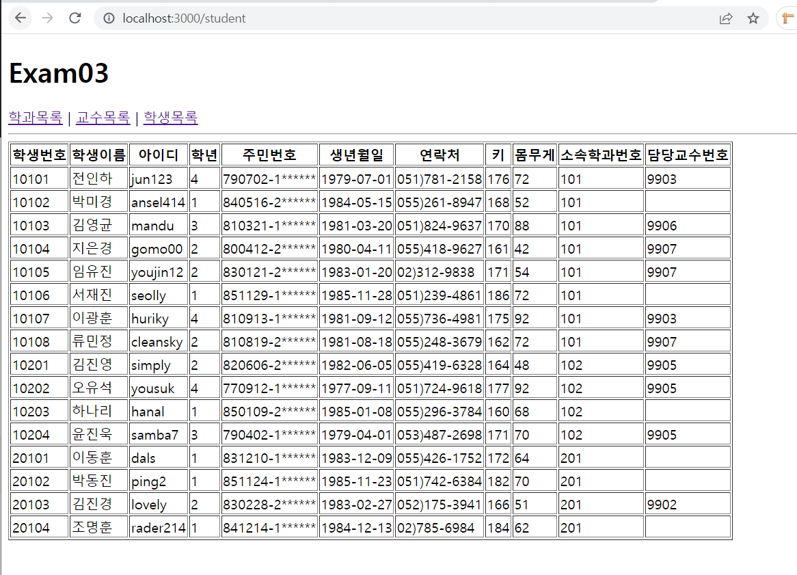

## App
```js
import React from "react";
import {Routes, Route} from "react-router-dom"

import Department from "./pages/Department"
import Professor from "./pages/Professor"
import Student from "./pages/Student"

function App() {
  return (
    <div>
      <h1>Exam03</h1>
      <nav>
        <a href="/department">학과목록</a>&nbsp;|&nbsp;
        <a href="/professor">교수목록</a>&nbsp;|&nbsp;
        <a href="/student">학생목록</a>
      </nav>
      <hr/>
        <Routes>
          <Route path="/department" element={<Department/>} />
          <Route path="/professor" element={<Professor/>} />
          <Route path="/student" element={<Student/>} />
        </Routes>
    </div>
  );
}

export default App;
```
## department

```js
import React from "react";

import mySchool from "../mySchool"

const Department = () => {
    return (
        <div>
            <table width="300px" border="1">
                <thead>
                    <tr align="Center">
                        <th>학과번호</th>
                        <th>학과이름</th>
                        <th>위치</th>
                    </tr>
                </thead>
                <tbody>
                    {
                        mySchool.department.map((item, index) => {
                            return(
                                <tr key={index + "a"}>
                                    <td key={index}>{item.id}</td>
                                    <td key={index + "b"}>{item.dname}</td>
                                    <td key={index + "c"}>{item.loc}</td>
                                </tr>
                            )
                        })
                    }
                </tbody>
            </table>
        </div>
    )
}

export default Department
```


## professor
```js
import React from "react";

import mySchool from "../mySchool"

const Professor = () => {
    return (
        <div>
            <table border="1">
                <thead align="center">
                    <tr>
                        <th>교수번호</th>
                        <th>교수이름</th>
                        <th>아이디</th>
                        <th>직급</th>
                        <th>급여</th>
                        <th>입사일</th>
                        <th>보직수당</th>
                        <th>소속학과번호</th>
                    </tr>
                </thead>
                <tbody>
                    {
                        mySchool.professor.map((item, index) => {
                            return(
                                <tr key={index}>
                                    <td key={index + 'a'}>
                                        {item.id}
                                    </td>
                                    <td key={index + 'b'}>
                                        {item.name}
                                    </td>
                                    <td key={index + 'c'}>
                                        {item.userid}
                                    </td>
                                    <td key={index + 'd'}>
                                        {item.position}
                                    </td>
                                    <td key={index + 'e'}>
                                        {item.sal}
                                    </td>
                                    <td key={index + 'f'}>
                                        {item.hiredate.substring(0,10)}
                                    </td>
                                    <td key={index + 'g'}>
                                        {item.comm}
                                    </td>
                                    <td key={index + 'h'}>
                                        {item.deptno}
                                    </td>
                                </tr>
                            )
                        })
                    }
                </tbody>
            </table>
        </div>
    )
}

export default Professor
```


## student
```js
import React from "react";

import mySchool from "../mySchool"

const Student = () => {
    return (
        <div>
            <table border="1">
                <thead align="center">
                    <tr>
                        <th>학생번호</th>
                        <th>학생이름</th>
                        <th>아이디</th>
                        <th>학년</th>
                        <th>주민번호</th>
                        <th>생년월일</th>
                        <th>연락처</th>
                        <th>키</th>
                        <th>몸무게</th>
                        <th>소속학과번호</th>
                        <th>담당교수번호</th>
                    </tr>
                </thead>
                <tbody>
                    {
                        mySchool.student.map((item, index) => {
                            return(
                                <tr key={index}>
                                    <td key={index + "a"}>
                                        {item.id}
                                    </td>
                                    <td key={index + "b"}>
                                        {item.name}
                                    </td>
                                    <td key={index + "c"}>
                                        {item.userid}
                                    </td>
                                    <td key={index + "d"}>
                                        {item.grade}
                                    </td>
                                    <td key={index + "e"}>
                                        {item.idnum.substring(0,6) + "-" + item.idnum.substring(6,7) + "******"}
                                    </td>
                                    <td key={index + "f"}>
                                        {item.birthdate.substring(0,10)}
                                    </td>
                                    <td key={index + "g"}>
                                        {item.tel}
                                    </td>
                                    <td key={index + "h"}>
                                        {item.height}
                                    </td>
                                    <td key={index + "i"}>
                                        {item.weight}
                                    </td>
                                    <td key={index + "j"}>
                                        {item.deptno}
                                    </td>
                                    <td key={index + "k"}>
                                        {item.profno}
                                    </td>
                                </tr>
                            )
                        })
                    }
                </tbody>
            </table>
        </div>
    )
}

export default Student
```


# useparams 사용하기

## App
```js
import React from "react";
import {Routes, Route} from "react-router-dom"

import Use from "./pages/Use";

function App() {
  return (
    <div>
      <h1>Exam03</h1>
      <nav>
        <a href="/department">학과목록</a>&nbsp;|&nbsp;
        <a href="/professor">교수목록</a>&nbsp;|&nbsp;
        <a href="/student">학생목록</a>
      </nav>
      <hr/>
        <Routes>
          <Route path="/:value" element={<Use/>} />
        </Routes>
    </div>
  );
}

export default App;
```

```js 
import React from "react";

import { useParams } from "react-router-dom";

import mySchool from "../mySchool"

const Use = () => {
    const site = useParams()
    if (site.value === "department") {
        return (
            <div>
                <table width="300px" border="1">
                    <thead>
                        <tr align="Center">
                            <th>학과번호</th>
                            <th>학과이름</th>
                            <th>위치</th>
                        </tr>
                    </thead>
                    <tbody>
                        {
                            mySchool.department.map((item, index) => {
                                return(
                                    <tr key={index + "a"}>
                                        <td key={index}>{item.id}</td>
                                        <td key={index + "b"}>{item.dname}</td>
                                        <td key={index + "c"}>{item.loc}</td>
                                    </tr>
                                )
                            })
                        }
                    </tbody>
                </table>
            </div>
        )
    } else if ( site.value === "professor") {
        return (
            <div>
                <table border="1">
                    <thead align="center">
                        <tr>
                            <th>교수번호</th>
                            <th>교수이름</th>
                            <th>아이디</th>
                            <th>직급</th>
                            <th>급여</th>
                            <th>입사일</th>
                            <th>보직수당</th>
                            <th>소속학과번호</th>
                        </tr>
                    </thead>
                    <tbody>
                        {
                            mySchool.professor.map((item, index) => {
                                return(
                                    <tr key={index}>
                                        <td key={index + 'a'}>
                                            {item.id}
                                        </td>
                                        <td key={index + 'b'}>
                                            {item.name}
                                        </td>
                                        <td key={index + 'c'}>
                                            {item.userid}
                                        </td>
                                        <td key={index + 'd'}>
                                            {item.position}
                                        </td>
                                        <td key={index + 'e'}>
                                            {item.sal}
                                        </td>
                                        <td key={index + 'f'}>
                                            {item.hiredate.substring(0,10)}
                                        </td>
                                        <td key={index + 'g'}>
                                            {item.comm}
                                        </td>
                                        <td key={index + 'h'}>
                                            {item.deptno}
                                        </td>
                                    </tr>
                                )
                            })
                        }
                    </tbody>
                </table>
            </div>
        )
    } else if ( site.value === "student") {
        return (
            <div>
                <table border="1">
                    <thead align="center">
                        <tr>
                            <th>학생번호</th>
                            <th>학생이름</th>
                            <th>아이디</th>
                            <th>학년</th>
                            <th>주민번호</th>
                            <th>생년월일</th>
                            <th>연락처</th>
                            <th>키</th>
                            <th>몸무게</th>
                            <th>소속학과번호</th>
                            <th>담당교수번호</th>
                        </tr>
                    </thead>
                    <tbody>
                        {
                            mySchool.student.map((item, index) => {
                                return(
                                    <tr key={index}>
                                        <td key={index + "a"}>
                                            {item.id}
                                        </td>
                                        <td key={index + "b"}>
                                            {item.name}
                                        </td>
                                        <td key={index + "c"}>
                                            {item.userid}
                                        </td>
                                        <td key={index + "d"}>
                                            {item.grade}
                                        </td>
                                        <td key={index + "e"}>
                                            {item.idnum.substring(0,6) + "-" + item.idnum.substring(6,7) + "******"}
                                        </td>
                                        <td key={index + "f"}>
                                            {item.birthdate.substring(0,10)}
                                        </td>
                                        <td key={index + "g"}>
                                            {item.tel}
                                        </td>
                                        <td key={index + "h"}>
                                            {item.height}
                                        </td>
                                        <td key={index + "i"}>
                                            {item.weight}
                                        </td>
                                        <td key={index + "j"}>
                                            {item.deptno}
                                        </td>
                                        <td key={index + "k"}>
                                            {item.profno}
                                        </td>
                                    </tr>
                                )
                            })
                        }
                    </tbody>
                </table>
            </div>
        )
    }
}

export default Use
```