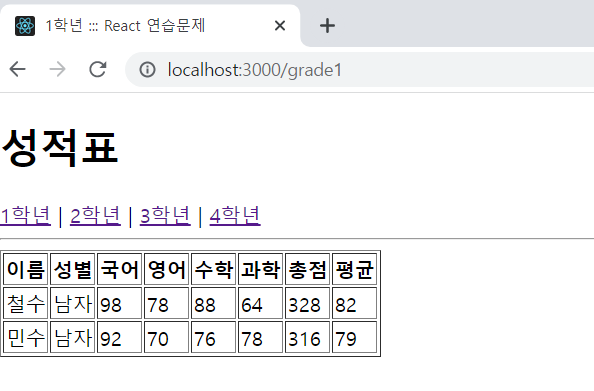
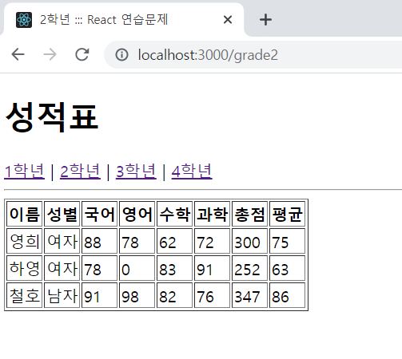
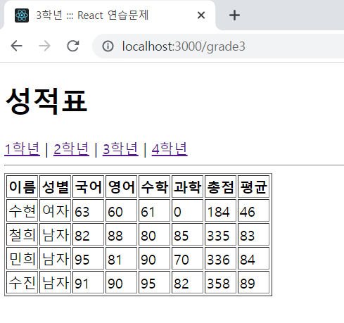
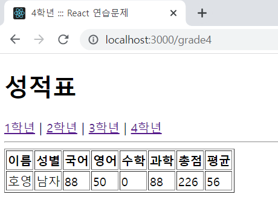

# 연습문제 04-1

## index.js
```js
import React from 'react';
import ReactDOM from 'react-dom/client';
import App from './App';
import { BrowserRouter } from 'react-router-dom';

const root = ReactDOM.createRoot(document.getElementById('root'));
root.render(
  <React.StrictMode>
    <BrowserRouter>
      <App />
    </BrowserRouter>
  </React.StrictMode>
);
```

## App.js
```js
import React from "react";
import {Link, Routes, Route} from 'react-router-dom'
import GradeData from "./GradeData"

import Grade from "./pages/Grade";
import Meta from "./components/Meta";
import { useLocation } from "react-router-dom";

function App() {
  const location = useLocation();
  const path = location.pathname;
  const pathNum = path.substring(6)
  return (
    <div>
      <Meta/>
      <h1>성적표</h1>
      <nav>
        <Link to="/grade1">1학년</Link>&nbsp;|&nbsp; 
        <Link to="/grade2">2학년</Link>&nbsp;|&nbsp;
        <Link to="/grade3">3학년</Link>&nbsp;|&nbsp;
        <Link to="/grade4">4학년</Link>
      </nav>
      <hr/>
      <Routes>
        <Route path={`/grade${pathNum}`} element={<Grade propsItems={GradeData[`${pathNum}학년`]}/>} />
      </Routes>
    </div>
  );
}

export default App;
```

## pages > grade.js
```js
import React from "react";
import GradeItem from "../components/GradeItem";
import Meta from "../components/Meta";
import { useLocation } from "react-router-dom";

const Grade = (props) => {
    const location = useLocation()
    const path = location.pathname.substring(6)
    let title = ""
    if (path === '1') {
        title = "1학년 ::: React 연습문제"
    } else if (path === '2') {
        title = '2학년 ::: React 연습문제'
    } else if (path === '3') {
        title = '3학년 ::: React 연습문제'
    } else {
        title = '4학년 ::: React 연습문제'
    }
    return(
        <table border="1">
            <Meta title={title} />
            <thead>
                <tr>
                    <th>이름</th>
                    <th>성별</th>
                    <th>국어</th>
                    <th>영어</th>
                    <th>수학</th>
                    <th>과학</th>
                    <th>총점</th>
                    <th>평균</th>
                </tr>
            </thead>
            <tbody>
                {
                    props.propsItems.map((v, i) => {
                        return(
                            <GradeItem key={i} 이름={v.이름} 성별={v.성별} 국어={v.국어} 영어={v.영어} 수학={v.수학} 과학={v.과학} />
                        )
                    })
                }
            </tbody>
        </table>
    )
}

export default Grade;
```

## components > GradeItem.js
```js
import React from "react";
import propTypes from "prop-types"

const GradeItem = (props) => {
    const sum = parseInt(props.국어 + props.영어 + props.수학 + props.과학)
    const avg = parseInt(sum / 4)
    return (
        <tr>
            <td>{props.이름}</td>
            <td>{props.성별}</td>
            <td>{props.국어}</td>
            <td>{props.영어}</td>
            <td>{props.수학}</td>
            <td>{props.과학}</td>
            <td>{sum}</td>
            <td>{avg}</td>
        </tr>
    )
}

GradeItem.propTypes = {
    이름: propTypes.string,
    성별: propTypes.string,
    국어: propTypes.number,
    영어: propTypes.number,
    수학: propTypes.number,
    과학: propTypes.number,
}

GradeItem.defaultProps = {
    국어: 0,
    영어: 0,
    수학: 0,
    과학: 0
}
export default GradeItem;
```

## components > Meta.js
```js
import React from "react";
import Helmet from "react-helmet";

const Meta = (props) => {
    return(
        <Helmet>
            <meta charSet="utf-8"/>
            <title>{props.title}</title>
        </Helmet>
    )
}

Meta.defaultProps = {
    title: "React 연습문제"
}

export default Meta;
```

## 결과



