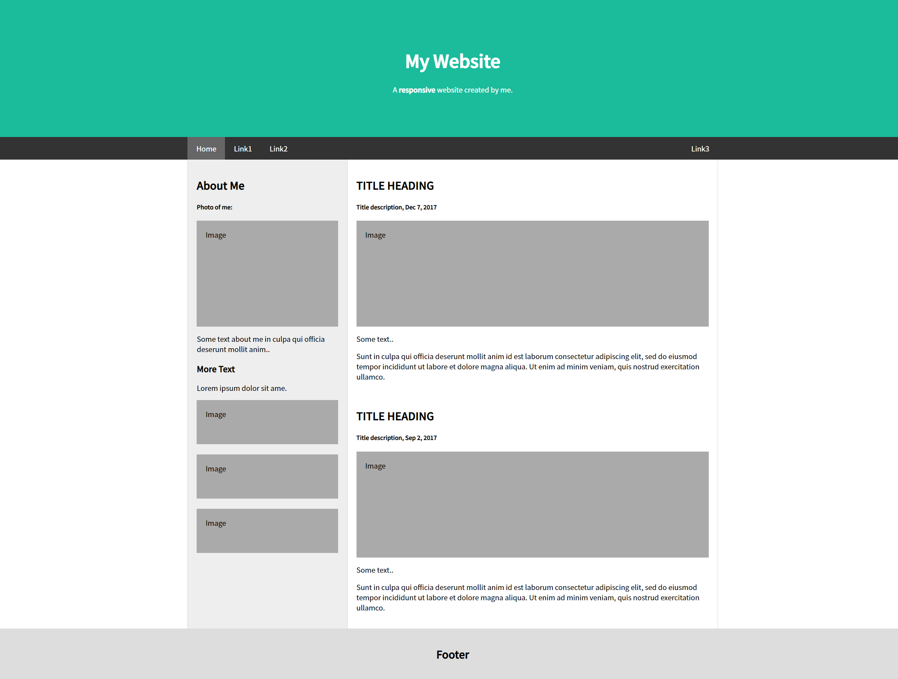

# 연습문제5

## index.js
```js
import React from 'react';
import ReactDOM from 'react-dom/client';
import App from './App';
import { BrowserRouter } from 'react-router-dom';

const root = ReactDOM.createRoot(document.getElementById('root'));
root.render(
  <React.StrictMode>
    <BrowserRouter>
      <App />
    </BrowserRouter>
  </React.StrictMode>
);
```

## App.js
```js
import React from "react";
import Helmet from "react-helmet";
import styled,{ createGlobalStyle} from "styled-components";

import Header from "./pages/Header"
import Content from "./pages/Content"
import Footer from "./pages/Footer"
const Global = createGlobalStyle`
  * {
    font-family: 'Noto Sans KR';
  }
  body {
    padding: 0;
    margin: 0;
  }
`
const Main = styled.div`
  font-family: 'Noto Sans KR';
  padding: 0;
  margin: 0;
  .header {
    .jumbotron {
      padding: 80px;
      text-align: center;
      background: #1abc9c;
      color: white;
      
      h1 {
        font-size: 40px;
      }
    }
  }
  .navbar {
    overflow: hidden;
    background-color: #333;
    position: sticky;
    top: 0;
    
    nav {
      max-width: 1200px;
      margin: auto;
      display: flex;
      flex-direction: row;
      flex-wrap: nowrap;
      justify-content: flex-start;

      a {
        display: block;
        color: white;
        text-align: center;
        padding: 14px 20px;
        text-decoration: none;

        &.right {
          margin-left: auto;
        }
        &:hover {
          background-color: #ddd;
          color: black;
        }
        &.isActive {
          background-color: #666;
          color: white;
        }
      }
    }
  }

  .content {
    max-width: 1200px;
    margin: auto;
    background-color: #eee;
    display: flex;
    flex-wrap: nowrap;
    flex-direction: row;

    .side {
      width: 360px;
      flex: none;
      border-left: 1px solid #d5d5d5;
      border-right: 1px solid #d5d5d5;
    }

    .main {
      flex: 0 1 auto;
      background-color: white;
      border-right: 1px solid #d5d5d5;
    }

    .container {
      padding: 20px;
    }

    .fakeimg {
      background-color: #aaa;
      width: auto;
      padding: 20px;
      
    }
  }

  .footer {
    padding: 20px;
    text-align: center;
    background: #ddd;
  }
`
function App() {
  return (
    <div>
      <Global/>
      <Helmet>
        <link rel="preconnect" href="https://fonts.googleapis.com"/>
        <link rel="preconnect" href="https://fonts.gstatic.com" crossorigin/>
        <link href="https://fonts.googleapis.com/css2?family=Gugi&family=Noto+Sans+KR:wght@100;300;400;500&display=swap" rel="stylesheet"/>
      </Helmet>
      <Main>
        <Header />
        <Content />
        <Footer />
      </Main>
    </div>
  );
}

export default App;
```

## Header.js
```js
import React from "react";
import { NavLink } from "react-router-dom";

const Header = () => {
    return (
        <div>
            <div className="header">
                <div className="jumbotron">
                    <h1>My Website</h1>
                    <p>A <b>responsive</b> website created by me.</p>
                </div>
            </div>
            
            <div className="navbar">
                <nav>
                    <NavLink to="#" className="isActive">Home</NavLink>
                    <NavLink to="#">Link1</NavLink>
                    <NavLink to="#">Link2</NavLink>
                    <NavLink to="#" className="right">Link3</NavLink>
                </nav>
            </div>
        </div>
    )
}

export default Header;
```

## Content.js
```js
import React from "react";
import Main from "../components/Main";
import Side from "../components/Side";

const Content = () => {
    return(
        <div className="content">
            <Side />
            <Main />
        </div>
    )
}

export default Content;
```

## Side.js
```js
import React from "react";

const Side = () => {
    return(
        <div className="side">
            <div className="container">
                <h2>About Me</h2>
                <h5>Photo of me:</h5>
                <div className="fakeimg" style={{height: "200px"}}>Image</div>
                <p>Some text about me in culpa qui officia deserunt mollit anim..</p>
                <h3>More Text</h3>
                <p>Lorem ipsum dolor sit ame.</p>
                <div className="fakeimg" style={{height: "60px"}}>Image</div>
                <br />
                <div className="fakeimg" style={{height: "60px"}}>Image</div>
                <br />
                <div className="fakeimg" style={{height: "60px"}}>Image</div>
            </div>
        </div>
    )
}

export default Side;
```

## Main.js
```js
import React from "react";

const Main = () => {
    return(
        <div className="main">
            <div className="container">
                <h2>TITLE HEADING</h2>
                <h5>Title description, Dec 7, 2017</h5>
                <div className="fakeimg" style={{height: "200px"}}>Image</div>
                <p>Some text..</p>
                <p>Sunt in culpa qui officia deserunt mollit anim id est laborum consectetur adipiscing elit, sed do eiusmod tempor incididunt ut labore et dolore magna aliqua. Ut enim ad minim veniam, quis nostrud exercitation ullamco.</p>
                <br />
                <h2>TITLE HEADING</h2>
                <h5>Title description, Sep 2, 2017</h5>
                <div className="fakeimg" style={{height: "200px"}}>Image</div>
                <p>Some text..</p>
                <p>Sunt in culpa qui officia deserunt mollit anim id est laborum consectetur adipiscing elit, sed do eiusmod tempor incididunt ut labore et dolore magna aliqua. Ut enim ad minim veniam, quis nostrud exercitation ullamco.</p>
            </div>
        </div>
    )
}

export default Main;
```

## Footer.js
```js
import React from "react";

const Footer = () => {
    return(
        <div className="footer">
            <h2>Footer</h2>
        </div>
    )
}

export default Footer;
```

# 결과
