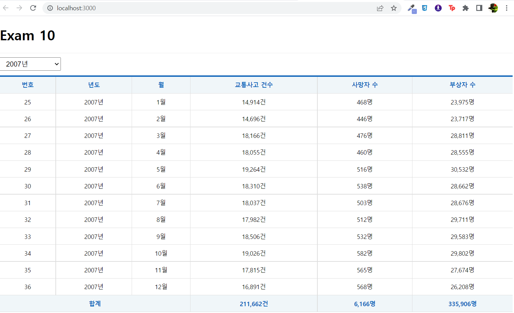

# 22.05.17_신지섭
## 연습문제 10

### App.js
```js
import React from 'react'
import styled from 'styled-components'
//components
import Spinner from "./components/Spinner";
import Table from './components/Table';
//hooks
import useMountedRef from "./hooks/useMountedRef";
//Axios 기능 제공 hook
import useAxios from 'axios-hooks'

/** 드롭다운을 배치하기 위한 박스 */
  const SelectContainer = styled.div`
    position: sticky;
    top: 0;
    background-color: #fff;
    border-top: 1px solid #eee;
    border-bottom: 1px solid #eee;
    padding: 10px 0;
    margin: 0;

    select {
        margin-right: 15px;
        font-size: 16px;
        padding: 5px 10px;
    }
`
const URL = 'http://localhost:3001/traffic_acc'
function App() {
  // 교통사고 데이터를 Ajax로 가져온다.
  const [{data, loading, error}, refetch] = useAxios(URL);
  //각 드롭다운의 선택 상태를 저장하기 위한 상태변수
  const [year, setYear] = React.useState({
    year: ''
  });

  const mountedRef = useMountedRef();
//총합 구하기
  let totalAcc = 0;
  let totalDeath = 0;
  let totalInjury = 0;
  const onChange = React.useCallback( e=> {
    e.preventDefault();

    //드롭다운의 입력값 취득
    const current = e.target;
    const key = current.name;
    const value = current[current.selectedIndex].value;

    const newYear = {...year, [key]: value}
    
    setYear(newYear)
  },[year])
  React.useEffect(()=> {
    if(mountedRef.current) {
      const params = {}
        for (const key in year) {
          if (year[key]) {
            params[key] = year[key];
          }
        }
      refetch({
        params : year
      })
    }
  }, [mountedRef, refetch, year])
  /** 에러가 발생했다면 에러 메시지를 표시한다. */
  if (error) {
    console.error(error);

    return (
      <div>
        <h1>{error.code} Error.</h1>
        <hr/>
        <p>{error.message}</p>
      </div>
    )
  }
  return (
    <div>
      <Spinner visible={loading}/>
      <h1>Exam 10</h1>
      <SelectContainer>
        <select name="year" onChange={onChange}>
          <option value="">-- 년도 선택 --</option>
          <option value="2005">2005년</option>
          <option value="2006">2006년</option>
          <option value="2007">2007년</option>
          <option value="2008">2008년</option>
          <option value="2009">2009년</option>
          <option value="2010">2010년</option>
          <option value="2011">2011년</option>
          <option value="2012">2012년</option>
          <option value="2013">2013년</option>
          <option value="2014">2014년</option>
          <option value="2015">2015년</option>
          <option value="2016">2016년</option>
          <option value="2017">2017년</option>
          <option value="2018">2018년</option>
        </select>
      </SelectContainer>
      <Table>
        <thead>
          <tr>
            <th>번호</th>
            <th>년도</th>
            <th>월</th>
            <th>교통사고 건수</th>
            <th>사망자 수</th>
            <th>부상자 수</th>
          </tr>
        </thead>
        <tbody>
          {data && data.map(({
            id, year, month, accident, death, injury
          }, i) => {
            totalAcc += accident;
            totalDeath += death;
            totalInjury += injury
            return (
              <tr key={id}>
                <td>{id}</td>
                <td>{year}년</td>
                <td>{month}월</td>
                <td>{accident.toLocaleString('ko-KR')}건</td>
                <td>{death.toLocaleString('ko-KR')}명</td>
                <td>{injury.toLocaleString('ko-KR')}명</td>
              </tr>
            )
          })}
        </tbody>
        <tfoot>
          <tr>
            <th colSpan="3">합계</th>
            <th>{totalAcc.toLocaleString('ko-KR')}건</th>
            <th>{totalDeath.toLocaleString('ko-KR')}명</th>
            <th>{totalInjury.toLocaleString('ko-KR')}명</th>
          </tr>
        </tfoot>
      </Table>
    </div>
  );
}

export default React.memo(App);
```

### Spinner.js
```js
import React from 'react';
import PropTypes from "prop-types"
import styled from 'styled-components';

/** 로딩바 컴포넌트 */
// --> https://mhnpd.github.io/react-loader-spinner/
import {Bars} from 'react-loader-spinner'

/** 로딩바 뒤에 표시될 반투명 막 */
const TransLayer = styled.div`
    position: fixed;
    left: 0;
    right: 0;
    z-index: 9999;
    background-color: #0003;
    width: 100%;
    height: 100%;
`
const Spinner = ({ visible, color, width, height }) => {
    return (
        <div>
            {visible &&
                <TransLayer>
                    <Bars
                        color={color}
                        height={height}
                        width={width}
                        wrapperStyle={{
                            position: 'absolute',
                            zIndex: 10000,
                            left: '50%',
                            top: '50%',
                            marginLeft: (-width/2)+'px',
                            marginTop: (-height/2)+'px'
                        }}
                    />
                </TransLayer>
            }
        </div>
    );
};

/**기본값 정의 */
Spinner.defaultProps = {
    visible: false,
    color: '#06f',
    width: 100,
    height: 100
};

/** 데이터 타입 설정 */
Spinner.propTypes = {
    visible: PropTypes.bool.isRequired,
    color: PropTypes.string,
    width: PropTypes.number,
    height: PropTypes.number,
}

export default Spinner;
```
### Table.js
```js
import styled from 'styled-components';

/** 표에 CSS를 적용한 styledComponents */
const Table = styled.table`
    border-collapse: collapse;
    border-top: 3px solid #16B;
    font-size: 14px;
    text-align: center;
    margin: auto;
    width: 100%;

    th {
        color: #16B;
        background: #f0f6f9;
        padding: 10px;
        border: 1px solid #ddd;

        &:first-child {
            border-left: 0;
        }

        &:last-child {
            border-right: 0;
        }
    }

    td {
        padding: 10px;
        border: 1px solid #ddd;
        &:first-child {
            border-left: 0;
        }
        &:last-child {
            border-right: 0;
        }
    }
`

export default Table;
```

### useMountedRef.js
```js
import React from 'react';

/** 페이지 로딩이 완료되었음을 감지하기 위한 커스텀 훅 */
const useMountedRef = () => {
    const mountedRef = React.useRef(false);
    React.useEffect(() => {
        setTimeout(() => {
            mountedRef.current = true;
        })
    }, []);

    return mountedRef;
};

export default useMountedRef;
```

### 결과
