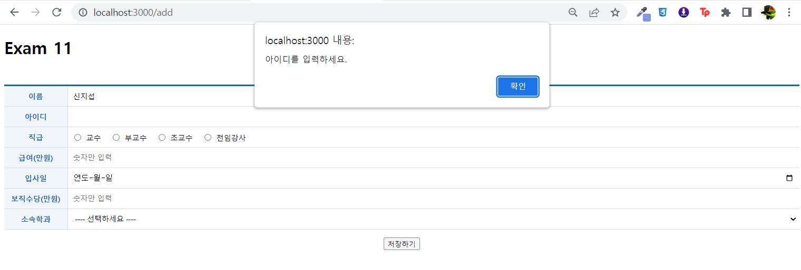
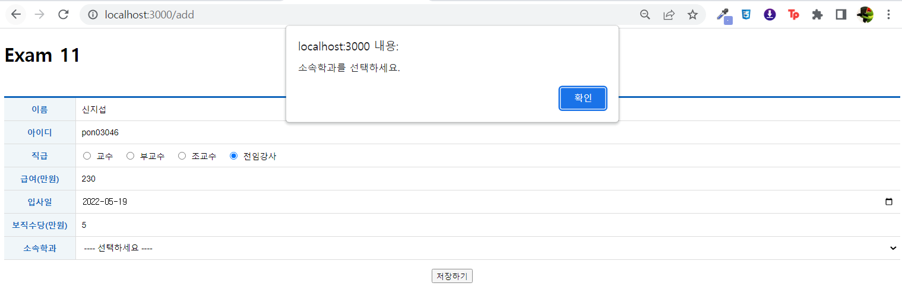

# exam 11
## index.js
```js
import React from 'react';
import ReactDOM from 'react-dom/client';
import { BrowserRouter } from 'react-router-dom';
import App from './App';

const root = ReactDOM.createRoot(document.getElementById('root'));
root.render(
  <React.StrictMode>
    <BrowserRouter>
      <App />
    </BrowserRouter>
  </React.StrictMode>
);
```
## App.js
```js
import React from "react";
import {Routes, Route} from 'react-router-dom'

import ProfessorList from "./pages/ProfessorList";
import ProfessorAdd from "./pages/ProfessorAdd";
import ProfessorEdit from "./pages/ProfessorEdit";
function App() {
  return (
    <div>
      <h1>Exam 11</h1>

      <Routes>
        <Route path="/" exact={true} element={<ProfessorList/>}/>
        <Route path="/add" element={<ProfessorAdd/>}/>
        <Route path="/edit/:id" element={<ProfessorEdit/>}/>
      </Routes>
    </div>
  );
}

export default App;
```
## pages > ProfessorList.js
```js
import React from 'react';
import useAxios from 'axios-hooks';
import styled from 'styled-components';
import { NavLink } from 'react-router-dom';
import dayjs from 'dayjs';

import Spinner from '../components/Spinner';
import Table from "../components/Table";
const LinkContainer = styled.div`
    position: sticky;
    top: 0;
    background-color: #fff;
    border-top: 1px solid #eee;
    border-bottom: 1px solid #eee;
    padding: 10px 0;
`;
const TopLink = styled(NavLink)`
    margin-right: 15px;
    display: inline-block;
    font-size: 16px;
    padding: 7px 10px 5px 10px;
    background-color: #fff;
    color: #000;
    text-decoration: none;

    &:hover {
        background-color: #06f2;
    }
`

const ProfessorList = () => {
    // data를 담기위해 useState생성
    const [professor, setProfessor] = React.useState([]);
    // useAxios
    const [{data, loading, error}, refetch] = useAxios("http://localhost:3001/professor", {
        useCache: false
    })
    // data가 변하면 실행
    React.useEffect(() => {
        setProfessor(data)
    },[data])
    //삭제기능 구현 - 자체 캐시기능 방지, 삭제 버튼 이벤트에 의해 호출되어야 하므로 메뉴얼 실행 모드
    const [{ loading2 }, sendDelete] = useAxios({
        method: 'DELETE'
    }, {
        useCache: false,
        manual: true
    })
    // 삭제 버튼 클릭시 이벤트
    const onDeleteClick = (e) => {
        e.preventDefault();
        const current = e.target;

        const id = parseInt(current.dataset.id);
        const name = current.dataset.name;
        if (window.confirm(`정말 ${name} 교수의 정보를 삭제하시겠습니까?`)) {
            (async () => {
                let json = null;
                try {
                    const response = await sendDelete({
                        method:'DELETE',
                        url: `http://localhost:3001/professor/${id}`
                    })
                    json = response.data
                } catch(e) {
                    console.error(e)
                    window.alert(`[${e.response.status}] ${e.response.statusText}\n${e.message}`);
                }
                if(json !== null) {
                    setProfessor(professor => professor.filter((v, i) => v.id !== id));
                }
            })()
        }
    }
    return (
        <div>
           <Spinner visible={loading || loading2}/>

           <LinkContainer>
                <TopLink to="add">교수 등록하기</TopLink>
            </LinkContainer>
            {error ? (
                <div>
                    <h1>Oops~!!! {error.code} Error.</h1>
                    <hr/>
                    <p>{error.message}</p>
                </div>
            ) : (
            <Table>
                <thead>
                    <tr>
                        <th>No.</th>
                        <th>이름</th>
                        <th>아이디</th>
                        <th>직급</th>
                        <th>급여</th>
                        <th>입사일</th>
                        <th>보직수당</th>
                        <th>소속학과번호</th>
                        <th>수정</th>
                        <th>삭제</th>
                    </tr>
                </thead>
                <tbody>
                    {professor&& professor.map(({id, name, userid, position, sal, hiredate, comm, deptno}, i) => {
                        return(
                            <tr key={id} align="center">
                                <td>{id}</td>
                                <td>{name}</td>
                                <td>{userid}</td>
                                <td>{position}</td>
                                <td>{sal}만원</td>
                                <td>{dayjs(hiredate).format('YY/MM/DD')}</td>
                                <td>{comm && `${comm}만원`}</td>
                                <td>{deptno}</td>
                                <td>
                                    <NavLink to={`edit/${id}`}>수정하기</NavLink>
                                </td>
                                <td>
                                    <a href="#!" data-id={id} data-name={name} onClick={onDeleteClick}>삭제하기</a>
                                </td>
                            </tr>
                        )
                    })}
                </tbody>
            </Table>
            )}    

        </div>
    );
};

export default React.memo(ProfessorList);
```
#### ProfessorList > 삭제하기


## pages > ProfessorList.js (Object.keys사용)
```js
import React from 'react';
import useAxios from 'axios-hooks';
import styled from 'styled-components';
import { NavLink } from 'react-router-dom';
import dayjs from 'dayjs';

import Spinner from '../components/Spinner';
import Table from "../components/Table";
const LinkContainer = styled.div`
    position: sticky;
    top: 0;
    background-color: #fff;
    border-top: 1px solid #eee;
    border-bottom: 1px solid #eee;
    padding: 10px 0;
`;
const TopLink = styled(NavLink)`
    margin-right: 15px;
    display: inline-block;
    font-size: 16px;
    padding: 7px 10px 5px 10px;
    background-color: #fff;
    color: #000;
    text-decoration: none;

    &:hover {
        background-color: #06f2;
    }
`

const ProfessorList = () => {
    // data를 담기위해 useState생성
    const [professor, setProfessor] = React.useState([]);
    // useAxios
    const [{data, loading, error}, refetch] = useAxios("http://localhost:3001/professor", {
        useCache: false
    })
    // data가 변하면 실행
    React.useEffect(() => {
        setProfessor(data)
    },[data])
    //삭제기능 구현 - 자체 캐시기능 방지, 삭제 버튼 이벤트에 의해 호출되어야 하므로 메뉴얼 실행 모드
    const [{ loading2 }, sendDelete] = useAxios({
        method: 'DELETE'
    }, {
        useCache: false,
        manual: true
    })
    // 삭제 버튼 클릭시 이벤트
    const onDeleteClick = (e) => {
        e.preventDefault();
        const current = e.target;

        const id = parseInt(current.dataset.id);
        const name = current.dataset.name;
        if (window.confirm(`정말 ${name} 교수의 정보를 삭제하시겠습니까?`)) {
            (async () => {
                let json = null;
                try {
                    const response = await sendDelete({
                        method:'DELETE',
                        url: `http://localhost:3001/professor/${id}`
                    })
                    json = response.data
                } catch(e) {
                    console.error(e)
                    window.alert(`[${e.response.status}] ${e.response.statusText}\n${e.message}`);
                }
                if(json !== null) {
                    setProfessor(professor => professor.filter((v, i) => v.id !== id));
                }
            })()
        }
    }
    return (
        <div>
           <Spinner visible={loading || loading2}/>

           <LinkContainer>
                <TopLink to="add">교수 등록하기</TopLink>
            </LinkContainer>
            {error ? (
                <div>
                    <h1>Oops~!!! {error.code} Error.</h1>
                    <hr/>
                    <p>{error.message}</p>
                </div>
            ) : (
            <Table>
                <thead>
                    <tr>
                        <th>No.</th>
                        <th>이름</th>
                        <th>아이디</th>
                        <th>직급</th>
                        <th>급여</th>
                        <th>입사일</th>
                        <th>보직수당</th>
                        <th>소속학과번호</th>
                        <th>수정</th>
                        <th>삭제</th>
                    </tr>
                </thead>
                <tbody>
                    {professor&& professor.map((v, i) => {
                        let index = []
                        for (let x in v) {
                            index.push(x);
                        }
                        if (index.pop() === "id") {
                            return (
                                <tr key={v.id}>
                                    <td>{v.id}</td>
                                    {Object.keys(v).map((item, j) => {
                                        let value = v[item]
                                        if (item === "hiredate") {
                                            value = dayjs(value).format('YY/MM/DD')
                                        } else if (item === 'sal') {
                                            value = `${value}만원`
                                        } else if ( item === "comm" && v["comm"]){
                                            value = `${value}만원`
                                        } else if (item === "id") {
                                            return
                                        }
                                        return (
                                            <td>
                                                {value}
                                            </td>
                                        )
                                    })}
                                    <td>
                                        <NavLink to={`edit/${v.id}`}>수정하기</NavLink>
                                    </td>
                                    <td>
                                        <a href="#!" data-id={v.id} data-name={v.name} onClick={onDeleteClick}>삭제하기</a>
                                    </td>
                                </tr>

                            )
                        } else {
                            return(
                                <tr key={v.id} align="center">
                                    {Object.keys(v).map((item, k) => {
                                        let value = v[item]
                                        if (item === "hiredate") {
                                            value = dayjs(value).format('YY/MM/DD')
                                        } else if (item === 'sal') {
                                            value = `${value}만원`
                                        } else if ( item === "comm" && v["comm"]){
                                            value = `${value}만원`
                                        }
                                        return (
                                            <td>{value}</td>
                                        )
                                    })}
                                    <td>
                                        <NavLink to={`edit/${v.id}`}>수정하기</NavLink>
                                    </td>
                                    <td>
                                        <a href="#!" data-id={v.id} data-name={v.name} onClick={onDeleteClick}>삭제하기</a>
                                    </td>
                                </tr>
                            )
                        }
                    })}
                </tbody>
            </Table>
            )}    

        </div>
    );
};

export default React.memo(ProfessorList);
```
## pages > ProfessorAdd.js
```js
import React from 'react';
import useAxios from 'axios-hooks';
import styled from 'styled-components';
import { useNavigate } from 'react-router-dom';

import Spinner from '../components/Spinner';
import Table from "../components/Table";

import regexHelper from '../libs/RegexHelper'
//Table 컴포넌트의 CSS를 확장한 컴포넌트
const TableEx = styled(Table)`
    margin-top: 50px;
    margin-bottom: 15px;

    .inputWrapper {
        padding: 0;
        position: relative;
        text-align: left;
        
        .field {
            box-sizing: border-box;
            display: block;
            position: absolute;
            left: 0;
            top: 0;
            width: 100%;
            height: 100%;
            border: 0;
            padding: 0 10px;
            outline: none;
            font-size: 14px;
        }

        label {
            margin-left: 7px;
            margin-right: 10px;

            input {
                margin-right: 10px;
            }
        }
    }
`
const ProfessorAdd = () => {
    //페이지 강제 이동
    const navigate = useNavigate();
    //useAxios - post
    const [{loading}, refetch] = useAxios({
        url: 'http://localhost:3001/professor',
        method: 'POST'
    }, {manual: true});
    //useAxios - select를 위해 department값 가져오기
    const [{data, loading2}] = useAxios('http://localhost:3001/department')
    const [department, setDepartment] = React.useState();
    React.useEffect((e) => {
        setDepartment(data);
    },[data])
    const onSubmit = e => {
        e.preventDefault();
        const current = e.target;
        //유효성 검사
        try {
            //이름
            regexHelper.value(current.name, "이름을 입력하세요.");
            regexHelper.kor(current.name, "이름은 한글만 입력하세요.")
            regexHelper.minLength(current.name, 2, "최소 2글자 이상 입력하세요.")
            regexHelper.maxLength(current.name, 10, "최대 10글자 이하 입력하세요.")
            //아이디
            regexHelper.value(current.userid, "아이디를 입력하세요.");
            regexHelper.engNum(current.userid, "영어와 숫자의 조합만 가능합니다.")
            regexHelper.minLength(current.userid, 2, "최소 2글자 이상 입력하세요.")
            regexHelper.maxLength(current.userid, 20, "최대 20글자 이하 입력하세요.")
            //직급
            regexHelper.check(current.position, "직급을 선택하세요.");
            //급여
            regexHelper.value(current.sal, "급여를 입력하세요.");
            regexHelper.num(current.sal, '급여는 숫자만 입력 가능합니다..');
            //입사일
            regexHelper.value(current.hiredate, "입사일을 입력하세요.");
            //보직수당
            regexHelper.value(current.comm, "보직수당을 입력하세요.");
            regexHelper.num(current.comm, "보직수당은 숫자만 입력 가능합니다.")
            //소속학과
            regexHelper.value(current.deptno, "소속학과를 선택하세요.");
        } catch(e) {
            window.alert(e.message);
            e.field.focus();
            return;
        }
        const name = current.name.value;
        const userid = current.userid.value;
        const position = current.position.value;
        const sal = parseInt(current.sal.value);
        const hiredate = current.hiredate.value;
        const comm = parseInt(current.comm.value);
        const deptno = parseInt(current.deptno.value);
        (async () => {
            let json = null;
            try {
                const response = await refetch({
                    data: {
                        name: name,
                        userid: userid,
                        position: position,
                        sal: sal,
                        hiredate: hiredate,
                        comm: comm,
                        deptno: deptno
                    }
                })
                json = response.data
            }catch(e) {
                console.error(e);
                window.alert(`[${e.response.status}] ${e.response.statusText}\n${e.message}`);
            }
            if(json !== null){
                window.alert('저장 되었습니다.')
                navigate('/');
            }
        })()

    }
    
    return (
        <div>
            <Spinner visible={loading || loading2}/>
            <form onSubmit={onSubmit}>
                <TableEx>
                    <colgroup>
                        <col width="120"/>
                        <col/>
                    </colgroup>
                    <tbody>
                        <tr>
                            <th>이름</th>
                            <td className="inputWrapper">
                                <input className="field" type="text" name="name"/>
                            </td>
                        </tr>
                        <tr>
                            <th>아이디</th>
                            <td className="inputWrapper">
                                <input className="field" type="text" name="userid"/>
                            </td>
                        </tr>
                        <tr>
                            <th>직급</th>
                            <td className="inputWrapper">
                                <label><input type="radio" name="position" value="교수"/>교수</label>
                                <label><input type="radio" name="position" value="부교수"/>부교수</label>
                                <label><input type="radio" name="position" value="조교수"/>조교수</label>
                                <label><input type="radio" name="position" value="전임강사"/>전임강사</label>
                            </td>
                        </tr>
                        <tr>
                            <th>급여(만원)</th>
                            <td className="inputWrapper">
                                <input className="field" type="number" name="sal" placeholder='숫자만 입력' />
                            </td>
                        </tr>
                        <tr>
                            <th>입사일</th>
                            <td className="inputWrapper">
                                <input className="field" type="date" name="hiredate"/>
                            </td>
                        </tr>
                        <tr>
                            <th>보직수당(만원)</th>
                            <td className="inputWrapper">
                                <input className="field" type="number" name="comm" placeholder='숫자만 입력'/>
                            </td>
                        </tr>
                        <tr>
                            <th>소속학과</th>
                            <td className="inputWrapper">
                                <select name="deptno" className="field">
                                    <option value="">---- 선택하세요 ----</option>
                                    {department && department.map((v, i) => {
                                        return(
                                            <option key={i} value={v.id}>{v.dname}</option>
                                        )
                                    })}
                                </select>
                            </td>
                        </tr>
                    </tbody>
                </TableEx>
                <div style={{ textAlign: 'center'}}>
                    <button type='submit'>저장하기</button>
                </div>
            </form>
        </div>
    );
};

export default React.memo(ProfessorAdd);
```


#### 유효성 검사
1. 이름<br/>
이름 입력 없음

영어 입력

이름 2자 미만

이름 10자 초과

<br/>

2. 아이디<br/>
아이디 입력 없음

한글 입력

아이디 2자 미만

아이디 20자 초과

<br/>

3. 직급<br/>
직급 입력 없음

<br/>

4. 급여<br/>
급여 입력 없음

<br/>

5. 입사일<br/>
입사일 입력 없음

<br/>

6. 보직수당<br/>
보직수당 입력 없음

<br/>

7. 소속학과<br/>
소속학과 입력 없음


## pages > ProfessorEdit.js
```js
import React from 'react';
import useAxios from 'axios-hooks';
import styled from 'styled-components';
import { useNavigate, useParams } from 'react-router-dom';

import Spinner from '../components/Spinner';
import Table from "../components/Table";

import regexHelper from '../libs/RegexHelper'

const TableEx = styled(Table)`
    margin-top: 50px;
    margin-bottom: 15px;

    .inputWrapper {
        padding: 0;
        position: relative;
        text-align: left;
        
        .field {
            box-sizing: border-box;
            display: block;
            position: absolute;
            left: 0;
            top: 0;
            width: 100%;
            height: 100%;
            border: 0;
            padding: 0 10px;
            outline: none;
            font-size: 14px;
        }

        label {
            margin-left: 7px;
            margin-right: 10px;

            input {
                margin-right: 10px;
            }
        }
    }
`

const ProfessorEdit = () => {
    const navigate = useNavigate();
    const { id } = useParams();
    //수정할 data 가져오기
    const [{data: professorData, loading: loading1, error: professorError}, refetch] = useAxios(`http://localhost:3001/professor/${id}`);
    //select 목록을 위해 department 데이터 가져오기
    const [{data: departmentData, loading: loading2 , error: departmentError}] = useAxios('http://localhost:3001/department');
    const [department, setDepartment] = React.useState();
    React.useEffect(() => {
        setDepartment(departmentData)
    },[departmentData])
    const onSubmit = (e) => {
        e.preventDefault();
        const current = e.target;
        const name = current.name.value;
        const userid = current.userid.value;
        const position = current.position.value;
        const sal = parseInt(current.sal.value);
        const hiredate = current.hiredate.value;
        const comm = parseInt(current.comm.value);
        const deptno = parseInt(current.deptno.value)
        //유효성 검사
        try {
            //이름
            regexHelper.value(current.name, "이름을 입력하세요.");
            regexHelper.kor(current.name, "이름은 한글만 입력하세요.")
            regexHelper.minLength(current.name, 2, "최소 2글자 이상 입력하세요.")
            regexHelper.maxLength(current.name, 10, "최대 10글자 이하 입력하세요.")
            //아이디
            regexHelper.value(current.userid, "아이디를 입력하세요.");
            regexHelper.engNum(current.userid, "영어와 숫자의 조합만 가능합니다.")
            regexHelper.minLength(current.userid, 2, "최소 2글자 이상 입력하세요.")
            regexHelper.maxLength(current.userid, 20, "최대 20글자 이하 입력하세요.")
            //직급
            regexHelper.check(current.position, '성별을 선택하세요.');
            //급여
            regexHelper.value(current.sal, "급여를 입력하세요.");
            regexHelper.num(current.sal, '급여는 숫자만 입력 가능합니다.');
            //입사일
            regexHelper.value(current.hiredate, "입사일을 입력하세요.");
            //보직수당
            regexHelper.value(current.comm, "보직수당을 입력하세요.");
            regexHelper.num(current.comm, "보직수당은 숫자만 입력 가능합니다.")
            //소속학과
            regexHelper.value(current.deptno, "소속학과를 선택하세요.");
        } catch(e) {
            window.alert(e.message);
            e.field.focus();
            return;
        }

        (async () => {
            let json = null;
            try {
                const response = await refetch({
                    method: 'PUT',
                    data: {
                        name: name,
                        userid: userid,
                        position: position,
                        sal: sal,
                        hiredate: hiredate,
                        comm: comm,
                        deptno: deptno
                    }
                })
                json = response.data
            } catch(e) {
                console.error(e);
                window.alert(`[${e.response.status}] ${e.response.statusText}\n${e.message}`);
            }
            if (json !== null) {
                window.alert('수정 되었습니다.');
                navigate('/');
            }
        })()
    }
    return (
        <div>
            <Spinner visible={loading1 || loading2} />
            {professorError || departmentError ? (
                <div>
                    <h1>Oops~!!! {professorError.code || departmentError.code} Error.</h1>
                    <hr/>
                    <p>{professorError.message || departmentError.message}</p>
                </div>
            ) : (
                professorData &&
                <form onSubmit={onSubmit}>
                    <TableEx>
                        <colgroup>
                            <col width="120"/>
                            <col/>
                        </colgroup>
                        <tbody>
                            <tr>
                                <th>이름</th>
                                <td className="inputWrapper">
                                    <input className="field" type="text" name="name" defaultValue={professorData.name}/>
                                </td>
                            </tr>
                            <tr>
                                <th>아이디</th>
                                <td className="inputWrapper">
                                    <input className="field" type="text" name="userid" defaultValue={professorData.userid}/>
                                </td>
                            </tr>
                            <tr>
                                <th>직급</th>
                                <td className="inputWrapper">
                                    <label><input type="radio" name="position" defaultChecked={professorData.position === "교수"} value="교수"/>교수</label>
                                    <label><input type="radio" name="position" defaultChecked={professorData.position === "부교수"} value="부교수"/>부교수</label>
                                    <label><input type="radio" name="position" defaultChecked={professorData.position === "조교수"} value="조교수"/>조교수</label>
                                    <label><input type="radio" name="position" defaultChecked={professorData.position === "전임강사"} value="전임강사"/>전임강사</label>
                                </td>
                            </tr>
                            <tr>
                                <th>급여(만원)</th>
                                <td className="inputWrapper">
                                    <input className="field" type="number" name="sal" placeholder='숫자만 입력' defaultValue={professorData.sal} />
                                </td>
                            </tr>
                            <tr>
                                <th>입사일</th>
                                <td className="inputWrapper">
                                    <input className="field" type="date" name="hiredate" defaultValue={professorData.hiredate}/>
                                </td>
                            </tr>
                            <tr>
                                <th>보직수당(만원)</th>
                                <td className="inputWrapper">
                                    <input className="field" type="number" name="comm" placeholder='숫자만 입력' defaultValue={professorData.comm}/>
                                </td>
                            </tr>
                            <tr>
                                <th>소속학과</th>
                                <td className="inputWrapper">
                                    <select name="deptno" className="field" defaultValue={professorData.deptno}>
                                        <option value="">---- 선택하세요 ----</option>
                                        {department && department.map((v, i) => {
                                            return(
                                                <option key={i} value={v.id}>{v.dname}</option>
                                            )
                                        })}
                                    </select>
                                </td>
                            </tr>
                        </tbody>
                    </TableEx>
                    <div style={{ textAlign: 'center'}}>
                        <button type='submit'>저장하기</button>
                    </div>
                </form>
            )}
        </div>
    );
};

export default React.memo(ProfessorEdit);
```
수정페이지 첫 화면

수정페이지에서 수정

저장하기 클릭시

수정완료

