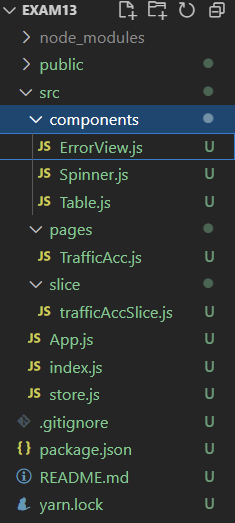
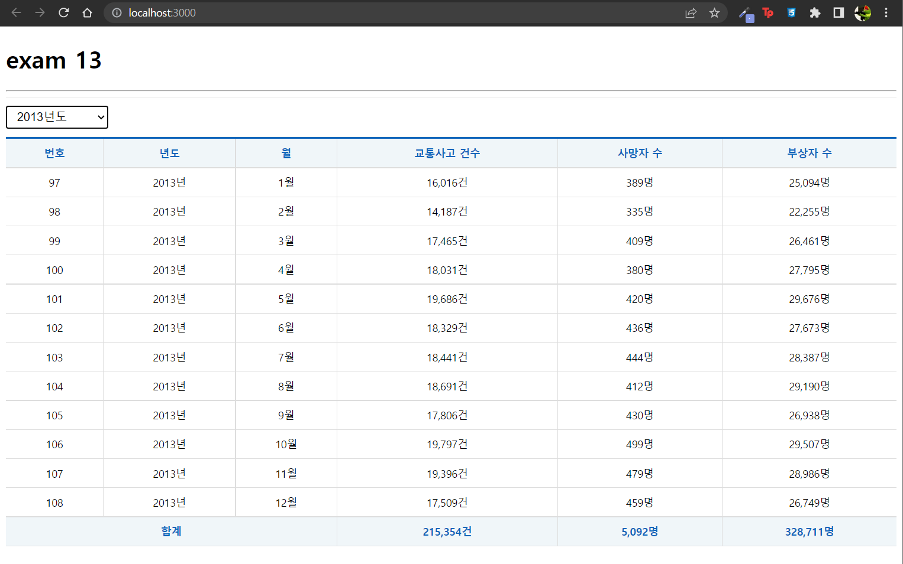

# 연습문제 13
## 파일

## index.js
```js
import React from 'react';
import ReactDOM from 'react-dom/client';
import App from './App';
import { BrowserRouter } from 'react-router-dom';

import { Provider } from 'react-redux';
import store from './store';

const root = ReactDOM.createRoot(document.getElementById('root'));
root.render(
  <React.StrictMode>
    <Provider store={store}>
      <BrowserRouter>
        <App />
      </BrowserRouter>
    </Provider>
  </React.StrictMode>
);
```
## App.js
```js
import React from "react";
import TrafficAcc from "./pages/TrafficAcc";


function App() {
  return (
    <div>
      <h1>exam 13</h1>
      <hr/>
      <TrafficAcc/>
    </div>
  );
}

export default App;
```

## slice > trafficAccSlice.js
```js
import { createSlice, createAsyncThunk } from "@reduxjs/toolkit";
import axios from 'axios'

export const getList = createAsyncThunk("trafficAccSlice/getList", async(payload, {rejectedWithValue}) => {
    let result = null;
    try {
        payload ? result = await axios.get(`http://localhost:3001/traffic_acc?year=${payload}`) : result = await axios.get(`http://localhost:3001/traffic_acc`)
    } catch(err) {
        result = rejectedWithValue(err.reponse)
    }
    return result;
})

const trafficAccSlice = createSlice({
    name: 'trafficAcc',
    initialState: {
        data: null,
        loading: false,
        error: null
    },
    reducers: {},
    extraReducers: {
        [getList.pending]: (state, { payload }) => {
            return { ...state, loading: true}
        },
        [getList.fulfilled]: (state, { payload }) => {
            return {
                data: payload?.data,
                loading: false,
                error: null
            }
        },
        [getList.rejected]: (state, {payload}) => {
            return {
                data: payload?.data,
                loading: false,
                error: {
                    code: payload?.status ? payload.status : 500,
                    messsage: payload?.statusText ? payload.statusText : 'Server Error'
                } 
            }
        }
    }
})

export default trafficAccSlice.reducer
```
## pages > TrafficAcc.js
```js
import React, { memo } from 'react';
import styled from "styled-components"
import { useSelector, useDispatch } from 'react-redux';
import { getList } from '../slice/trafficAccSlice';

import Spinner from "../components/Spinner"
import Table from "../components/Table"
import ErrorView from '../components/ErrorView';
/** 드롭다운을 배치하기 위한 박스 */
const SelectContainer = styled.div`
    position: sticky;
    top: 0;
    background-color: #fff;
    border-top: 1px solid #eee;
    border-bottom: 1px solid #eee;
    padding: 10px 0;
    margin: 0;

    select {
        margin-right: 15px;
        font-size: 16px;
        padding: 5px 10px;
    }
`

const TrafficAcc = memo(() => {
    let totalAcc = 0;
    let totalDeath = 0;
    let totalInjury = 0;
    const dispatch = useDispatch();
    const {data, loading, error} = useSelector(state => state.trafficAcc)
    const [trafficData, setTrafficData] = React.useState();
    React.useEffect(() => {
        dispatch(getList(trafficData))
    }, [dispatch, trafficData])
    const onChange = React.useCallback((e) => {
        e.preventDefault();
        const current = e.target;
        const selectValue = current[current.selectedIndex].value
        setTrafficData(selectValue)
    },[setTrafficData])
    return (
        <div>
            <Spinner visible={loading}/>
            <SelectContainer>
                <select name="year" onChange={onChange}>
                    <option value="">-- 년도 선택--</option>
                    {[...new Array(2018 - 2005 + 1)].map((v, i) => {
                        return (<option key={i} value={2005 + i}>{2005+i}년도</option>)
                    })}
                </select>
            </SelectContainer>
            {error ? (<ErrorView error={error}/>) : (
                <Table>
                    <thead>
                        <tr>
                            <th>번호</th>
                            <th>년도</th>
                            <th>월</th>
                            <th>교통사고 건수</th>
                            <th>사망자 수</th>
                            <th>부상자 수</th>
                        </tr>
                    </thead>
                    <tbody>
                        {data && data.map(({
                            id, year, month, accident, death, injury
                        }, i) => {
                            totalAcc += accident;
                            totalDeath += death;
                            totalInjury += injury
                            return (
                            <tr key={id}>
                                <td>{id}</td>
                                <td>{year}년</td>
                                <td>{month}월</td>
                                <td>{accident.toLocaleString('ko-KR')}건</td>
                                <td>{death.toLocaleString('ko-KR')}명</td>
                                <td>{injury.toLocaleString('ko-KR')}명</td>
                            </tr>
                            )
                        })}
                    </tbody>
                    <tfoot>
                        <tr>
                            <th colSpan="3">합계</th>
                            <th>{totalAcc.toLocaleString('ko-KR')}건</th>
                            <th>{totalDeath.toLocaleString('ko-KR')}명</th>
                            <th>{totalInjury.toLocaleString('ko-KR')}명</th>
                        </tr>
                    </tfoot>
                </Table>
            )}
        </div>
    );
});

export default TrafficAcc;
```

## components > Spinner.js
```js
import React from 'react';
import PropTypes from "prop-types"
import styled from 'styled-components';

/** 로딩바 컴포넌트 */
// --> https://mhnpd.github.io/react-loader-spinner/
import {Bars} from 'react-loader-spinner'

/** 로딩바 뒤에 표시될 반투명 막 */
const TransLayer = styled.div`
    position: fixed;
    left: 0;
    right: 0;
    z-index: 9999;
    background-color: #0003;
    width: 100%;
    height: 100%;
`
const Spinner = ({ visible, color, width, height }) => {
    return (
        <div>
            {visible &&
                <TransLayer>
                    <Bars
                        color={color}
                        height={height}
                        width={width}
                        wrapperStyle={{
                            position: 'absolute',
                            zIndex: 10000,
                            left: '50%',
                            top: '50%',
                            marginLeft: (-width/2)+'px',
                            marginTop: (-height/2)+'px'
                        }}
                    />
                </TransLayer>
            }
        </div>
    );
};

/**기본값 정의 */
Spinner.defaultProps = {
    visible: false,
    color: '#06f',
    width: 100,
    height: 100
};

/** 데이터 타입 설정 */
Spinner.propTypes = {
    visible: PropTypes.bool.isRequired,
    color: PropTypes.string,
    width: PropTypes.number,
    height: PropTypes.number,
}

export default Spinner;
```

## components > Table.js
```js
import styled from 'styled-components';

/** 표에 CSS를 적용한 styledComponents */
const Table = styled.table`
    border-collapse: collapse;
    border-top: 3px solid #16B;
    font-size: 14px;
    text-align: center;
    margin: auto;
    width: 100%;

    th {
        color: #16B;
        background: #f0f6f9;
        padding: 10px;
        border: 1px solid #ddd;

        &:first-child {
            border-left: 0;
        }

        &:last-child {
            border-right: 0;
        }
    }

    td {
        padding: 10px;
        border: 1px solid #ddd;
        &:first-child {
            border-left: 0;
        }
        &:last-child {
            border-right: 0;
        }
    }
`

export default Table;
```

## components > ErrorVeiw.js
```js
import React, { memo } from 'react';

const ErrorView = memo(({error}) => {
    return (
        <div>
            <h1>Oops~!!! {error.code} Error.</h1>
            <hr/>
            <p>{error.message}</p>
        </div>
    );
});

export default ErrorView;
```

## 결과
.png)
