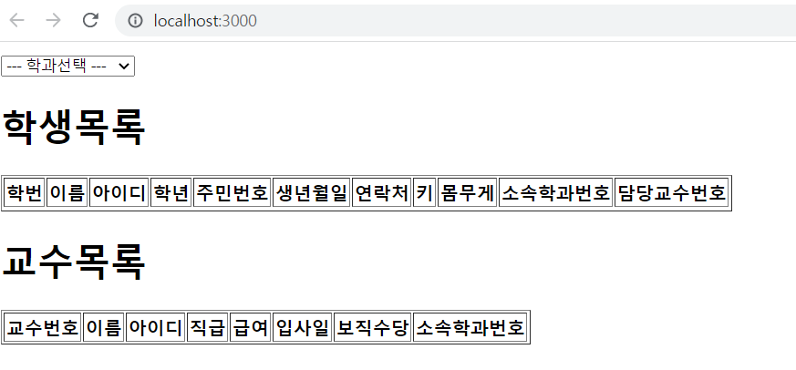
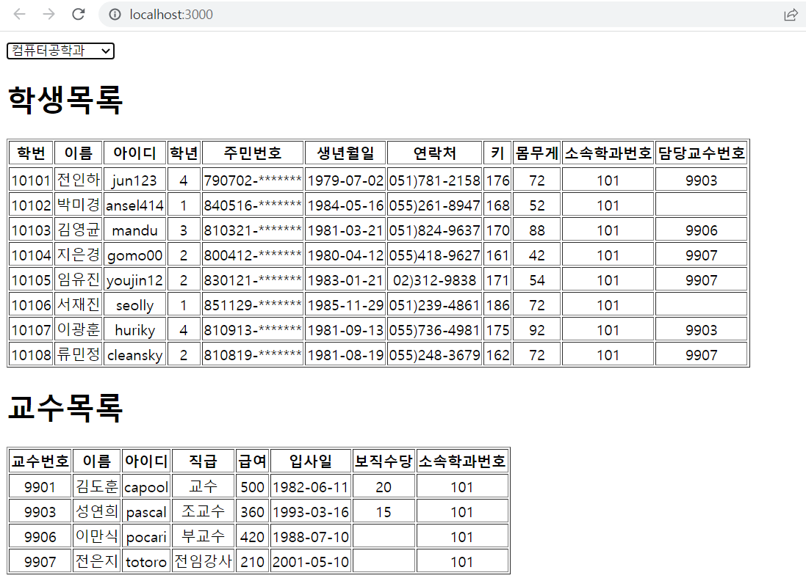
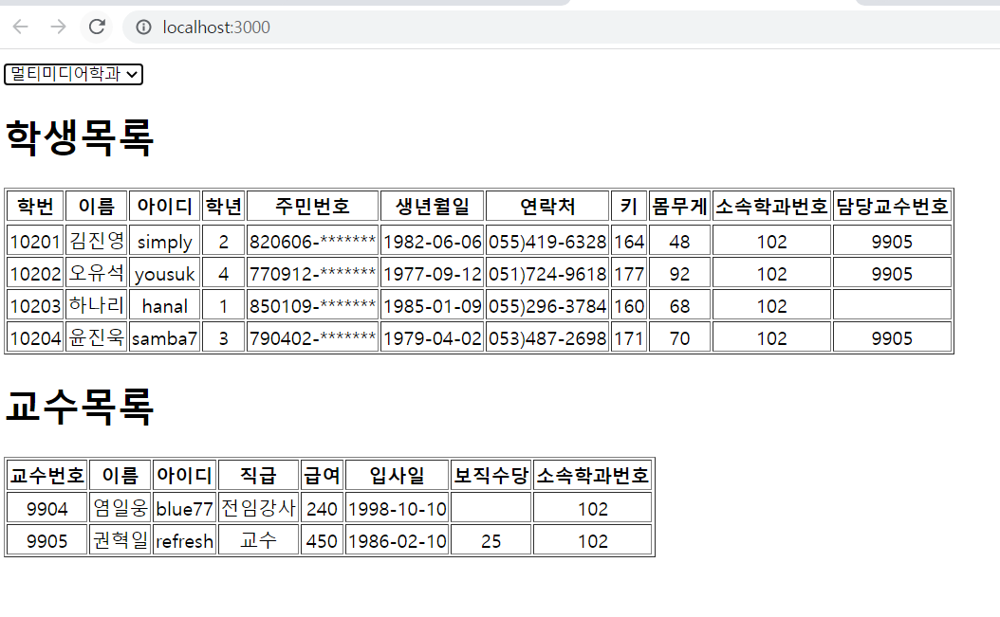
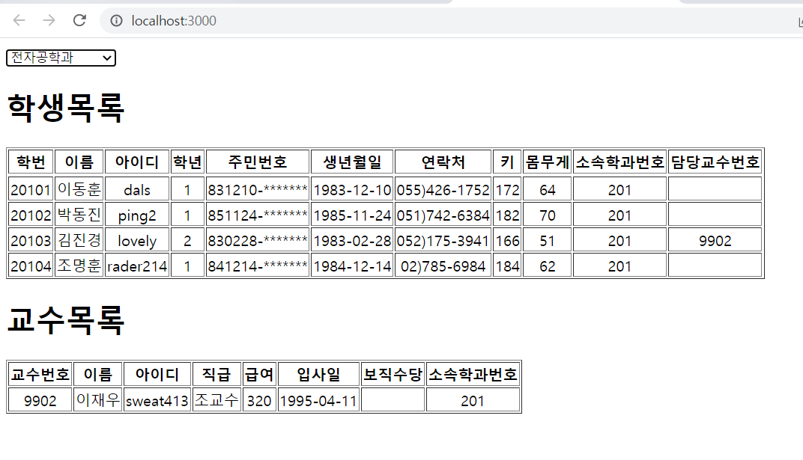
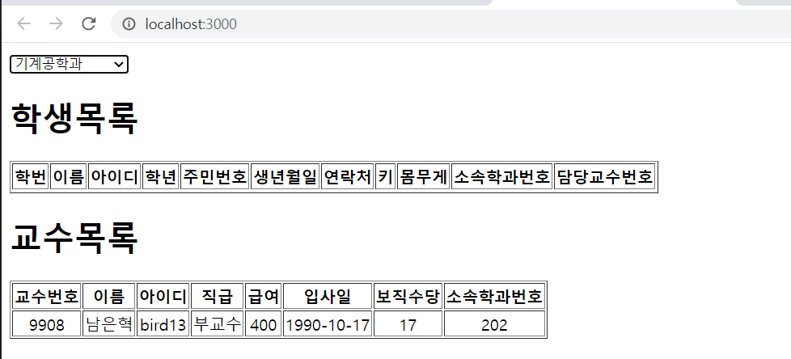

# 22.05.06 신지섭
## index.js
```js
import React from 'react';
import ReactDOM from 'react-dom/client';
import App from './App';

const root = ReactDOM.createRoot(document.getElementById('root'));
root.render(
  <React.StrictMode>
    <App />
  </React.StrictMode>
);
```
## App.js
```js
import React from "react";
import Professor from "./components/Professor";
import Student from "./components/Student";

function App() {
  const [selectValue, setSelectValue] = React.useState(-1)
  const onChange = React.useCallback((e) => {
    setSelectValue(e.target.value)
  },[])
  
  return (
    <div>
      <select onChange={onChange} value={selectValue}>
        <option value="">--- 학과선택 ---</option>
        <option value="101">컴퓨터공학과</option>
        <option value="102">멀티미디어학과</option>
        <option value="201">전자공학과</option>
        <option value="202">기계공학과</option>
      </select>
      <h1>학생목록</h1>
      <table border="1">
        <thead>
          <th>학번</th>
          <th>이름</th>
          <th>아이디</th>
          <th>학년</th>
          <th>주민번호</th>
          <th>생년월일</th>
          <th>연락처</th>
          <th>키</th>
          <th>몸무게</th>
          <th>소속학과번호</th>
          <th>담당교수번호</th>
        </thead>
        <Student props={selectValue}/>
      </table>
      <h1>교수목록</h1>
      <table border="1">
        <thead>
          <th>교수번호</th>
          <th>이름</th>
          <th>아이디</th>
          <th>직급</th>
          <th>급여</th>
          <th>입사일</th>
          <th>보직수당</th>
          <th>소속학과번호</th>
        </thead>
        <Professor props={selectValue}/>
      </table>
    </div>
  );
}

export default App;
```
## Student.js
```js
import React from 'react';
import axios from "axios"
import Spinner from './Spinner';

const Student = (id) => {
    const [loading, setLoading] = React.useState(false);
    const [student, setStudent] = React.useState([]);
    React.useEffect(() => {
        (async() => {
            setLoading(true)
            try {
                const response = await axios.get(`http://localhost:3001/student?deptno=${id.props}`)
                setStudent(data => response.data)
            } catch(e) {
                console.eroor(e)
                alert("서버 연결 실패")
            } finally{
                setLoading(false)
            }
        })()
    },[id.props])
    return (
        <tbody>
            <Spinner visible={loading}/>
            {
                id.props > -1 &&
                student.map((v, i) => {
                    const date = new Date(v.birthdate)
                    const m = date.getMonth(v.birthdate)+1
                    const mm = m < 10 ? `0${m}` : m
                    const d = date.getDate(v.birthdate)
                    const dd = d < 10 ? `0${d}` : d
                    return(
                        <tr align="center" key={i}>
                            <td>{v.id}</td>
                            <td>{v.name}</td>
                            <td>{v.userid}</td>
                            <td>{v.grade}</td>
                            <td>{v.idnum.substring(0,6)}-*******</td>
                            <td>{date.getFullYear(v.birthdate)}-{mm}-{dd}</td>
                            <td>{v.tel}</td>
                            <td>{v.height}</td>
                            <td>{v.weight}</td>
                            <td>{v.deptno}</td>
                            <td>{v.profno}</td>
                        </tr>
                    )
                })
            }
        </tbody>
    );
};

export default React.memo(Student);
```
## Professor.js
```js
import React from 'react';
import axios from "axios"

const Professor = (id) => {
    const [professor, setProfessor] = React.useState([]);
    React.useEffect(() => {
        (async() => {
            try {
                const response = await axios.get(`http://localhost:3001/professor?deptno=${id.props}`)
                setProfessor(data => response.data)
            } catch(e) {
                console.eroor(e)
                alert("서버 연결 실패")
            } 
        })()
    },[id.props])
    return (
        <tbody>
            {
                id.props > -1 &&
                professor.map((v, i) => {
                    return(
                        <tr align="center" key={i}>
                            <td>{v.id}</td>
                            <td>{v.name}</td>
                            <td>{v.userid}</td>
                            <td>{v.position}</td>
                            <td>{v.sal}</td>
                            <td>{v.hiredate.substring(0,10)}</td>
                            <td>{v.comm}</td>
                            <td>{v.deptno}</td>
                        </tr>
                    )
                })
            }
        </tbody>
    );
};

export default React.memo(Professor);
```
## Spinner.js
```js
import React from 'react';
import PropTypes from "prop-types"
import styled from 'styled-components';

/** 로딩바 컴포넌트 */
// --> https://mhnpd.github.io/react-loader-spinner/
import {Bars} from 'react-loader-spinner'

/** 로딩바 뒤에 표시될 반투명 막 */
const TransLayer = styled.div`
    position: fixed;
    left: 0;
    right: 0;
    z-index: 9999;
    background-color: #0003;
    width: 100%;
    height: 100%;
`
const Spinner = ({ visible, color, width, height }) => {
    return (
        <div>
            {visible &&
                <TransLayer>
                    <Bars
                        color={color}
                        height={height}
                        width={width}
                        wrapperStyle={{
                            position: 'absolute',
                            zIndex: 10000,
                            left: '50%',
                            top: '50%',
                            marginLeft: (-width/2)+'px',
                            marginTop: (-height/2)+'px'
                        }}
                    />
                </TransLayer>
            }
        </div>
    );
};

/**기본값 정의 */
Spinner.defaultProps = {
    visible: false,
    color: '#06f',
    width: 100,
    height: 100
};

/** 데이터 타입 설정 */
Spinner.propTypes = {
    visible: PropTypes.bool.isRequired,
    color: PropTypes.string,
    width: PropTypes.number,
    height: PropTypes.number,
}

export default Spinner;
```
## 결과




