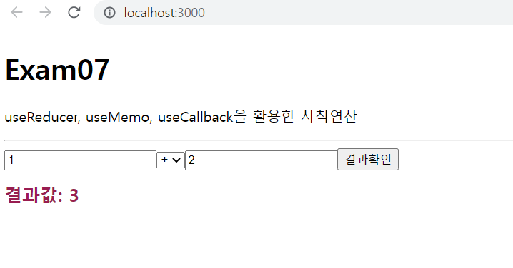

# 연습문제07 - 2

## App.js
```js
import React from "react";

function App() {
  // 첫번째 input
  const first = React.useRef();
  // 두번째 input 
  const second = React.useRef();
  // 선택박스 
  const operator = React.useRef();
  //상태값 갱신 Reducer
  function setCalculate(state, action) {
    switch (action.operatorValue) {
      case "+":
        return state = action.firstValue + action.secondValue;
      case '-':
        return state = action.firstValue - action.secondValue;
      case '*':
        return state = action.firstValue * action.secondValue;
      case "/":
        return state = action.firstValue / action.secondValue;
      default:
        return state;
    }
  }
  //useReducer 사용
  const [cal, setCal] = React.useReducer(setCalculate, 0)
  // useCallback을 사용한 버튼 클릭이벤트
  const onClick = React.useCallback((e) => {
    //첫번째 input값 가져오기
    const firstValue = parseInt(first.current.value)
    //두번째 input값 가져오기
    const secondValue = parseInt(second.current.value)
    //선택박스 값 가져오기
    const operatorValue = operator.current.value 
    // json형태로 setCal(action)에 대입
    setCal({firstValue, secondValue, operatorValue})
  },[]);
  const colorChange = React.useMemo(() => {
    return cal % 2 === 0 ? "#cfbee0" : "#981d50"
  }, [cal])

  return (
    <div>
      <h1>Exam07</h1>
      <p>
        useReducer, useMemo, useCallback을 활용한 사칙연산
      </p>
      <hr/>
      <div>
        <input type="text" ref={first}/>
        <select ref={operator}>
          <option>+</option>
          <option>-</option>
          <option>*</option>
          <option>/</option>
        </select>
        <input type="text" ref={second}/>
        <button type="button" onClick={onClick}>결과확인</button>
      </div>
      <h1 style={{fontSize: '20px', color:colorChange}}>
        결과값: {cal}
      </h1>
    </div>
  );
}

export default App;
```

