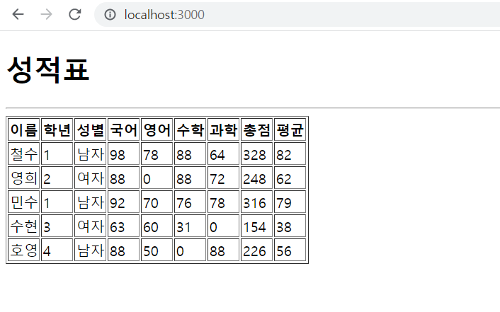

# 연습문제4

### GradeData
```js
const GradeData = [
    {"이름": "철수", "학년": 1, "성별": "남자", "국어": 98, "영어": 78, "수학": 88, "과학": 64},
    {"이름": "영희", "학년": 2, "성별": "여자", "국어": 88, "영어": "미응시", "수학": 88, "과학": 72},
    {"이름": "민수", "학년": 1, "성별": "남자", "국어": 92, "영어": 70, "수학": 76, "과학": 78},
    {"이름": "수현", "학년": 3, "성별": "여자", "국어": 63, "영어": 60, "수학": 31, "과학": "미응시"},
    {"이름": "호영", "학년": 4, "성별": "남자", "국어": 88, "영어": 50, "수학": "미응시", "과학": 88}
]

export default GradeData;
```

### GradeItem
```js
import React from "react";
import PropTypes from 'prop-types';

const GradeItem = ({이름, 학년, 성별, 국어, 영어, 수학, 과학, }) => {
    return (
        <tr>
            <td>
                {이름}
            </td>
            <td>
                {학년}
            </td>
            <td>
                {성별}
            </td>
            <td>
                {국어}
            </td>
            <td>
                {영어}
            </td>
            <td>
                {수학}
            </td>
            <td>
                {과학}
            </td>
            <td>
                {parseInt(국어 + 영어 + 수학 + 과학)}
            </td>
            <td>
                {parseInt((국어 + 영어 + 수학 + 과학) / 4)}
            </td>
        </tr>
    )
}
GradeItem.propTypes = {
    이름: PropTypes.string,
    학년: PropTypes.number,
    성별: PropTypes.string,
    국어: PropTypes.number,
    영어: PropTypes.number,
    수학: PropTypes.number,
    과학: PropTypes.number
}

export default GradeItem;
```

### App
``` js
import React from "react";
import GradeItem from "./components/GradeItem";
import GradeData from "./GradeData";
function App() {
  console.clear();
  return (
    <div>
      <h1>성적표</h1>
      <hr/>
      <table border="1">
        <thead>
            <tr>
                <th>이름</th>
                <th>학년</th>
                <th>성별</th>
                <th>국어</th>
                <th>영어</th>
                <th>수학</th>
                <th>과학</th>
                <th>총점</th>
                <th>평균</th>
            </tr>
        </thead>
        <tbody>
          { 
            GradeData.map((v, i) => {
              let key = Object.keys(v);
              for (let j = 3; j < 7; j++) {
                if (v[key[j]] === "미응시") {
                    return(v[key[j]] = 0)
                }
              }
              return(
                <GradeItem 이름={v.이름} 학년={v.학년} 성별={v.성별} 국어={v.국어} 영어={v.영어} 수학={v.수학} 과학={v.과학} /> 
              )
            })
          }
        </tbody>
      </table>
    </div>
  );
}

export default App;
```
