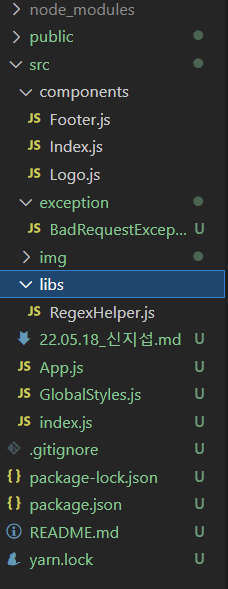
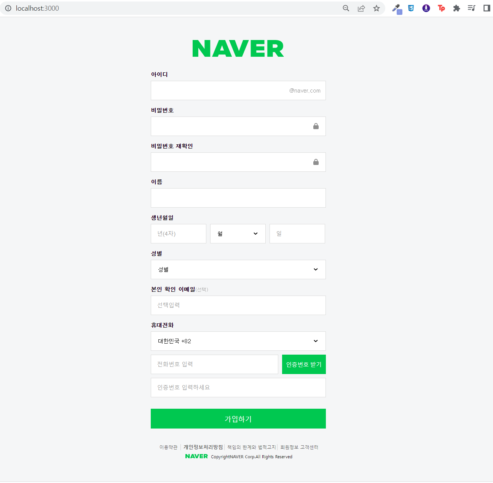
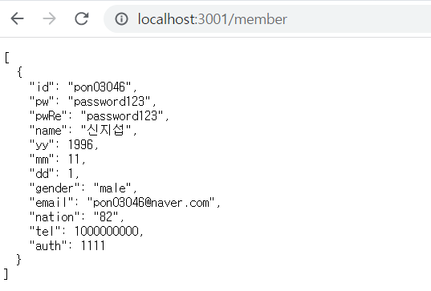

# naver-clone
## react 파일 구조


## index.js
```js
import React from 'react';
import ReactDOM from 'react-dom/client';
import App from './App';
import Global from './GlobalStyles';

const root = ReactDOM.createRoot(document.getElementById('root'));
root.render(
  <React.StrictMode>
    <Global/>
      <App />
  </React.StrictMode>
);
```
## App.js
```js
import React from "react";
import Logo from "./components/Logo"
import Index from "./components/Index"
import Footer from "./components/Footer"
function App() {
  return (
    <div>
      <Logo/>
      <Index/>
      <Footer/>
    </div>
  );
}

export default App;
```

## GlobalStyleds.js
```js
/**
* @filename GlobalStyles.js
* @description body에 CSS 적용하기 위해 createGlovalStyle 사용
* @author: 신지섭 (pon0304616@gmail.com)
*/
import { createGlobalStyle } from "styled-components";

const Global = createGlobalStyle`
    /* http://meyerweb.com/eric/tools/css/reset/ 
    v2.0 | 20110126
    License: none (public domain)
    */

    html, body, div, span, applet, object, iframe,
    h1, h2, h3, h4, h5, h6, p, blockquote, pre,
    a, abbr, acronym, address, big, cite, code,
    del, dfn, em, img, ins, kbd, q, s, samp,
    small, strike, strong, sub, sup, tt, var,
    b, u, i, center,
    dl, dt, dd, ol, ul, li,
    fieldset, form, label, legend,
    table, caption, tbody, tfoot, thead, tr, th, td,
    article, aside, canvas, details, embed, 
    figure, figcaption, footer, header, hgroup, 
    menu, nav, output, ruby, section, summary,
    time, mark, audio, video {
        margin: 0;
        padding: 0;
        border: 0;
        font-size: 100%;
        font: inherit;
        vertical-align: baseline;
    }
    /* HTML5 display-role reset for older browsers */
    article, aside, details, figcaption, figure, 
    footer, header, hgroup, menu, nav, section {
        display: block;
    }
    body {
    width: 100%;
    background-color: #F5F6F7;
    }
    label {
        cursor: pointer;
    }
    /* float 마감제*/
    .clear:after {
        content: '';
        clear: both;
        float: none;
        display: block;
    }
`
export default Global
```

## components > Logo.js
```js
import React from 'react';
import styled from "styled-components"

const LogoBox = styled.div`
    max-width: 768px;
    min-width: 460px;
    height: 44px;
    margin: auto;
    padding: 60px 0 20px 0;
    h1 {
        height: 44px;
    }
    .logo_n {
        display: block;
        margin: 0 auto;
        width: 240px;
        height: 44px;
        background-image: url(https://static.nid.naver.com/images/ui/join/m_naver_logo_20191126.png);
        background-repeat: no-repeat;
        background-position: 0 0;
        background-size: 240px auto;
    }
    a {
        cursor: pointer;
    text-decoration: none;
    }
`

const Logo = () => {
    return (
        <LogoBox>
            <h1>
                <a href="http://www.naver.com" className="logo_n">
                </a>
            </h1>
        </LogoBox>
    );
};

export default Logo;
```

## Index.js
```js
import React from 'react';
import styled from 'styled-components'
import useAxios from 'axios-hooks';
import regexHelper from '../libs/RegexHelper'
import { faLock } from "@fortawesome/free-solid-svg-icons";
import { FontAwesomeIcon } from "@fortawesome/react-fontawesome";
const FormBox = styled.form`
    display: block;
    width: 100%;
    .container {
        width: 768px;
        margin: 0 auto;
        .content {
            width: 460px;
            margin: auto;
            /* input에 대한 CSS코드*/
            input {
                display: block;
                position: relative;
                width: 100%;
                height: 29px;
                padding-right: 25px;
                line-height: 29px;
                border: none;
                background: #fff;
                font-size: 15px;
                box-sizing: border-box;
                z-index: 10;
                cursor:pointer;
                /* input이 focus 되었을때 */
                &:focus{
                    outline: none;
                }
                /* input의 placeholder의 투명도 0.7*/
                &::placeholder {
                    opacity: 0.7;
                }
            }
        }
    }
    /* 클릭했을때 추가된 focus css코드*/
    .boxjs.focus{
        border:1px solid #00C850;
    }
    /* 아이디 부분은 focus 되어도 기본 효과*/
    .box_xs.focus{
        border: 1px solid #dadada;
    }
    /* 아이디 부분 작은 상자 */
    .box_xs {
        display: block;
        border: 1px solid #dadada;
        background-color: #fff;
        outline: 0;
        position: relative;
        padding: 10px 110px 10px 14px; 
        cursor:pointer;
        /* 아이디 부분 작은상자의 @naver.com을 넣기 위한 CSS 코드*/
        & > span {
            position: absolute;
            line-height: 18px;
            right: 13px;
            top: 16px;
            color: #8e8e8e;
        }
    }
    /* 제목에 적용할 CSS 코드 */
    .title {
        font-size: 14px;
        display: block;
        margin: 19px 0 8px 0;
        font-weight: 600;
        font-family: "dotum";
    }
    /* 아이디 @naver.com에 적용할 타이틀*/
    .title_m {
        font-size: 15px;
        font-weight: 300;
        font-family: "dotum";
    }
    /* 이메일 (선택)에 적용할 타이틀*/
    .title_sm {
        font-size: 12px;
        color: #9d9d9d;
        opacity: 0.8;
        font-weight: 300;
        cursor: pointer;
    }
    /* float 적용하기*/
    .left-lg {
        float: left;
        width: 305px;
    }
    /*비빌번호가 들어갈 상자*/
    .box_sm {
        display: block;
        border: 1px solid #dadada;
        background-color: #fff;
        outline: 0;
        position: relative;
        padding: 10px 40px 10px 14px;
        cursor:pointer;
        /*비밀번호의 아이콘이 들어갈 상자*/
        & > .box_sm-span {
            position: absolute;
            line-height: 18px;
            right: 18px;
            top: 30%;
            color: #8e8e8e;
            z-index: 10;
        }
        /* 비밀번호 틀렸을 때 추가되는 클래스 CSS코드*/
        & > .pw_false {
            color: red;
            font-size: 13px;
        }
        /* 비밀번호 틀리거나 맞았을 때 icon에 적용되는 CSS코드*/
        & > .pw_false i,
        & > .pw_true i {
            margin-left: 5px;
        }
        /* 비밀번호 맞았을 때 추가되는 클래스 CSS코드*/
        & > .pw_true {
            color: #00C850;
        }
    }
    /*아이디와 비밀번호를 제외한 나머지 상자*/
    .box {
        padding: 10px 14px;
        display: block;
        border: 1px solid #dadada;
        background-color: #fff;
        outline: 0;
        position: relative;
    }
    /* margin-top을 적용하기 위한 CSS 코드*/
    .mar-top {
        margin-top: 40px;
    }
    /* margin-top을 조금 적용하기 위한 CSS 코드*/
    .mar-top_xs {
        margin-top: 10px;
    }
    /* 생년월일 float css 코드 */
    .left {
        float: left;
        width: 31.8%;
    }
    /* margin-right css코드*/
    .mar-right {
        margin-right: 10px;
    }
    /* select태그에 적용될 CSS 코드*/
    .select_sel {
        cursor: pointer;
        border: none;
        width: 100%;
        height: 29px;
        font-size: 14px;
        font-family: "dotum";
        &:focus {
            outline: none;
        }
    }
    /* 인증번호 버튼 CSS코드*/
    .btn {
        display: block;
        width: 115px;
        float: left;
        height: 51px;
        border: none;
        background-color: #00C850;
        color: #fff;
        font-size: 15px;
        padding: 0;
        cursor: pointer;
    }

    .btn_area {
        margin: 30px auto 10px auto;
        width: 460px;
    }

    .sub_btn {
        width: 100%;
        padding: 15px 0;
        background-color: #00C850;
        cursor:pointer;
        height: 52px;
        border: none;
        color: #fff;
        font-size: 18px;
    }
`

const Index = () => {
    const [{loading}, refetch] = useAxios({
        url: "http://localhost:3001/member",
        method: "POST"
    }, {manual: true})
    const onSubmit = React.useCallback((e) => {
        e.preventDefault();
        const current = e.target;
        // 유효성 검사
        try {
            /** 아이디 검사*/
            regexHelper.value(current.id, "필수 정보입니다.")
            regexHelper.minLength(current.id,5, "5~20자의 영문 소문자, 숫자와 특수기호(_),(-)만 사용 가능합니다.")
            regexHelper.engNumSym(current.id, "5~20자의 영문 소문자, 숫자와 특수기호(_),(-)만 사용 가능합니다.")
            /** 비밀번호 검사*/
            regexHelper.value(current.pw, "필수 정보입니다.")
            regexHelper.engNumSymbol(current.pw, "8~16자 영문 대 소문자, 숫자, 특수문자를 사용하세요.")
            regexHelper.compareTo(current.pw, current.pw_re, "비밀번호가 일치하지 않습니다.")
            /** 이름 검사*/
            regexHelper.noSpaceValue(current.name, "필수 정보입니다.")
            regexHelper.value(current.name,"한글과 영문 대 소문자를 사용하세요. (특수기호, 공백 사용 불가)" )
            regexHelper.korEng(current.name, "한글과 영문 대 소문자를 사용하세요. (특수기호, 공백 사용 불가)")
            /** 년도 검사*/
            regexHelper.num(current.yy, "태어난 년도 4자리를 정확하게 입력하세요.")
            /** 월 검사*/
            regexHelper.value(current.mm,"태어난 월을 선택하세요.")
            /** 일 검사*/
            regexHelper.value(current.dd,"태어난 일(날짜) 2자리를 정확하게 입력하세요.")
            regexHelper.dateTimeValue(current.yy, current.mm, current.dd, "생년월일을 다시 확인 해주세요.")
            regexHelper.noSpaceNum(current.dd, "생년월일을 다시 확인해주세요.")
            regexHelper.timeValue(current.yy, current.mm, "정말이세요?")
            /** 미래인 검사*/
            regexHelper.futureTimeValue(current.yy, current.mm, current.dd, "미래에서 오셨군요. ^^")
            /** 만14세 미만 검사*/
            regexHelper.underTimeValue(current.yy, current.mm, current.dd, "만 14세 미만의 어린이는 보호자 동의가 필요합니다.")
            /**성별 검사*/
            regexHelper.value(current.gender, "필수 정보입니다.")
            /** 이메일 검사*/
            regexHelper.email(current.email, "이메일 주소를 다시 확인해주세요.")
            /** 핸드폰 검사*/
            regexHelper.value(current.tel, "필수 정보입니다.")
            regexHelper.cellPhone(current.tel, "형식에 맞지 않는 번호입니다.")
            /** disabled = false 면 활성*/
            regexHelper.value(current.auth, "필수 정보입니다.")
            regexHelper.minLength(current.auth,4 ,"인증번호는 4자리 숫자입니다.")
        } catch(e) {
            alert(e.message);
            console.error(e);
            e.field.focus();
            return;
        }
        //값 가져오기
        const idValue = current.id.value;
        const pwValue = current.pw.value;
        const pwReValue = current.pw_re.value;
        const nameValue = current.name.value;
        const yyValue = parseInt(current.yy.value);
        const mmValue = parseInt(current.mm.value);
        const ddValue = parseInt(current.dd.value);
        const genderValue = current.gender.value;
        const emailValue = current.email.value;
        const nationValue = current.nation.value;
        const telValue = parseInt(current.tel.value);
        const authValue = parseInt(current.auth.value);
        (async () => {
            let json = null;
            try {
                const response = await refetch({
                    data: {
                        id: idValue,
                        pw: pwValue,
                        pwRe: pwReValue,
                        name: nameValue,
                        yy: yyValue,
                        mm: mmValue,
                        dd: ddValue,
                        gender: genderValue,
                        email: emailValue,
                        nation: nationValue,
                        tel: telValue,
                        auth: authValue,
                    }
                })
                json = response.data
            } catch (e) {
                console.error(e)
            }
            if (json !== null) {
                window.alert('저장 되었습니다.')
            }
        })();
    },[])
    const [state, setState] = React.useState(true)
    const able = React.useRef();
    const onBtnClick = React.useCallback((e) => {
        e.preventDefault();
        if (able.current.value) {
            setState(false)
        }
    },[])
    const [id, setId] = React.useState(false);
    const [pw, setPw] = React.useState(false);
    const [pwRe, setPwRe] = React.useState(false);
    const [name, setName] = React.useState(false);
    const [yy, setYy] = React.useState(false);
    const [mm, setMm] = React.useState(false);
    const [dd, setDd] = React.useState(false);
    const [gender, setGender] = React.useState(false);
    const [email, setEmail] = React.useState(false);
    const [nation, setNation] = React.useState(false);
    const [tel, setTel] = React.useState(false);
    const [auth, setAuth] = React.useState(false);
    const onFocus = React.useCallback((e) => {
        e.preventDefault();
        const current = e.target
        const inputName = current.name
        if (inputName === "id") {
            setId(!id);
        } else if (inputName === "pw") {
            setPw(!pw);
        } else if (inputName === 'pw_re') {
            setPwRe(!pwRe)
        } else if (inputName === 'name') {
            setName(!name)
        } else if (inputName === 'yy') {
            setYy(!yy)
        } else if (inputName === 'mm') {
            setMm(!mm)
        } else if (inputName === 'dd') {
            setDd(!dd)
        } else if (inputName === 'gender') {
            setGender(!gender)
        } else if (inputName === 'email') {
            setEmail(!email)
        } else if (inputName === 'nation') {
            setNation(!nation)
        } else if (inputName === 'tel') {
            setTel(!tel)
        } else if (inputName === 'auth') {
            setAuth(!auth)
        }
    },[id, pw, pwRe, name, yy, mm, dd, gender, email, nation, tel, auth])
    const onBlur = React.useCallback((e) => {
        e.preventDefault();
        setId(false)
        setPw(false)
        setPwRe(false)
        setName(false)
        setYy(false)
        setMm(false)
        setDd(false)
        setGender(false)
        setEmail(false)
        setNation(false)
        setTel(false)
        setAuth(false)
    },[id, pw, pwRe, name, yy, mm, dd, gender, email, nation, tel, auth])
    return (
        <FormBox onSubmit={onSubmit}>
            <div className="container">
                <div className="content">
                    <h3 className="title"><label htmlFor="id">아이디</label></h3>
                    <div className={id === true ? "box_xs boxjs focus" : "box_xs boxjs"}>
                        <input onBlur={onBlur} onFocus={onFocus} type="text" name="id" id="id"  maxLength="20"/>
                        <span className="title_m">@naver.com</span>
                    </div>
                </div>
                <div className="content">
                    <h3 className="title"><label htmlFor="pw">비밀번호</label></h3>
                    <div className={pw === true ? "box_sm boxjs focus" : "box_sm boxjs"}>
                        <input onBlur={onBlur} onFocus={onFocus} type="password" name="pw" id="pw" maxLength="20"/>
                        <span className="box_sm-span">
                            <FontAwesomeIcon icon={faLock} />
                        </span>
                    </div>
                </div>
                <div className="content">
                    <h3 className="title"><label htmlFor="pw_re">비밀번호 재확인</label></h3>
                    <div className={pwRe === true ? "box_sm boxjs focus" : "box_sm boxjs"}>
                        <input onBlur={onBlur} onFocus={onFocus} type="password" name="pw_re" id="pw_re" maxLength="20"/>
                        <span className="box_sm-span">
                            <FontAwesomeIcon icon={faLock} />
                        </span>
                    </div>
                </div>
                <div className="content mar-top">
                    <div className="content">
                        <h3 className="title"><label htmlFor="name" maxLength="40">이름</label></h3>
                        <div className={name === true ? "box boxjs focus" : "box boxjs"}>
                            <input onBlur={onBlur} onFocus={onFocus} type="text" name="name" id="name"/>
                        </div>
                    </div>
                    <div className="content">
                        <h3 className="title"><label htmlFor="yy">생년월일</label></h3>
                        <div className="clear">
                            <div className="left mar-right">
                                <div className={yy === true ? "box boxjs focus" : "box boxjs"}>
                                    <input onBlur={onBlur} onFocus={onFocus} type="text" name="yy" id="yy" placeholder="년(4자)" maxLength="4"/>
                                </div>
                            </div>
                            <div className="left mar-right">
                                <div className={mm === true ? "box boxjs focus" : "box boxjs"}>
                                    <select onBlur={onBlur} onFocus={onFocus} className="select_sel" id="mm" name="mm">
                                        <option value="">월</option>
                                        <option value="1">1</option>
                                        <option value="2">2</option>
                                        <option value="3">3</option>
                                        <option value="4">4</option>
                                        <option value="5">5</option>
                                        <option value="6">6</option>
                                        <option value="7">7</option>
                                        <option value="8">8</option>
                                        <option value="9">9</option>
                                        <option value="10">10</option>
                                        <option value="11">11</option>
                                        <option value="12">12</option>
                                    </select>
                                </div>
                            </div>
                            <div className="left">
                                <div className={dd === true ? "box boxjs focus" : "box boxjs"}>
                                    <input onBlur={onBlur} onFocus={onFocus} type="text" id="dd" name="dd" placeholder="일" maxLength="2"/>
                                </div>
                            </div>
                        </div>
                    </div>
                    <div className="content">
                        <h3 className="title"><label htmlFor="gender">성별</label></h3>
                        <div className={gender === true ? "box boxjs focus" : "box boxjs"}>
                            <select onBlur={onBlur} onFocus={onFocus} className="select_sel" id="gender" name="gender">
                                <option value="">성별</option>
                                <option value="male">남자</option>
                                <option value="female">여자</option>
                                <option value="no">선택 안함</option>
                            </select>
                        </div>
                    </div>
                    <div className="content">
                        <h3 className="title">
                            <label htmlFor="email">
                                본인 확인 이메일
                            </label>
                            <span className="title_sm">(선택)</span>
                        </h3>
                        <div className={email === true ? "box boxjs focus" : "box boxjs"}>
                            <input onBlur={onBlur} onFocus={onFocus} type="text" name="email" id="email" placeholder="선택입력" maxLength="100"/>
                        </div>
                    </div>
                </div>
                <div className="content mar-top">
                    <h3 className="title"><label htmlFor="tel">휴대전화</label></h3>
                    <div className={nation === true ? "box boxjs focus" : "box boxjs"}>
                        <select onBlur={onBlur} onFocus={onFocus} id="nation" name="nation" className="select_sel" defaultValue="82">
                            <option value="81">일본 +81</option>
                            <option value="82">대한민국 +82</option>
                            <option value="84">베트남 +84</option>
                            <option value="852">홍콩 +852</option>
                            <option value="853">마카오 +853</option>
                            <option value="855">캄보디아 +855</option>
                            <option value="856">라오스 +856</option>
                            <option value="86">중국 +86</option>
                            <option value="880">방글라데시 +880</option>
                            <option value="886">대만 +886</option>
                        </select>
                    </div>
                    <div className="mar-top_xs clear">
                        <div className={tel === true ? "box left-lg mar-right boxjs focus" : "box left-lg mar-right boxjs"}>
                            <input onBlur={onBlur} onFocus={onFocus} type="tel" id="tel" name="tel" ref={able} placeholder="전화번호 입력" maxLength="16"/>
                        </div>
                        <button onClick={onBtnClick} type="submit" className="btn">인증번호 받기</button>
                    </div>
                    <div className={auth === true ? "box mar-top_xs boxjs focus" : "box mar-top_xs boxjs"}>
                        <input onBlur={onBlur} onFocus={onFocus} type="tel" id="auth" name="auth" placeholder="인증번호 입력하세요" maxLength="4" disabled={state}/>
                    </div>
                </div>
            </div>
            <div className="btn_area">
                <button type="submit" className="sub_btn">
                    <span>가입하기</span>
                </button>
            </div>
        </FormBox>
    );
};

export default React.memo(Index);
```

## Footer.js
```js
import React from 'react';
import styled from 'styled-components'

const FooterBox = styled.div`
    margin: auto;
    max-width: 768px;
    min-width: 460px;
    padding: 30px 0 15px 0;
    text-align: center;
    font-size: 11px;
    a {
        text-decoration: none;
        color: #5e5e5e
    }
    ul {
        margin-bottom: 9px;
        li {
            display: inline;
            padding: 0 3px 0 7px;
            text-decoration: none;
            border-left: 1px solid #CFCFCF;
            font-size: 12px;
            &:first-child {
                border: none;
            }
        }
    }
    strong {
        font-weight: bolder;
        font-size: 13px;
    }
    address {
        a {
            color: #5e5e5e;
            font-weight: bolder;
            &:hover {
                text-decoration: underline;
                color: #00C850;
            }
        }
    }
    .logo_sm {
        position: relative;
        display: inline-block;
        width: 63px;
        height: 12px;
        background: url(https://static.nid.naver.com/images/ui/login/pc_sp_login_190522.png) no-repeat;
        background-position: -242px 0;
        background-size: 460px auto;
    }
    .pad-left {
        font:9px;
        padding-left: 4px;
    }
`
const Footer = () => {
    return (
        <FooterBox>
            <ul>
                <li> <a href="http://policy.naver.com/rules/service.html">이용약관</a> </li>
                <li><strong><a href="http://policy.naver.com/policy/privacy.html">개인정보처리방침</a></strong></li>
                <li><a href="http://policy.naver.com/rules/disclaimer.html">책임의 한계와 법적고지</a></li>
                <li><a href="https://help.naver.com/support/alias/membership/p.membership/p.membership_26.naver" target="_blank">회원정보 고객센터</a> </li>
            </ul>
            <address>
                <span className="pad-left">
                    <a href="http://www.naver.com" className="logo_sm">
                    </a>
                </span>
                <span className="pad-left">Copyright</span>
                <a href="http://www.navercorp.com/">NAVER Corp.</a>
                <span>All Rights Reserved</span>
            </address>
        </FooterBox>
    );
};

export default Footer;
```

## BadRequestException.js
```js
class BadRequestException extends Error {
    constructor(msg = '잘못된 요청 입니다.', field = null) {
        super(msg);
        // 멤버변수 추가
        this._statusCode = 400;
        this._field = field;
    }

    get statusCode() {
        return this._statusCode;
    }

    get field() {
        return this._field;
    }

    set field(params) {
        this._field = params;
    }
}

export default BadRequestException;
```

## RegexHelper.js
```js
/**
 * @filename : RegexHelper.js
 * @author : 신지섭 (pon0304616@gmail.com)
 * @dexcription : 정규표현식 검사 수행
 */

import BadRequestException from "../exception/BadRequestException";

 class RegexHelper {
    //constructor() {}

    /**값의 존재 여부를 검사한다.
     * @param {string} field 검사할 대상
     * @param {string} msg      값이 없을 경우 표시할 메시지 내용
     */
    value(field, msg) {
        const content = field.value;

        if (content === undefined || content === null || (typeof content === 'string' && content.trim().length === 0)) {
            throw new BadRequestException(msg, field);
        } 
        return true;
    }
    
    /**
    100년보다 오래 되었는지 년도, 월, 일을 검사한다.
     * @param {string} field1 검사할 대상의 CSS 선택자
     * @param {string} field2 검사할 대상의 CSS 선택자
     * @param {string} field3 검사할 대상의 CSS 선택자
     * @param {string} msg      값이 없을 경우 표시할 메시지 내용
     */
    timeValue(field1, field2, msg) {
        const content = field1.value;
        const dropdown = field2
        const choose = dropdown.selectedIndex;
        const value = dropdown[choose].value

        const time = new Date()
        if (value === 1) {
            time.setMonth(0);
            time.setDate(31);
        } else {
            time.setMonth(value)
            time.setDate(0)
        }
        time.setFullYear(content);
        const year = time.getFullYear();
        const month = time.getMonth() + 1;

        if (year <= 1922 && month <= 3) {
            throw new BadRequestException(msg, content)
        }
        return true;
    }

    /**
    월에 맞는 일이 되었는지 년도, 월, 일을 검사한다.
     * @param {string} field1 검사할 대상의 CSS 선택자
     * @param {string} field2 검사할 대상의 CSS 선택자
     * @param {string} field3 검사할 대상의 CSS 선택자
     * @param {string} msg      값이 없을 경우 표시할 메시지 내용
     */
    dateTimeValue(field1, field2, field3, msg) {
        const content = field1.value;
        const dropdown = field2
        const choose = dropdown.selectedIndex;
        const value = dropdown[choose].value
        const content3 = field3.value

        const time = new Date()
        if (value === 1) {
            time.setMonth(0);
            time.setDate(31);
        } else {
            time.setMonth(value)
            time.setDate(0)
        }
        time.setFullYear(content);
        const date = time.getDate();
        if (date < content3) {
            throw new BadRequestException(msg, content3)
        } 
        return true;
    }

    /**
    현재보다 년도, 월, 일이 미래인지 검사한다.
     * @param {string} field1 검사할 대상의 CSS 선택자
     * @param {string} field2 검사할 대상의 CSS 선택자
     * @param {string} field3 검사할 대상의 CSS 선택자
     * @param {string} msg      값이 없을 경우 표시할 메시지 내용
     */
    futureTimeValue(field1, field2, field3, msg) {
        const content = field1.value;
        const dropdown = field2
        const choose = dropdown.selectedIndex;
        const value = dropdown[choose].value
        const content3 = field3.value

        const now = new Date()
        const nowYear = now.getFullYear();
        const nowMonth = now.getMonth() + 1;
        const nowDate = now.getDate();

        if (content >= nowYear && value >= nowMonth && content3 > nowDate) {
            throw new BadRequestException(msg, field1)
        }
        return true;
    }

        /**
    만14세 미만인 년도, 월, 일이 미래인지 검사한다.
     * @param {string} field1 검사할 대상의 CSS 선택자
     * @param {string} field2 검사할 대상의 CSS 선택자
     * @param {string} field3 검사할 대상의 CSS 선택자
     * @param {string} msg      값이 없을 경우 표시할 메시지 내용
     */
    underTimeValue(field1, field2, field3, msg) {
        const content = field1.value;
        const dropdown = field2
        const choose = dropdown.selectedIndex;
        const value = dropdown[choose].value
        const content3 = field3.value

        const now = new Date()
        const underYear = now.getFullYear() - 14;
        const nowMonth = now.getMonth() + 1;
        const nowDate = now.getDate();

        if (content >= underYear && value >= nowMonth && content3 > nowDate) {
            throw new BadRequestException(msg, field1)
        } else if (content > underYear) {
            throw new BadRequestException(msg, field1)
        }
        return true;
    }

    /**띄어쓰기와 값의 존재 여부를 검사한다.
     * @param {string} field 검사할 대상의 CSS 선택자
     * @param {string} msg      값이 없을 경우 표시할 메시지 내용
     */
    noSpaceValue(field, msg) {
        let content = field.value;

        if (content === undefined || content === null || (typeof content === 'string' && content.length === 0)) {
            throw new BadRequestException(msg, field);
        }
        return true;
    }

    /**입력값이 지정된 글자수 미만인지 검사한다.
     * @param {string} field 검사할 대상의 css 선택자
     * @param {int} length      최소 글자수
     * @param {string} msg      값이 없을 경우 표시될 메시지
     */
      minLength(field, len, msg) {
        this.value(field, msg);

        let content = field.value;

        if (content.trim().length < len) {
            throw new BadRequestException(msg, field);
        }
        return true;
    }
    /** 비밀번호 입력값이 지정된 글자수 미만인지 검사한다.
     * @param {string} field 검사할 대상의 css 선택자
     * @param {int} length      최소 글자수
     * @param {string} msg      값이 없을 경우 표시될 메시지
     */
    pwMinLength(field, len, msg) {
        this.value(field, msg);

        let content = field.value;
        let content1 = field;
        const parents = content1.closest(".box_sm")
        const span = parents.queryfield('.box_sm-span')
        
        if (content.trim().length < len) {
            span.innerHTML = "사용불가" + `<i class="fas fa-lock fa-la"></i>`
            span.classList.remove('pw_true');
            span.classList.add('pw_false');
            throw new BadRequestException(msg, field);
        }
        return true;
    }

    /** 두 값이 동일한지 검사한다.
     * @param {string} origin   원본에 대한 CSS 선택자.
     * @param {string} compare  검사 대상에 대한 CSS 선택자.
     * @param {string} msg      검사에 실패한 경우 표시할 메시지
     */
      compareTo(origin, compare, msg) {
        this.value(origin, msg);
        this.value(compare, msg);

        var src = origin.value.trim(); //원본값을 가져온다.
        var dsc = compare.value.trim(); //비교할 값을 가져온다.
        
        if (src !== dsc) {

            throw new BadRequestException(msg,origin);
        }

        return true;
    }

    /** 입력값이 정규표현식을 충족하는지 검사한다.
    * @param {string} field 검사할 대상의 CSS 선택자
    * @param {string} msg       표시할 메시지
    * @param {object} regexExpr 검사할 정규표현시
    */
   field(field, msg, regexExpr) {
    this.value(field, msg);

    const content = field.value;
    const src = content.trim();

    //입력값에 대한 정규표현식 검사가 실패라면?
    if (!regexExpr.test(src)) {
        throw new BadRequestException(msg, field);
    }
    return true;
    }

    /** 입력값이 정규표현식을 충족하는지 검사한다.
    * @param {string} field 검사할 대상의 CSS 선택자
    * @param {string} msg       표시할 메시지
    * @param {object} regexExpr 검사할 정규표현시
    */
    noSpaceField(field, msg, regexExpr) {
        this.noSpaceValue(field, msg);

        const content = field.value;
        //입력값에 대한 정규표현식 검사가 실패라면?
        if (!regexExpr.test(content)) {
            throw new BadRequestException(msg, field);
        }
        return true;
    }

    /**
    * 숫자로만 이루어 졌는지 검사하기 위해 field() 간접적으로 호출한다.
    * @param {string} field 검사할 대상의 CSS 선택자
    * @param {string} msg       표시할 메시지
    */
    num(field, msg) {
        return this.field(field, msg, /^[0-9]*$/);
    }

    /**
    * 숫자로만 이루어 졌는지 검사하기 위해 field() 간접적으로 호출한다.
    * @param {string} field 검사할 대상의 CSS 선택자
    * @param {string} msg       표시할 메시지
    */
    noSpaceNum(field, msg) {
        return this.noSpaceField(field, msg, /^[0-9]*$/);
    }

     /**
    * 한글과 영문 대소문자로만 이루어 졌는지 검사하기 위해 field()를 간접적으로 호출한다.
    * @param {string} field 검사할 대상의 CSS 선택자
    * @param {string} msg       표시할 메시지
    */
    korEng(field, msg) {
        return this.noSpaceField(field, msg, /^[a-zA-Zㄱ-ㅎ가-힣]*$/);
    }

      /**
    * 영문 소문자, 숫자와 특수기호(_) (-) 로만 이루어 졌는지 검사하기 위해 field()를 간접적으로 호출한다.
    * @param {string} field 검사할 대상의 CSS 선택자
    * @param {string} msg       표시할 메시지
    */
    engNumSym(field, msg) {
        return this.field(field, msg, /^[a-z0-9_-]*$/)
    }
    /**
     * 영문, 숫자와 특수기호로만 이루어 졌는지 검사하기 위해 field()를 간접적으로 호출한다.
     * @param {string} field 검사할 대상의 CSS 선택자
     * @param {string} msg       표시할 메시지
     */
    engNumSymbol(field, msg) {
        return this.field(field, msg, /$[a-zA-z0-9!@#$%^&*_+=-]*$/)
    }

    /**
     * 이메일주소 형식인지 검사하기 위해 field()를 간접적으로 호출한다.
     * @param {string} field 검사할 대상의 CSS 선택자
     * @param {string} msg       표시할 메시지
     */
    email(field, msg) {
        return this.field(field, msg, /^([\w-]+(?:\.[\w-]+)*)@((?:[\w-]+\.)*\w[\w-]{0,66})\.([a-z]{2,6}(?:\.[az]{2})?)$/i);
    }

    /**
     * 핸드폰 번호 형식인지 검사하기 위해 field()를 간접적으로 호출한다.
     * @param {string} field 검사할 대상의 CSS 선택자
     * @param {string} msg       표시할 메시지
     */
    cellPhone(field, msg) {
        return this.field(field, msg, /^01(?:0|1|[6-9])(?:\d{3}|\d{4})\d{4}$/);
    }
}

export default new RegexHelper();
```
## 구현결과


## CRUD - POST 결과
.png)
