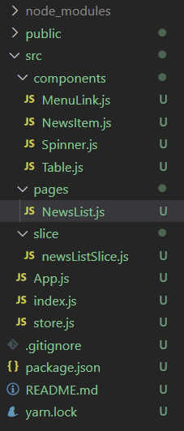

# redux-exam-NewsList
## 파일

## index.js
```js
import React from 'react';
import ReactDOM from 'react-dom/client';
import App from './App';
import { BrowserRouter } from 'react-router-dom';

import { Provider } from 'react-redux';
import store from './store';

const root = ReactDOM.createRoot(document.getElementById('root'));
root.render(
  <React.StrictMode>
    <Provider store={store}>
      <BrowserRouter>
        <App />
      </BrowserRouter>
    </Provider>
  </React.StrictMode>
);
```
## store.js
```js
import { configureStore, getDefaultMiddleware } from "@reduxjs/toolkit";
import { createLogger } from "redux-logger";
import newsListSlice from "./slice/newsListSlice";
const logger = createLogger()
const store = configureStore({
    reducer: {
        newsList: newsListSlice
    },
    middleware: [...getDefaultMiddleware({serializableCheck: false}), logger]
})

export default store;
```

## App.js
```js
import React from "react";
import {Routes, Route} from "react-router-dom"

import MenuLink from "./components/MenuLink";
import NewsList from "./pages/NewsList";

function App() {
  return (
    <div>
      <h1>redux-exam</h1>
      <nav>
        <MenuLink to="/">NewsList</MenuLink>
      </nav>
      <hr/>
      <Routes>
        <Route path="/" element={<NewsList/>} />
      </Routes>
    </div>
  );
}

export default App;
```
## newsListSlice.js
```js
import { createSlice, createAsyncThunk } from "@reduxjs/toolkit";
import axios from 'axios'

export const getList = createAsyncThunk("newslist/getList", async(payload, {rejectwithValue}) => {
    let result = null
    try {
        result = await axios.get("http://localhost:3001/news")
    } catch(err) {
        result = rejectwithValue(err.response);
    }
    return result;
})

const newsListSlice = createSlice({
    name: 'newsList',
    initialState: {
        data: null,
        loading: false,
        error: null
    },
    reducers: {},
    extraReducers: {
        [getList.pending]: (state, { payload }) => {
            return { ...state, loading: true}
        },
        [getList.fulfilled]: (state, { payload }) => {
            return {
                data: payload?.data,
                loading: false,
                error: null
            }
        },
        [getList.rejected]: (state, {payload}) => {
            return {
                data: payload?.data,
                loading: false,
                error: {
                    code: payload?.status ? payload.status : 500,
                    messsage: payload?.statusText ? payload.statusText : 'Server Error'
                } 
            }
        }
    }
})

export default newsListSlice.reducer
```
## NewsList.js
```js
import React from 'react';
import Spinner from "../components/Spinner"
import NewsItem from "../components/NewsItem"
import styled from "styled-components"
import {useSelector, useDispatch} from "react-redux"
import { getList } from '../slice/newsListSlice';

const ListContainer = styled.ul`
   list-style: none;
   padding: 0;
   margin: 0;
   width: 100%;
   box-sizing: border-box;
   display: flex;
   flex-direction: column;
   margin-bottom: 30px;
`

const NewList = () => {
    //출력 결과가 복잡해지는 것을 방지
    React.useEffect(() => console.clear(), []);

    const {loading, data, error} = useSelector(state => state.newsList)

    const dispatch = useDispatch();

    React.useEffect(() => {
        dispatch(getList())
    }, [dispatch])
    return (
        <div>
            <Spinner visible={loading}></Spinner>
            <h1>News List</h1>
            { error ? (
                <div>
                    <h1>Oops~!!! {error.code} Error.</h1>
                    <hr/>
                    <p>{error.message}</p>
                </div>
            ) : (
                <ListContainer>
                    {data && data.map((v, i) => <NewsItem key={i} item={v}/>)}
                </ListContainer>
            )}
        </div>
    );
};

export default NewList;
```

## components
### Spinner.js
```js
import React from 'react';
import PropTypes from "prop-types"
import styled from 'styled-components';

/** 로딩바 컴포넌트 */
// --> https://mhnpd.github.io/react-loader-spinner/
import {Bars} from 'react-loader-spinner'

/** 로딩바 뒤에 표시될 반투명 막 */
const TransLayer = styled.div`
    position: fixed;
    left: 0;
    right: 0;
    z-index: 9999;
    background-color: #0003;
    width: 100%;
    height: 100%;
`
const Spinner = ({ visible, color, width, height }) => {
    return (
        <div>
            {visible &&
                <TransLayer>
                    <Bars
                        color={color}
                        height={height}
                        width={width}
                        wrapperStyle={{
                            position: 'absolute',
                            zIndex: 10000,
                            left: '50%',
                            top: '50%',
                            marginLeft: (-width/2)+'px',
                            marginTop: (-height/2)+'px'
                        }}
                    />
                </TransLayer>
            }
        </div>
    );
};

/**기본값 정의 */
Spinner.defaultProps = {
    visible: false,
    color: '#06f',
    width: 100,
    height: 100
};

/** 데이터 타입 설정 */
Spinner.propTypes = {
    visible: PropTypes.bool.isRequired,
    color: PropTypes.string,
    width: PropTypes.number,
    height: PropTypes.number,
}

export default Spinner;
```

### NewsItem.js
```js
import React from "react";
import styled from 'styled-components';

const ListItem = styled.li`
    border-top: 1px solid #eee;

    &:last-child{
        border-bottom: 1px solid #eee;
    }
    .list-item-link {
        box-sizing: border-box;
        display: flex;
        flex-wrap: nowrap;
        flex-direction: row;
        align-items: center;
        padding: 5px 10px;
        text-decoration: none;
        color: #000;
        transition: all 0.1s;
        
        &:hover {
            background-color: #eeeeee55;
        }

        .thumbnail {
            width: 150px;
            height: 100px;
            display: block;
            object-fit: cover;
            flex: none;
        }

        .content {
            flex: 0 1 auto;
            padding: 5px 0 5px 20px;
            background-color: #ff01;

            h3 {
                background-color: #f0f1;
                box-sizing:border-box;
                font-size: 18px;
                font-weight: bold;
                margin: 0;
                margin-bottom: 10px;
                display: -webkit-box;
                overflow: hidden;
                text-overflow: ellipsis;
                -webkit-line-clamp: 1;
                -webkit-box-orient: vertical;
            }

            p {
                background-color: #0601;
                font-size: 14px;
                margin: 0;
                margin-bottom: 8px;
                display: -webkit-box;
                overflow: hidden;
                text-overflow: ellipsis;
                -webkit-line-clamp: 2;
                -webkit-box-orient: vertical;
            }

            ul {
                background-color: #0061;
                list-style: none;
                padding: 0;
                margin: 0;

                li {
                    display: inline-block;
                    font-size: 12px;

                    &:first-child:after {
                        content: '|';
                        display: inline-block;
                        color: #555;
                        padding: 0 5px;
                    }
                }
            }
        }
    }
`

const NewsItem = ({item: {author, title, description, url, image, datetime}}) => {
    console.group("NewsItem")
    console.log(`author: ${author}`);
    console.log(`title: ${title}`);
    console.log(`description: ${description}`);
    console.log(`url: ${url}`);
    console.log(`image: ${image}`);
    console.log(`datetime: ${datetime}`);
    console.groupEnd();
    return(
        <ListItem>
            <a className="list-item-link" href={url} target="_blank" rel="noreferrer">
                
                <div className="content">
                    <h3>{title}</h3>
                    <p>{description}</p>
                    <ul>
                        <li>{author}</li>
                        <li>{new Date(datetime).toLocaleString()}</li>
                    </ul>
                </div>
            </a>
        </ListItem>
    )
}

export default NewsItem;
```
### MenuLink.js
```js
import React from 'react';
import styled from 'styled-components';
import { NavLink } from 'react-router-dom';

/** 메뉴링크 --> NavLink: 현재 머물고 있는 페이지와 관련된 링크에 CSS 적용 */
const MenuLinkContainer = styled(NavLink)`
    font-size: 20px;
    cursor: pointer;
    text-decoration: none;
    padding-bottom: 2px;
    color: #222;
    /* css의 가상 클래스 hover*/
    &:hover {
        color: #22b9cf;
    }

    &:after {
        content: '|';
        display: inline-block;
        padding: 0 7px;
        color: #ccc; 
    }

    &:last-child {
        &:after {
            /*글자색을 흰색으로 지정하여 화면에서 숨긴다*/
            color: #fff;
        }
    }
    /*
        URL이 현재 메뉴를 가르키는 경우 (콜론이 아닌 점에 주의)
        활성 메뉴에 적용되는 기본 클래스 이름이 'active'이다.
    */
    &.active {
        text-decoration: underline;
        color: #22b8cf;

        &:after {
            /* 흰색 선을 추가하여 .active에서 지정한 border를 덮을 수 있도록 지정한다. (가림효과)*/
            border-bottom: 4px solid #fff !important;
        }
    }
`
const MenuLink = ({to, children}) => <MenuLinkContainer to={to}>{children}</MenuLinkContainer>

export default MenuLink;
```
## 구현
.png)