# 22.05.10
## 9장 컴포넌트 스타일링
* 일반 CSS: 컴포넌트를 스타일링하는 가장 기본적인 방식
* Sass: 자주 사용되는 CSS 전처리기 중 하나로 확장된 CSS문법을 사용하여 CSS코드를 더욱 쉽게 작성할 수 있도록 해 준다.
* CSS Module: 스타일 작성할 때 CSS클래스가 다른 CSS 클래스의 이름과 절대 충돌하지 않도록 파일마다 고유한 이름을 자동으로 생성해 주는 옵션이다.
* styled-components: 스타일을 자바스크립트 파일에 내장 시키는 방식으로 스타일을 작성함과 동시에 해당 스타일이 적용된 컴포넌트를 만들 수 있게 해 준다.<br/>
위의 방식중 편한 것을 선택하여 사용하면 된다.

### 9.1 가장 흔한 방식, 일반 CSS
react-app을 새로만들면 생기는 기본적인 파일.
App.js
```js
import logo from './logo.svg';
import './App.css';

function App() {
  return (
    <div className="App">
      <header className="App-header">
        
        <p>
          Edit <code>src/App.js</code> and save to reload.
        </p>
        <a
          className="App-link"
          href="https://reactjs.org"
          target="_blank"
          rel="noopener noreferrer"
        >
          Learn React
        </a>
      </header>
    </div>
  );
}

export default App;
```
```css
.App {
  text-align: center;
}

.App-logo {
  height: 40vmin;
  pointer-events: none;
}

@media (prefers-reduced-motion: no-preference) {
  .App-logo {
    animation: App-logo-spin infinite 20s linear;
  }
}

.App-header {
  background-color: #282c34;
  min-height: 100vh;
  display: flex;
  flex-direction: column;
  align-items: center;
  justify-content: center;
  font-size: calc(10px + 2vmin);
  color: white;
}

.App-link {
  color: #61dafb;
}

@keyframes App-logo-spin {
  from {
    transform: rotate(0deg);
  }
  to {
    transform: rotate(360deg);
  }
}
```
#### 9.1.1 이름 짓는 규칙
자기만의 네이밍 규칙을 만들거나, 메이저 업체의 코딩 규칙 문서를 참고 ex)네이버 코딩 컨벤션 등

### 9.2 Sass 사용하기
스타일 코드의 재활용성을 높여주는 것이 목적이다.<br/>
sass 와 scss의 차이는 중괄호({})와 세미콜론(;)의 차이로 scss를 권장하고 있다. scss 확장자는 기존 CSS를 작성하는 방식과 비교해서 문법이 크게 다르지 않다
```scss
$red: #fa5252;
$orange: #fd7e14;
$yellow: #fcc419;
$green: #40c057;
$blue: #339af0;
$indigo: #5c7cfa;
$violet: #7950f2;
//믹스인 만들기(재사용되는 스타일블록을 함수처럼 사용할 수 있음)
@mixin square($size) {
    $calculated: 32px * $size;
    width: $calculated;
    height: $calculated;
}

.SassComponent {
    display: flex;
    .box {//일반 CSS에서는 .SassComponent .box와 마찬가지
        background: red;
        cursor: pointer;
        transition: all 0.3s ease-in;
        &.red {
            // .red 클래스가 .box와 함께 사용되었을 때
            background: $red;
            @include square(1);
        }
        &.orange {
            background: $orange;
            @include square(2);
        }
        &.yellow {
            background: $yellow;
            @include square(3);
        }
        &.green {
            background: $green;
            @include square(4);
        }
        &.blue {
            background: $blue;
            @include square(5);
        }
        &.indigo {
            background: $indigo;
            @include square(6);
        }
        &.violet {
            background: $violet;
            @include square(7);
        }
        &:hover {
            //.box에 마우스를 올렸을 때
            background: black;
        }
    }
}
```
```js
import React from 'react';
import "./SassComponent.scss";

const SassComponent = () => {
    return (
        <div className="SassComponent">
            <div className="box red"/>
            <div className="box orange"/>
            <div className="box yellow"/>
            <div className="box green"/>
            <div className="box blue"/>
            <div className="box indigo"/>
            <div className="box violet"/>
        </div>
    );
};

export default SassComponent;
```
```js
import React from "react";
import SassComponent from "./SassComponent";

function App() {
  return (
    <div >
      <SassComponent/>
    </div>
  );
}

export default App;
```
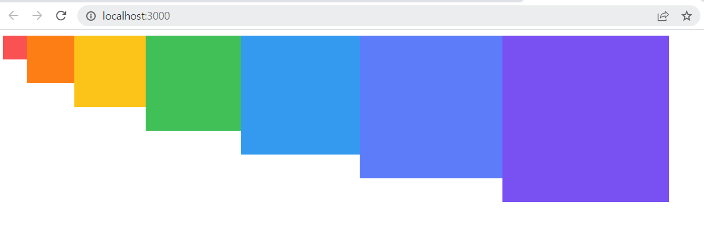
#### 9.2.1 utils 함수 분리하기
선언한 변수와 mixin을 따로 utils.scss 파일에 분리하여 SassComponent.scss에서 import하여 사용할 수 있다.
```scss
$red: #fa5252;
$orange: #fd7e14;
$yellow: #fcc419;
$green: #40c057;
$blue: #339af0;
$indigo: #5c7cfa;
$violet: #7950f2;
//믹스인 만들기(재사용되는 스타일블록을 함수처럼 사용할 수 있음)
@mixin square($size) {
    $calculated: 32px * $size;
    width: $calculated;
    height: $calculated;
}
```
```scss
@import './styles/utils.scss';
.SassComponent {
    display: flex;
    .box {//일반 CSS에서는 .SassComponent .box와 마찬가지
        background: red;
        cursor: pointer;
        transition: all 0.3s ease-in;
        &.red {
            // .red 클래스가 .box와 함께 사용되었을 때
            background: $red;
            @include square(1);
        }
        &.orange {
            background: $orange;
            @include square(2);
        }
        &.yellow {
            background: $yellow;
            @include square(3);
        }
        &.green {
            background: $green;
            @include square(4);
        }
        &.blue {
            background: $blue;
            @include square(5);
        }
        &.indigo {
            background: $indigo;
            @include square(6);
        }
        &.violet {
            background: $violet;
            @include square(7);
        }
        &:hover {
            //.box에 마우스를 올렸을 때
            background: black;
        }
    }
}
```

### 9.3 CSS Module
CSS를 불러와서 사용할 때 클래스 이름을 고유한 값, 즉 [파일이름]_[클래스 이름]__[해시값(랜덤값)]형태로 자동으로 만들어서 컴포넌트 스타일 클래스 이름이 중첩되는 현상을 방지해 주는 기술이다. 따로 설정할 필요없이 .module.css 확장자로 파일을 저장히가만 하면 CSS Module이 적용된다.
```css
/*자동으로 고유해질 것이므로 흔히 사용되는 단어를 클래스 이름으로 마음대로 사용 가능*/

.wrapper {
    background: black;
    padding: 1rem;
    color: white;
    font-size: 2rem;
}

/* 글로벌 CSS를 작성하고 싶다면 */
:global .something {
    font-weight: 800;
    color: aqua;
}
```
글로벌 css는 클래스이름이 난독화 되지 않는다. CSS Module을 사용하면 클래스 이름을 지을 때 그 고유성에 대해 고민하지 않아도 된다. 서로 다른 css에 같은 클래스 이름이 있어도 난독화 과정에서 서로 다른 값으로 구분된다.
```js
import React from 'react';
import styles from "./CSSModule.module.css"

const CSSModule = () => {
    return (
        <div className={styles.wrapper}
        // CSS클래스 이름이 멤버변수로 인식되므로 클래스 이름을 카멜표기법으로 지정해야 한다.
        // 스네이크 표기법을 사용한 경우 styles["클래스이름"] 형식으로 적용해야 한다.
        >
            안녕하세요, 저는 <span className="something">CSS Module!</span>
        </div>
    );
};

export default CSSModule;
```
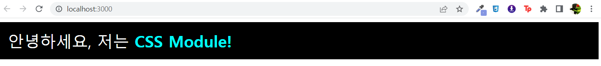
고유한 클래스 이름을 사용하려면 클래스를 적용하고 싶은 JSX 엘리먼트에 className={styles.[클래스 이름]} 형태로 전달하면 된다. :global을 사용하여 전역적으로 선언한 클래스의 경우 평상시 해 왔던 것처럼 그냥 문자열로 넣어 준다. <br/>

```css
/*자동으로 고유해질 것이므로 흔히 사용되는 단어를 클래스 이름으로 마음대로 사용 가능*/

.wrapper {
    background: black;
    padding: 1rem;
    color: white;
    font-size: 2rem;
}

.inverted {
    color: black;
    background: white;
    border: 1px solid black;
}

/* 글로벌 CSS를 작성하고 싶다면 */
:global .something {
    font-weight: 800;
    color: aqua;
}
```
```js
import React from 'react';
import styles from "./CSSModule.module.css"

const CSSModule = () => {
    return (
        <div className={`${styles.wrapper} ${styles.inverted}`}>
            안녕하세요, 저는 <span className="something">CSS Module!</span>
        </div>
    );
};

export default CSSModule;
```
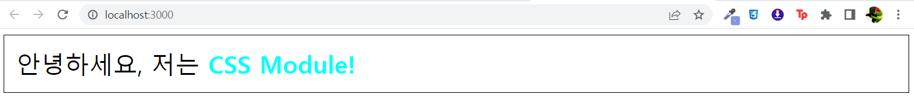
두개 이상의 클래스를 적용하려면 위의 방법을 사용하거나 클래스를 배열로 배치하여 join() 함수를 사용하면 된다.<br/>

```js
className={[styles.wrapper, styles.inverted].join(' ')}
```

#### 9.3.1 classnames
CSS 클래스를 조건부로 설정할 때 매우 유용한 라이브러리이다.
```js
import classNames from 'classnames';

classNames('one', 'two'); // = 'one two'
classNames('one', {two : true}); // = 'one two'
classNames('one', {two : false}); // = 'one '
classNames('one', ['two', 'three']); // = 'one two three'

const myClass = 'hello'; //클래스이름 변수화 
// let a = true; 조건부 클래스 적용
classNames('one', myclass, { myCondition: true /* true 대신 a */ }); // = 'one hello myCondition'
```
여러 가지 종류의 파라미터를 조합해 CSS클래스를 설정할 수 있기 때문에 컴포넌트에서 조건부로 클래스를 설정할 때 편하다.
```js
const MyComponent = ({highlighted, theme}) => {
    <div className={classNames('MyComponent', {highlighted}, theme)}>Hello</div>
    //props값이 존재할 때만 props에 저장된 값이 class이름으로 사용됨
}
```
라이브러리가 없다면 다음 같은 형식으로 처리해야 한다.
```js
const MyComponent = ({highlighted, theme}) => {
    <div className={`MyComponent ${theme} ${highlighted ? 'highlighted' : ''}`}>
        Hello
    </div>
}
```
bind 함수를 사용하면 클래스를 넣어 줄 때마다 styles.[클래스이름] 형태를 사용할 필요가 없다.
```js
import React from 'react';
import classNames from 'classnames/bind';
import styles from "./CSSModule.module.css"

const cx = classNames.bind(styles) //미리 styles에서 클래스를 받아 오도록 설정
const CSSModule = () => {
    return (
        <div className={cx('wrapper', 'inverted')}>
            안녕하세요, 저는 <span className="something">CSS Module!</span>
        </div>
    );
};

export default CSSModule;
```

#### 9.3.2 Sass와 함께 사용하기
module.scss 확장자를 사용하면 된다.
```scss
/*자동으로 고유해질 것이므로 흔히 사용되는 단어를 클래스 이름으로 마음대로 사용 가능*/

.wrapper {
    background: black;
    padding: 1rem;
    color: white;
    font-size: 2rem;

    &.inverted {
        color: black;
        background: white;
        border: 1px solid black;
    }
}

/* 글로벌 CSS를 작성하고 싶다면 */
:global {
    .something {
        font-weight: 800;
        color: aqua;
    }
} 
```

### 9.4 styled-components
자바스크립트 파일 안에 스타일 선언하는 방식이다. CSS-in-JS라고 부른다.
```js
import React from 'react';
import styled, {css} from 'styled-components'
const Box = styled.div`
    /*props로 넣어 준 값을 직접 전달해 줄 수 있다.*/
    background: ${props => props.color || 'black'};
    padding: 1rem;
    display: flex;
`

const Button = styled.button`
    background: white;
    color: black;
    border-radius: 4px;
    padding: 0.5rem;
    display: flex;
    align-items: center;
    justify-content: center;
    box-sizing: border-box;
    font-size: 1rem;
    font-weight: 600;
    /* & 문자를 사용하여 Sass처럼 자기 자신 선택 가능 */
    &:hover {
        background: rgba(255,255,255, 0.9);
    }
    /* 다음 코드는 inverted 값이 true일 때 특정 스타일을 부여해 준다. */
    ${props =>
        props.inverted &&
        css`
            background: none;
            border: 2px solid white;
            color: white;
            &:hover {
                background: white;
                color: black;
            }
        `
    }
    & + button {
        margin-left: 1rem;
    }
`

const StyledComponent = () => {
    return (
        <Box color='black'>
            <Button>안녕하세요</Button>
            <Button inverted={true}>테두리만</Button>
        </Box>
    );
};

export default StyledComponent;
```
```js
import React from "react";
import StyledComponent from "./StyledComponent";

function App() {
  return (
    <div >
      <StyledComponent/>
    </div>
  );
}

export default App;
```
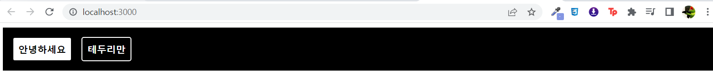

#### 9.4.1 Tagged 템플릿 리터럴
앞서 작성한 코드에서 ``을 사용하여 만든 문자열에 스타일 정보를 넣어 주었다. 이 문법을 Tagged 템플릿 리터럴 이라고 한다. 일반 템플릿 리터럴과 다른 점은 자바스크립트 객체나 함수를 전달할 때 온전히 추출할 수 있다는 것이다.
```js
function tagged(...args) {
console.log(args);
}
tagged`hello ${{foo: 'bar'}} ${() => 'world'}`
```
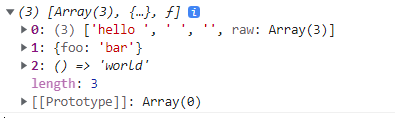

#### 9.4.2 스타일링된 엘리먼트 만들기
styled-components를 사용하여 스타일링된 엘리먼트를 만들 때는 컴포넌트 파일의 상단에서 styled를 물러오고, styled.태그명을 사용하여 구현한다.
```js
import styled from 'styled-components';

const MyComponent = styled.div`
    font-size: 2rem;
`
```
사용하려면 `<MyComponent>Hello</MyComponent>`와 같은 형태로 사용 가능하다.<br/>
태그명이 유동적이거나 특정 컴포넌트 자체에 스타일링 하고 싶다면 다음과 같이 구현할 수 있다.
```js
// 태그의 타입을 styled 함수의 인자로 전달
const MyInput = styled('input')`
    background: gray;
`

// 아예 컴포넌트 형식의 값을 넣어 줌
const StyledLink = styled(Link)`
    color: blue;
`
```

#### 9.4.3 스타일에서 props 조회하기
스타일 쪽에서 컴포넌트에게 전달된 props 값을 참조할 수 있다.
```js
const Box = styled.div`
    /* props로 넣어 준 값을 직접 전달해 줄 수 있다. */
    background: ${props => props.color || 'blue'};
    padding: 1rem;
    display: flex;
`
```
props를 조회해서 props.color의 값을 사용하게 했다. color값이 주어지지 않으면 blue가 기본 색상이 된다.<br/>
JSX에서 사용될 때 color 값을 props로 넣어 줄 수 있다.
```js
<Box color="black">(...)</Box>
```

#### 9.4.4 props에 따른 조건부 스타일링
```js
/* 다음 코드는 inverted 값이 true일 때 특정 스타일을 부여해 준다. */
${props =>
    props.inverted &&
    css`
        background: none;
        border: 2px solid white;
        color: white;
        &:hover {
            background: white;
            color: black;
        }
    `
}
```
#### 9.4.5 반응형 디자인
media 쿼리를 사용하면 된다.
```js
const Box = styled.div`
    /*props로 넣어 준 값을 직접 전달해 줄 수 있다.*/
    background: ${props => props.color || 'black'};
    padding: 1rem;
    display: flex;
    /* 기본적으로 가로 크기는 1024px에 가운데 정렬을하고
    가로 크기가 작아짐에 따라 크기를 줄이고
    768px 미만이 되면 꽉 채운다.*/
    width: 1024px;
    margin: 0 auto;
    @media (max-width: 1024px){
        width: 768px;
    }
    @media (max-width: 768px) {
        width: 100%;
    }
`
```
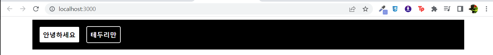
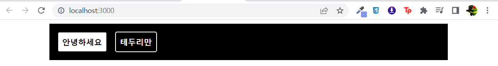
styled-components 매뉴얼에서 제공하는 유틸 함수를 사용하면 다음과 같다
```js
const sizes = {
    desktop: 1024,
    tablet: 768
};
// 위에 있는 size 객체에 따라 자동으로 media 쿼리 함수를 만들어 준다.
const media = Object.keys(sizes).reduce((acc, label) => {
    acc[label] = (...args) => css`
        @media (max-width: ${sizes[label]/16}em) {
            ${css(...args)};
        }
    `
    return acc;
}, {});
const Box = styled.div`
    /*props로 넣어 준 값을 직접 전달해 줄 수 있다.*/
    background: ${props => props.color || 'black'};
    padding: 1rem;
    display: flex;
    /* 기본적으로 가로 크기는 1024px에 가운데 정렬을하고
    가로 크기가 작아짐에 따라 크기를 줄이고
    768px 미만이 되면 꽉 채운다.*/
    width: 1024px;
    margin: 0 auto;
    ${media.desktop`width: 768px,`}
    ${media.tablet`width: 100%`};
`
```

## 13장 리액트 라우터로 SPA 개발하기
### 13.1 SPA란?
SPA는 Single Page Application(싱글 페이지 애플리케이션). 말 그래도 한개의 페이지로 이루어진 애플리케이션이다. <br/>


웹 서버라는 소프트웨어에 웹 브라우저가 접속한다. 이 때 전달되는 URL은 웹 서버가 관리하는 폴더에 저장되어 있는 HTML파일의 경로를 의미한다. 즉, 웹 브러우저가 웹 서버에 저장되어 있는 웹 페이지를 열람한다. 페이지 이동시마다 접속과 해제가 이루어 진다. <br/>

기존에는 사용자가 다른 페이지로 이동할 때마다 새로운 html을 받아 오고, 페이지를 로딩할 때마다 서버에서 리소스를 전달받아 해석한 뒤 화면에 보여 주었다. 사용자에게 보이는 화면은 서버측에서 준비했다. 사전에 html파일을 만들어서 제공하거나, 데이터에 따라 유동적인 html을 생성해 주는 템플릿 엔진을 사용하기도 했다. <br/>

요즘은 웹에서 제공되는 정보가 정말 많기 때문에 화면을 보여줄 때 마다 뷰를 준비한다면 성능상의 문제가 발생할 수 있다. <br/>

화면 전환이 일어날 때마다 html을 계속 서버에 새로 요청하면 사용자의 인터페이스에서 사용하고 있던 상태를 유지하는 것도 번거롭고, 바뀌지 않는 부분까지 새로 불러와서 보여주어야 하기 때문에 불필요한 로딩이 있어서 비효율 적이다. <br/>

그래서 리액트 같은 라이브러리 혹은 프레임워크를 사용하여 뷰 렌더링을 사용자의 브라우저가 담당하도록 하고, 우선 애플리케이션을 부라우저에 불러와서 실행시킨 후 사용자와의 인터랙션이 발생하면 필요한 부분만 자바스크립트를 사용하여 업데이트해 준다.(SPA) 새로운 데이터가 필요하다면 서버API를 호출하여 필요한 데이터만 새로 불러와 애플리케이션에서 사용할 수 있다.(Ajax) <br/>
 
싱글 페이지라고 화면이 한 종류는 아니다. 다른 주소에 다른 화면을 보여 주는 것을 라우팅이라고 한다. 대표적인 리액트 라우팅 라이브러리는 리액트 라우터다.

#### 13.1.1 SPA의 단점
앱의 규모가 커지면 자바스크립트 파일이 너무 커지는 것이 단점이다. 최초 접속시 모든 화면을 구성하는 스크립트를 한번에 모두 로딩해야 한다. 페이지 로딩시 사용자가 실제로 방문하지 않을 수도 있는 페이지의 스크립트도 불러오기 때문이다. 소스 코드 분할을 하면 개선할 수 있다. <br/>

리액트 라우터처럼 브라우저에서 자바스크립트를 사용하여 라우팅 관리하는 것은 자바스크립트를 실행하지 않는 일반 크롤러에서는 페이지의 정보를 제대로 수집해 가지 못한다는 잠재적 단업이 따른다. 검색 엔진의 검색 결과에 페이지가 잘 나타나지 않을 수 있다. 이러한 경우는 서버 사이드 렌더링(react와 불리해야함. next.js사용)을 통해 해결할 수 있다.

### 13.2 프로젝트 준비 및 기본적인 사용법
#### 13.2.1 프로젝트 생성 및 라이브러리 설치
새로운 프로젝트 생성
`$yarn create react-app router-tutorial `

<br/>

react-router-dom 설치
`$yarn add react-router-dom`

#### 13.2.2 프로젝트에 라우터 적용
```js
import React from 'react';
import ReactDOM from 'react-dom/client';
import App from './App';
import { BrowserRouter } from 'react-router-dom';

const root = ReactDOM.createRoot(document.getElementById('root'));
root.render(
  <React.StrictMode>
    <BrowserRouter>
      <App />
    </BrowserRouter>
  </React.StrictMode>
);
```

#### 13.2.3 페이지 만들기
Home.js
```js
import React from 'react';

const Home = () => {
    return (
        <div>
            <h1>홈</h1>
            <p>홈, 그 페이지는 가장 먼저 보여지는 페이지.</p>
        </div>
    );
};

export default Home;
```
About.js
```js
import React from 'react';

const About = () => {
    return (
        <div>
            <h1>소개</h1>
            <p>이 프로젝트는 리액트 라우터 기초를 실습해 보는 예제 프로젝트입니다.</p>
        </div>
    );
};

export default About;
```

#### 13.2.4 Route 컴포넌트로 특정 주소에 컴포넌트 연결
```js
import React from "react";
import Home from "./Home";
import About from "./About";
import {Routes, Route} from "react-router-dom"

function App() {
  return (
    <div >
      <Routes>
      {/*exact={true}는 첫페이지 설정*/}
        <Route path="/" exact={true} element={<Home/>} />
        <Route path="/about" element={<About/>}/>
      </Routes>
    </div>
  );
}

export default App;
```
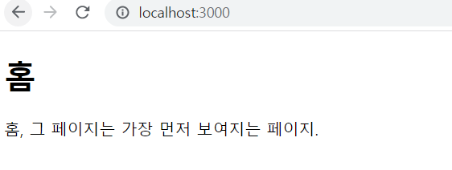
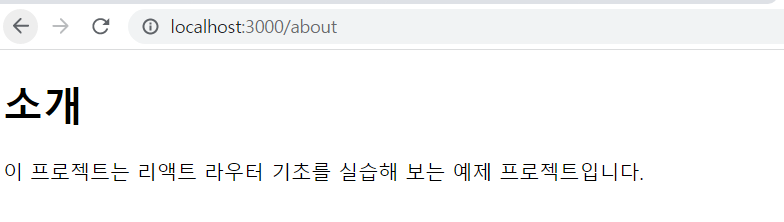

#### 13.2.5 Link 컴포넌트를 사용하여 다른 주소로 이동하기
Link 컴포넌트는 클릭하면 다른 주소로 이동시켜주는 컴포넌트이다. a태그를 사용하면 페이지를 전환하는 과정에서 페이지를 새로 불러오기 때문에 애플리케이션이 들고 있던 상태들을 모두 날려 버리게 된다.<br/>
Link 컴포넌트를 사용하여 페이지를 전환하면, 페이지를 새로 불러오지 않고 애플리케이션은 그대로 유지한 상태에서 HTML5 History API를 사용하여 페이지의 주소만 변경해 준다. 페이지 전환을 방지하는 기능이 내장되어 있다.
```js
import React from "react";
import Home from "./Home";
import About from "./About";
import {Routes, Route, Link} from "react-router-dom"

function App() {
  return (
    <div >
      <ul>
        <li>
          <Link to="/">홈</Link>
        </li>
        <li>
          <Link to='/about'>소개</Link>
        </li>
      </ul>
      <hr/>
      <Routes>
        <Route path="/" exact={true} element={<Home/>} />
        <Route path="/about" element={<About/>}/>
      </Routes>
    </div>
  );
}

export default App;
```

### 13.3 Route 하나에 여러개의 path 설정하기
여러 개의 path에 같은 컴포넌트를 보여주고 싶을 경우
```js
import React from "react";
import Home from "./Home";
import About from "./About";
import {Routes, Route} from "react-router-dom"

function App() {
  return (
    <div >
      <Routes>
        <Route path="/" exact={true} element={<Home/>} />
        <Route path='/info' element={<About/>} />
        <Route path="/about" element={<About/>}/>
      </Routes>
    </div>
  );
}

export default App;
```

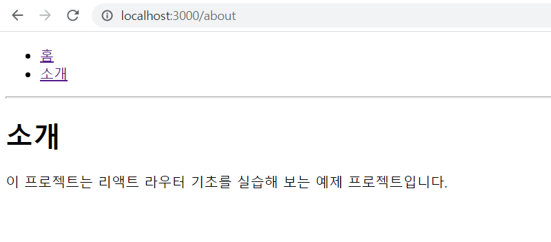
path를 배열로 주는 방법은 최신버전에선 해당되지 않는다. (2022년 05월 6.21버전 기준으로 적용 안됨)

### 13.4 URL 파라미터와 쿼리
#### 13.4.1 URL파라미터
Profile.js
```js
import React from 'react';
import { useParams } from 'react-router-dom';
const data = {
    velopert: {
        name: "김민준",
        description: '리액트를 좋아하는 개발자'
    },
    gildong: {
        name: '홍길동',
        description: '고전 소설 홍길동전의 주인공'
    }
}

const Profile = () => {
    const {username} = useParams();
    const profile = data[username];
    if (!profile) {
        return <div>존재하지 않는 사용자입니다.</div>
    }
    return (
        <div>
            <h3>{username}({profile.name})</h3>
            <p>{profile.description}</p>
        </div>
    );
};

export default Profile;
```
react-router-dom패키지의 useParams() 함수를 사용하여 URL파라미터가 저장되어 있는 객체를 리턴받을 수 있다.
```js
import React from "react";
import Home from "./Home";
import About from "./About";
import Profile from "./Profile";
import {Routes, Route, Link} from "react-router-dom"

function App() {
  return (
    <div >
      <ul>
        <li>
          <Link to="/">홈</Link>
        </li>
        <li>
          <Link to='/about'>소개</Link>
        </li>
        <li>
          <Link to='/profile/velopert'>velopert 프로필</Link>
        </li>
        <li>
        <Link to='/profile/gildong'>gildong 프로필</Link>
        </li>
      </ul>
      <hr/>
      <Routes>
        <Route path="/" exact={true} element={<Home/>} />
        <Route path="/about" element={<About/>}/>
        <Route path="/profile/:username" element={<Profile/>}/>
      </Routes>
    </div>
  );
}

export default App;
```
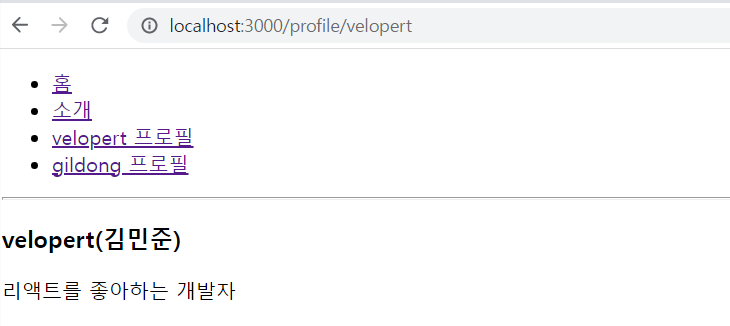
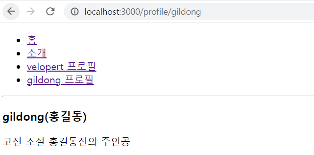

#### 13.4.2 URL 쿼리
```js
import React from 'react';
import { useLocation } from 'react-router-dom';

const About = () => {
    const location = useLocation();
    const {search} = location;
    const query = new URLSearchParams(search);
    const showDetail = query.get('detail') ==='true';
    return (
        <div>
            <h1>소개</h1>
            <p>이 프로젝트는 리액트 라우터 기초를 실습해 보는 예제 프로젝트입니다.</p>
            {showDetail && <p>detail 값을 true로 설정하셨군요!</p>}
        </div>
    );
};

export default About;
```
쿼리를 사용할 때는 쿼리 문자열을 객체로 파싱하는 과정에서 결과 값은 언제나 문자열이다. 그렇기 때문에 숫자를 받아와야 한다면 parseInt 함수를 통해 꼭 숫자로 변환 해야 한다. 논리 자료형 값을 사용해야 하는 경우에는 정확히 "true" 문자열이랑 일치하는지 비교해야 한다.

### 13.5 서브 라우트
라우트 내부에 또 라우트를 정의하는 것을 의미한다. 라우트로 사용되고 있는 컴포넌트의 내부에 Route컴포넌트를 또 사용하면 된다.
Profiles.js
```js
import React from 'react';
import {Link, Route, Routes} from "react-router-dom"
import Profile from './Profile';

const Profiles = () => {
    return (
        <div>
            <h3>사용자 목록:</h3>
            <ul>
                <li>
                    <Link to="/profiles/velopert">velopert</Link>
                </li>
                <li>
                    <Link to="/profiles/gildong">gildong</Link>
                </li>
            </ul>

            <Routes>
                <Route 
                    path="/" 
                    element='사용자를 선택해 주세요.'
                />
                <Route path=":username" element={<Profile/>}/>
            </Routes>
        </div>
    );
};

export default Profiles;
```
App.js
```js
import React from "react";
import Home from "./Home";
import About from "./About";
import Profiles from "./Profiles";
import {Routes, Route, Link} from "react-router-dom"

function App() {
  return (
    <div >
      <ul>
        <li>
          <Link to="/">홈</Link>
        </li>
        <li>
          <Link to='/about'>소개</Link>
        </li>
        <li>
          <Link to='/profiles'>프로필</Link>
        </li>
      </ul>
      <hr/>
      <Routes>
        <Route path="/" exact={true} element={<Home/>} />
        <Route path="/about" element={<About/>}/>
        <Route path="/profiles/*" element={<Profiles/>}/>
      </Routes>
    </div>
  );
}

export default App;
```
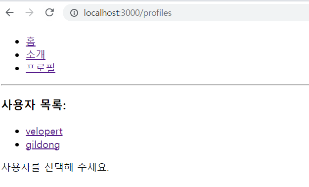
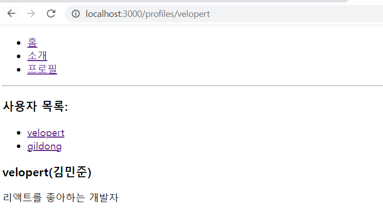
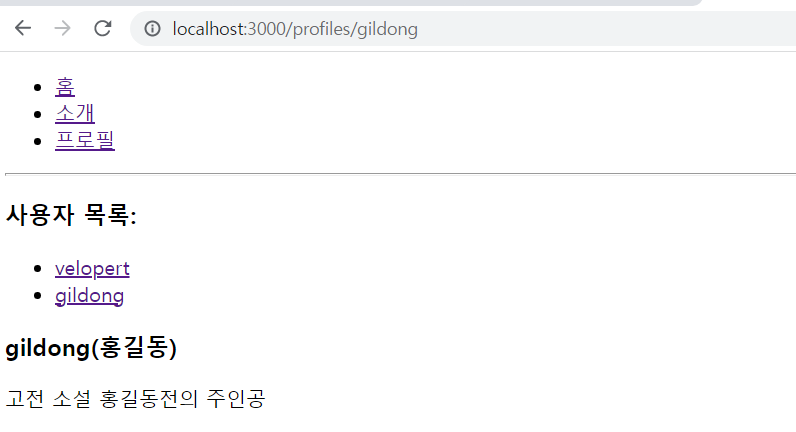

### 13.6 리액트 라우터 부가기능
#### 13.6.1 history -> useNavigate
```js
import useNavigate from 'react-router-dom';
const navigate = useNavigate();

const goBack = () => {
    // 이전페이지로 이동 (-1)
    navigate(-1);
    // 앞페이지롱 이동(+1)
    // 숫자만큼 앞 뒤로 이동함
}
```
replace 라는 옵션을 사용하면 페이지를 이동할 때 현재 페이지를 페이지 기록에 남기지 않을수 있다. { replace: true }

#### 13.6.2 WithRouter -> useLocation(), useParams()
```js
import useLocation from 'react-router-dom'
const location = useLocation()
const search = {location}
const query = URLSearchParams(search)
const showDetail = query.get('detail') // boolean 값은 비교가 필수, 숫자는 parseInt, 문자열은 그냥 출력
```
```js
import useParams from 'react-router-dom'
//Link의 패스에 명시된 값을 라우트를 통해 받아옴 
//ex)<Link path="/profile/velopert">(...)</Link> <Route path="profile/:username" element={<profile/>}/>
//링크를 클릭하면 username = velopert가 된다.
const {username} = useParams();
```

#### 13.6.3 Switch -> Routes로 변경됨
여러 Routes를 감싸서 그중 URL이 일치하는 단 하나의 라우트만을 렌더링 한다.
```js
<Routes>
    <Route/>
</Routes>
```

#### 13.6.4 NavLink
링크가 활성화되었을 때의 스타일을 적용할 때는 activeStyle 값을, CSS 클래스를 적용할 때는 activeClassName 값을 props로 넣어 주면 된다. <br/>
활성화 되었을 때 acitve 클래스가 자동 적용되므로 active 클래스에 대한 Global CSS만 미리 정의해 두면 된다.

#### 13.6.5 Navigate
컴포넌트를 화면에 보여주는 순간 다른 페이지로 이동 하고 싶을 때 사용하는 컴포넌트이다. 즉, 리다이렉트하고 싶을 때 사용한다.
```js
const Login = () => {
    return <div>로그인 페이지</div>
};

export default Login;
```
```js
import { Navigate } from 'react-router-dom';

const MyPage = () => {
    const isLoggedIn = false;

    if(!isLoggedIn) {
        return <Navigate to="/login" replace={true} />
    }
    return <div>마이 페이지</div>;

}
export default MyPage;
```
```js
import React from "react";
import {Routes, Route, Link} from "react-router-dom"
import MyPage from "./MyPage";
import Login from "./Login";

function App() {
  return (
    <div >
      <ul>
        <li>
          <Link to="/mypage">마이페이지</Link>
        </li>
        <li>
          <Link to="/login">로그인</Link>
        </li>
      </ul>
      <hr/>
      <Routes>
        <Route path="/mypage" element={<MyPage/>}/>
        <Route path="/login" element={<Login/>}/>
      </Routes>
    </div>
  );
}

export default App;
```
isLoggedIn 값이 false 이므로 Navigate에 의하여 MyPage 링크를 눌러도 Login 페이지로 이동한다.