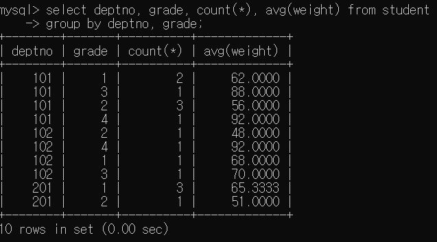
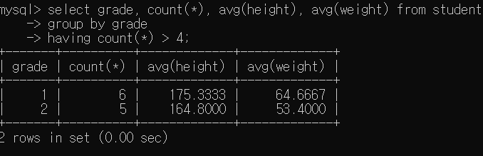
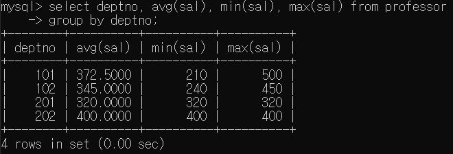
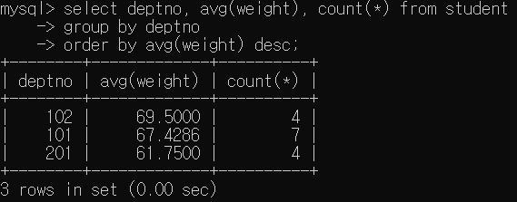
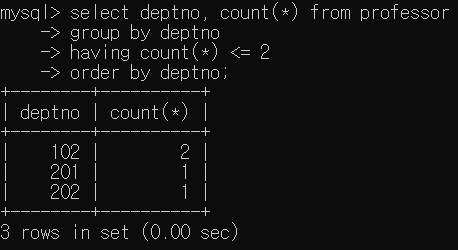
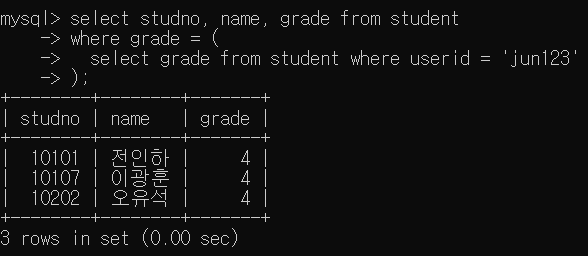
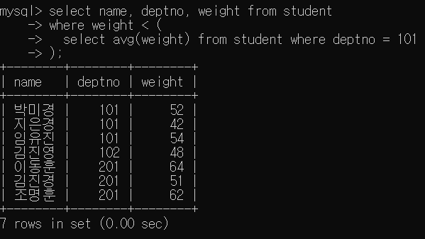
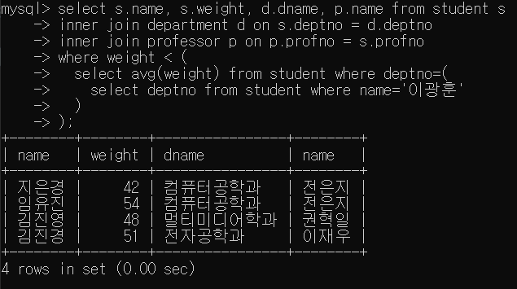
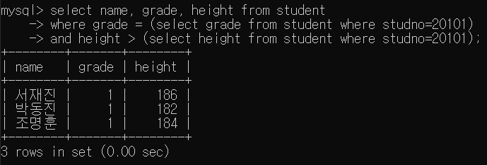
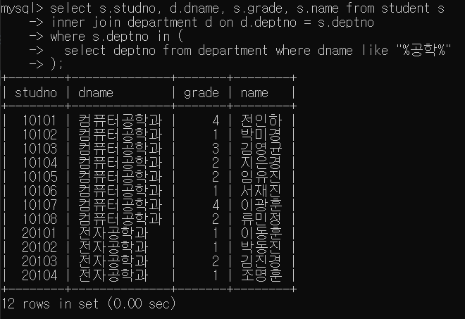

# 보고서

## 문항 1
1-1)
```sql
select deptno, grade, count(*), avg(weight) from student
group by deptno, grade;
```


1-2)
```sql
select grade, count(*), avg(height), avg(weight) from student
group by grade
having count(*) > 4;
```


1-3)
```sql
select deptno, avg(sal), min(sal), max(sal) from professor
group by deptno;
```


1-4)
```sql
select deptno, avg(weight), count(*) from student
group by deptno
order by avg(weight) desc;
```


1-5)
```sql
select deptno, count(*) from professor
group by deptno
having count(*) <= 2
order by deptno;
```


## 문항 2
2-1)
```sql
select studno, name, grade from student
where grade = (
  select grade from student where userid = 'jun123'
);
```


2-2)
```sql
select name, deptno, weight from student
where weight < (
  select avg(weight) from student where deptno = 101
);
```


2-3)
```sql
select s.name, s.weight, d.dname, p.name from student s
inner join department d on s.deptno = d.deptno
inner join professor p on p.profno = s.profno
where weight < (
  select avg(weight) from student where deptno=(
    select deptno from student where name='이광훈'
  )
);
```


2-4)
```sql
select name, grade, height from student
where grade = (select grade from student where studno=20101)
and height > (select height from student where studno=20101);
```


2-5)
```sql
select s.studno, d.dname, s.grade, s.name from student s
inner join department d on d.deptno = s.deptno
where s.deptno in (
  select deptno from department where dname like "%공학%"
);
```
