# 22.06.28 신지섭 시험 보고서
## 1)
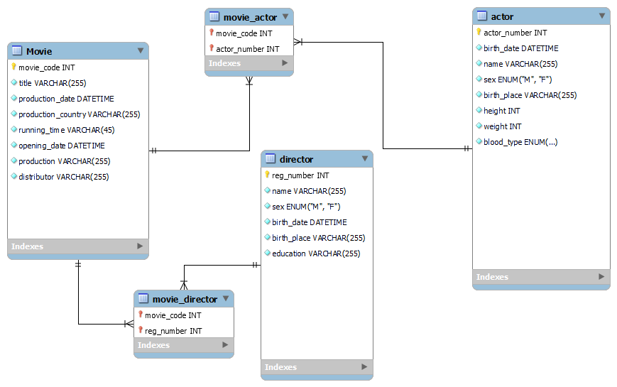

## 2)
영화 테이블
```sql
CREATE TABLE Movie (
  movie_code INT(11) NOT NULL COMMENT '영화코드번호',
  title VARCHAR(255) NOT NULL COMMENT '영화제목',
  production_date DATETIME NOT NULL COMMENT '제작년도',
  production_country VARCHAR(255) NOT NULL COMMENT '제작국가',
  running_time VARCHAR(45) NOT NULL COMMENT '상영시간',
  opening_date DATETIME NOT NULL COMMENT '개봉일자',
  production VARCHAR(255) NOT NULL COMMENT '제작사',
  distributor VARCHAR(255) NOT NULL COMMENT '배급사',
  PRIMARY KEY (movie_code))
ENGINE = InnoDB DEFAULT charset utf8 COMMENT '영화 정보 테이블';
```
감독 테이블
```sql
CREATE TABLE director (
  reg_number INT(11) NOT NULL COMMENT '등록번호',
  name VARCHAR(255) NOT NULL COMMENT '이름',
  sex ENUM("M", "F") NOT NULL COMMENT '성별',
  birth_date DATETIME NOT NULL COMMENT '생년월일',
  birth_place VARCHAR(255) NOT NULL COMMENT '출생지',
  education VARCHAR(255) NOT NULL COMMENT '학력사항',
  PRIMARY KEY (reg_number))
ENGINE = InnoDB DEFAULT charset utf8 COMMENT '영화감독 테이블';
```
배우 테이블
```sql
CREATE TABLE actor (
  actor_number INT(11) NOT NULL COMMENT '배우 번호',
  birth_date DATETIME NOT NULL COMMENT '생년월일',
  name VARCHAR(255) NOT NULL COMMENT '이름',
  sex ENUM("M", "F") NOT NULL COMMENT '성별',
  birth_place VARCHAR(255) NOT NULL COMMENT '출생지',
  height INT(11) NOT NULL COMMENT '키',
  weight INT(11) NOT NULL COMMENT '몸무게',
  blood_type ENUM('A', 'B', 'O', 'AB') NOT NULL COMMENT '혈액형',
  PRIMARY KEY (actor_number))
ENGINE = InnoDB DEFAULT charset = utf8 COMMENT '배우 테이블';
```
영화-감독 테이블
```sql
CREATE TABLE movie_director (
  movie_code int NOT NULL,
  reg_number int NOT NULL,
  PRIMARY KEY (movie_code, reg_number),
  FOREIGN KEY (movie_code) REFERENCES movie (movie_code),
  FOREIGN KEY (reg_number) REFERENCES director (reg_number)
)
ENGINE = InnoDB DEFAULT charset = utf8;
```
영화-배우 테이블
```sql
CREATE TABLE movie_actor (
  movie_code int NOT NULL,
  actor_number int NOT NULL,
  PRIMARY KEY (movie_code, actor_number),
  FOREIGN KEY (movie_code) REFERENCES movie (movie_code),
  FOREIGN KEY (actor_number) REFERENCES actor (actor_number)
)
ENGINE = InnoDB DEFAULT charset = utf8;
```
## 3)
영화 테이블 명세서

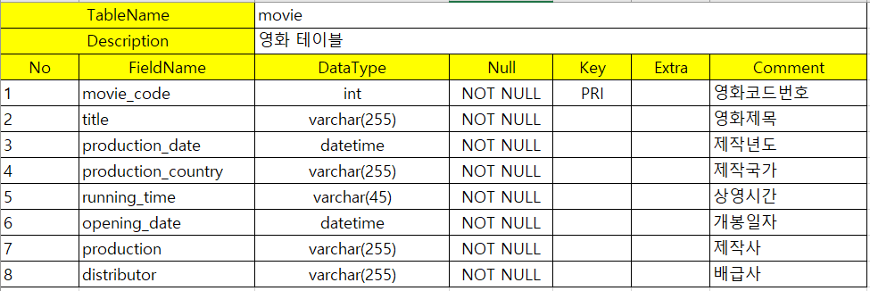

감독 테이블 명세서

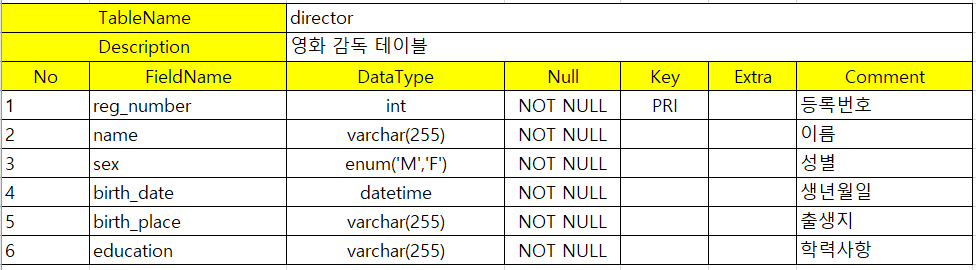

배우 테이블 명세서

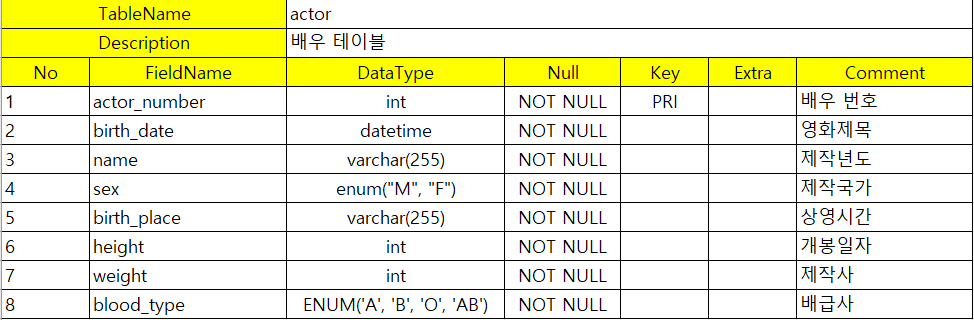

영화-감독 테이블

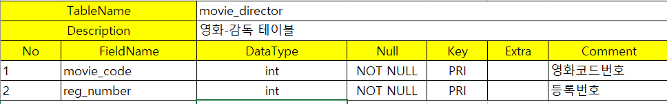

영화-배우 테이블

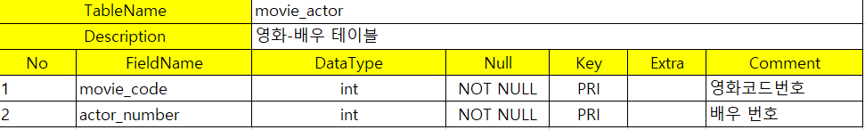

## 4)
영화 테이블


감독 테이블

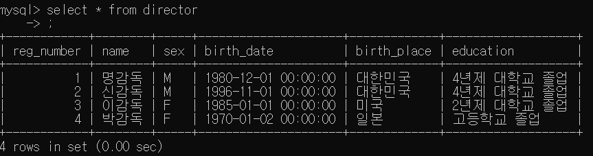

배우 테이블

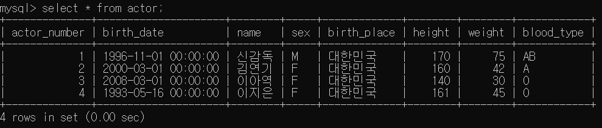

영화-감독 테이블

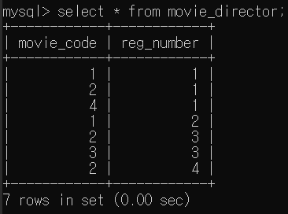

영화-배우 테이블

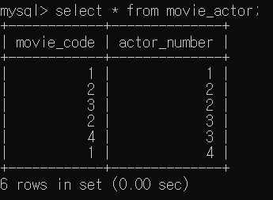
### 4-1)
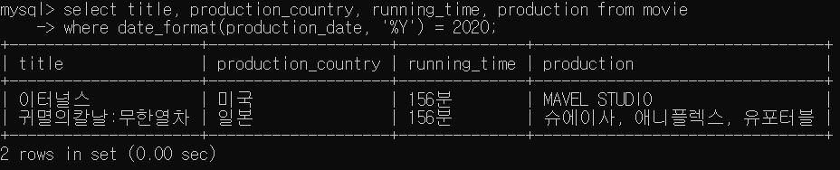

### 4-2)
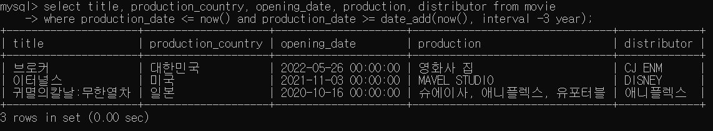
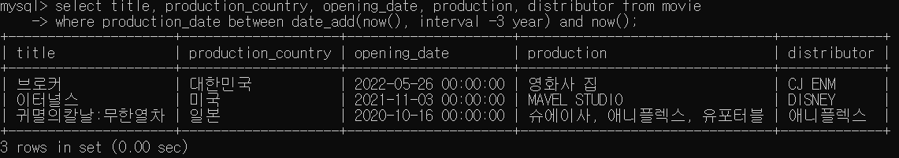

### 4-3)
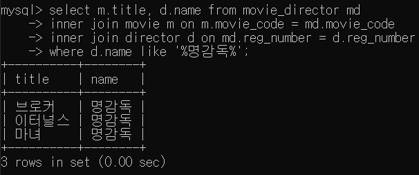

### 4-4)
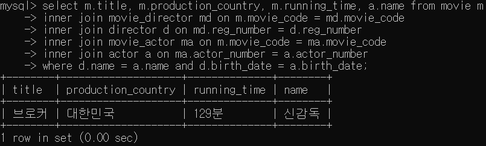
