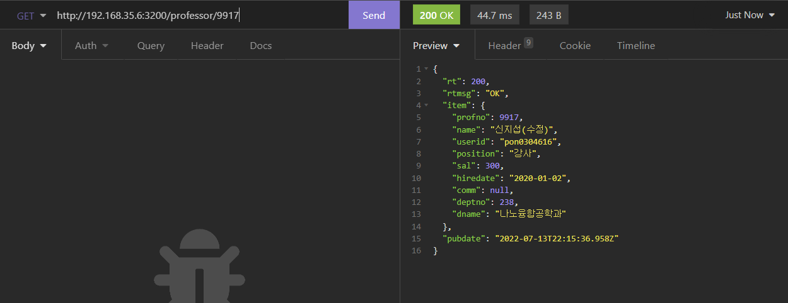

# NODEJS_신지섭

## 1) 생성
ProfessorMapper.xml
```xml
<insert id="insertItem">
  INSERT INTO professor (name, userid, position, sal, hiredate, comm, deptno) 
  VALUES (#{name}, #{userid}, #{position}, #{sal}, #{hiredate}, #{comm}, #{deptno})
</insert>
```

ProfessorService.js
```js
async addItem(params) {
  let dbcon = null;
  let data = null;

  try {
    dbcon = await DBPool.getConnection();

    let sql = mybatisMapper.getStatement('ProfessorMapper', 'insertItem', params);
    let [{insertId, affectedRows}] = await dbcon.query(sql);

    if (affectedRows === 0) {
      throw new RuntimeException('조회된 데이터가 없습니다.');
    }

    sql = mybatisMapper.getStatement('ProfessorMapper', 'selectItem', {profno: insertId})
    let [result] = await dbcon.query(sql);

    if (result.length === 0) {
      throw new RuntimeException('저장된 데이터를 조회할 수 없습니다.');
    }

    data = result[0];
  } catch (err) {
    throw err;
  } finally {
    if (dbcon) { dbcon. release(); }
  }
  return data;
}
```

professorController.js
```js
router.post(url, async(req, res, next) => {
  const name = req.post('name');
  const userid = req.post('userid');
  const position = req.post('position');
  const sal = req.post('sal');
  const hiredate = req.post('hiredate');
  const comm = req.post('comm');
  const deptno = req.post('deptno');

  let json = null;

  try {
    json = await ProfessorService.addItem({
      name: name,
      userid: userid,
      position: position,
      sal: sal,
      hiredate: hiredate,
      comm: comm,
      deptno: deptno
    })
  } catch (err) {
    return next(err);
  }

  res.sendResult({item: json});
})
```

### 생성 결과


## 2) 수정
ProfessorMapper.xml
```xml
<update id="updateItem">
  UPDATE
    professor SET name=#{name}, userid=#{userid}, sal=#{sal}, hiredate=#{hiredate}, comm=#{comm}, deptno=#{deptno}
  WHERE profno=#{profno};
</update>
```

ProfessorService.js
```js
async editItem(params) {
  let dbcon = null;
  let data = null;

  try {
    dbcon = await DBPool.getConnection();

    let sql = mybatisMapper.getStatement('ProfessorMapper', 'updateItem', params);
    let [{affectedRows}] = await dbcon.query(sql);

    sql = mybatisMapper.getStatement('ProfessorMapper', 'selectItem', {profno: params.profno});
    let [result] = await dbcon.query(sql);

    if (result.length === 0) {
      throw new RuntimeException('저장된 데이터를 조회할 수 없습니다.');
    }

    data = result[0]
  } catch (err) {
    throw err;
  } finally {
    if (dbcon) { dbcon.release(); }
  }
  return data;
}
```

professorController.js
```js
router.put(`${url}/:profno`, async(req, res, next) => {
  const profno = req.get('profno');
  const name = req.post('name');
  const userid = req.post('userid');
  const position = req.post('position');
  const sal = req.post('sal');
  const hiredate = req.post('hiredate');
  const comm = req.post('comm');
  const deptno = req.post('deptno');

  try {
    regexHelper.value(profno, '교수번호가 없습니다.');
    regexHelper.num(profno, '교수번호가 잘못되었습니다.');

    regexHelper.value(name, '이름이 없습니다.');

    regexHelper.value(userid, '아이디가 없습니다.');

    regexHelper.value(position, '직급이 없습니다.');

    regexHelper.value(sal, '급여가 없습니다.');
    regexHelper.num(sal, '급여는 숫자로 입력해야합니다.');

    regexHelper.value(hiredate, '입사일이 없습니다.');
    
    regexHelper.value(deptno, '학과번호가 없습니다.');
    regexHelper.num(deptno, '학과번호가 잘못되었습니다.');
  } catch (err) {
    return next(err);
  }

  let json = null;
  
  try {
    json = await ProfessorService.editItem({
      profno: profno,
      name: name,
      userid: userid,
      position: position,
      sal: sal,
      hiredate: hiredate,
      comm: comm,
      deptno: deptno
    })
  } catch (err) {
    return next(err);
  }

  res.sendResult({item: json});
})
```

### 수정 결과


## 3) 삭제
StudentMapper.xml
```xml
<delete id="deleteItemByProfno">
  DELETE FROM student WHERE profno=#{profno};
</delete>
```

ProfessorMapper.xml
```xml
<delete id="deleteItem">
  DELETE FROM professor WHERE profno=#{profno};
</delete>
```

ProfessorService.js
```js
async deleteItem(params) {
  let dbcon = null;

  try {
    dbcon = await DBPool.getConnection();

    let sql = mybatisMapper.getStatement('StudentMapper', 'deleteItemByProfno', params);
    let [{affectedRows}] = await dbcon.query(sql);

    sql = mybatisMapper.getStatement('ProfessorMapper', 'deleteItem', params);
    [{affectedRows}] = await dbcon.query(sql);

    if (affectedRows === 0) {
      throw new RuntimeException('삭제된 데이터가 없습니다.');
    }
  } catch (err) {
    return err;
  } finally {
    if (dbcon) { dbcon.release(); }
  }
}
```

professorController.js
```js
router.delete(`${url}/:profno`, async (req, res, next) => {
  const profno = req.get('profno');

  try {
    regexHelper.value(profno, '학과번호가 없습니다.');
    regexHelper.num(profno, '학과번호가 잘못되었습니다.');
  } catch (err) {
    return next(err);
  }

  try {
    await ProfessorService.deleteItem({
      profno: profno
    });
  }catch (err) {
    return next(err);
  }

  res.sendResult();
});
```

### 삭제 결과


## 4) 한명 조회
ProfessorMapper.xml
```xml
<select id="selectItem">
  SELECT
  profno, name, userid, position, sal, date_format(hiredate, '%Y-%m-%d') as hiredate, comm, d.deptno, d.dname
FROM department as d
INNER JOIN professor as p
ON p.deptno = d.deptno
WHERE profno=#{profno};
</select>
```

ProfessorService.js
```js
async getItem(params) {
  let dbcon = null;
  let data = null;

  try {
    dbcon = await DBPool.getConnection();

    let sql = mybatisMapper.getStatement('ProfessorMapper', 'selectItem', params);
    let [result] = await dbcon.query(sql);

    if (result.length === 0) {
      throw new RuntimeException('조회된 데이터가 없습니다.');
    }

    data = result[0];
  } catch (err) {
    throw err;
  } finally {
    if (dbcon) { dbcon.release(); }
  }
  return data;
}
```

professorController.js
```js
router.get(`${url}/:profno`, async (req, res, next) => {
  const profno = req.get('profno');

  try {
    regexHelper.value(profno, '교수번호가 없습니다.');
    regexHelper.num(profno, '교수번호가 잘못되었습니다.');
  } catch (err) {
    return next (err);
  }

  let json = null;

  try {
    json = await ProfessorService.getItem({
      profno: profno
    });
  } catch (err) {
    return next(err);
  }

  res.sendResult({item: json});
});
```

### 한명 조회 결과


## 5) 목록 조회
ProfessorMapper.xml
```xml
<select id="selectList">
  SELECT 
    profno, name, userid, position, sal, date_format(hiredate, '%Y-%m-%d') as hiredate, comm, p.deptno, d.dname 
  FROM professor as p
  INNER JOIN department as d
  ON p.deptno = d.deptno

  ORDER BY profno DESC

  <if test="listCount > 0">
    LIMIT ${offset}, ${listCount}
  </if>
</select>
```

ProfessorService.js
```js
async getList(params) {
  let dbcon = null;
  let data = null;

  try {
    dbcon = await DBPool.getConnection();

    let sql = mybatisMapper.getStatement('ProfessorMapper', 'selectList', params);
    let [result] = await dbcon.query(sql);

    if (result.length === 0) {
      throw new RuntimeException('조회된 데이터가 없습니다.');
    }

    data = result;
  } catch (err) {
    throw err
  } finally {
    if (dbcon) { dbcon.release(); }
  }
  return data;
}
```

professorController.js
```js
router.get(url, async (req, res, next) => {
  const query = req.get('query');
  const page = req.get('page', 1);
  const rows = req.get('rows', 10);

  const params = {}
  if (query) {
    params.name = query;
    params.userid = query;
    params.position = query;
    params.sal = query;
    params.hiredate = query;
    params.comm = query;
    params.deptno = query;
    params.dname = query;
  }

  let json = null;
  let pageInfo = null;

  try {
    const totalCount = await ProfessorService.getCount(params);
    pageInfo = pagenation(totalCount, page, rows);

    params.offset = pageInfo.offset;
    params.listCount = pageInfo.listCount;
    json = await ProfessorService.getList(params);
  } catch (err) {
    return next(err);
  }

  res.sendResult({pagenaiton: pageInfo, item: json});
});
```

### 목록 조회 결과


## 전체 코드
ProfessorMapper.xml
```xml
<?xml version="1.0" encoding="UTF-8"?>
<!DOCTYPE mapper PUBLIC "-//mybatis.org//DTD Mapper 3.0//EN" "http://mybatis.org/dtd/mybatis-3-mapper.dtd">

<mapper namespace="ProfessorMapper">

  <select id="selectItem">
   SELECT
    profno, name, userid, position, sal, date_format(hiredate, '%Y-%m-%d') as hiredate, comm, d.deptno, d.dname
  FROM department as d
  INNER JOIN professor as p
  ON p.deptno = d.deptno
  WHERE profno=#{profno};
  </select>

  <select id="selectList">
    SELECT 
      profno, name, userid, position, sal, date_format(hiredate, '%Y-%m-%d') as hiredate, comm, p.deptno, d.dname 
    FROM professor as p
    INNER JOIN department as d
    ON p.deptno = d.deptno

    ORDER BY profno DESC

    <if test="listCount > 0">
      LIMIT ${offset}, ${listCount}
    </if>
  </select>

  <!--데이터 생성을 위한 기능 정의-->
  <insert id="insertItem">
    INSERT INTO professor (name, userid, position, sal, hiredate, comm, deptno) VALUES (#{name}, #{userid}, #{position}, #{sal}, #{hiredate}, #{comm}, #{deptno})
  </insert>
  
  <!-- 데이터 갱신-->
  <update id="updateItem">
    UPDATE
      professor SET name=#{name}, userid=#{userid}, sal=#{sal}, hiredate=#{hiredate}, comm=#{comm}, deptno=#{deptno}
    WHERE profno=#{profno};
  </update>

  <!-- 데이터 삭제-->
  <delete id="deleteItem">
    DELETE FROM professor WHERE profno=#{profno};
  </delete>

  <select id="selectCountAll">
    SELECT COUNT(*) AS cnt FROM department
  </select>

</mapper>
```

StudentMapper.xml
```xml
<?xml version="1.0" encoding="UTF-8"?>
<!DOCTYPE mapper PUBLIC "-//mybatis.org//DTD Mapper 3.0//EN" "http://mybatis.org/dtd/mybatis-3-mapper.dtd">

<mapper namespace="StudentMapper">

  <!-- 특정 학과에 속한 교수 일괄 삭제-->
  <delete id="deleteItemByProfno">
    DELETE FROM student WHERE profno=#{profno};
  </delete>

</mapper>
```

ProfessorService.js
```js
import mybatisMapper from 'mybatis-mapper';
import DBPool from '../helper/DBPool.js';
import RuntimeException from '../exceptions/RuntimeException.js';

class ProfessorService {
  constructor() {
    mybatisMapper.createMapper ([
      './mappers/StudentMapper.xml',
      './mappers/ProfessorMapper.xml'
    ]);
  }
  /** 목록 데이터 조회 */
  async getList(params) {
    let dbcon = null;
    let data = null;

    try {
      dbcon = await DBPool.getConnection();

      let sql = mybatisMapper.getStatement('ProfessorMapper', 'selectList', params);
      let [result] = await dbcon.query(sql);

      if (result.length === 0) {
        throw new RuntimeException('조회된 데이터가 없습니다.');
      }

      data = result;
    } catch (err) {
      throw err
    } finally {
      if (dbcon) { dbcon.release(); }
    }
    return data;
  }

  /** 단일 데이터 조회 */
  async getItem(params) {
    let dbcon = null;
    let data = null;

    try {
      dbcon = await DBPool.getConnection();

      let sql = mybatisMapper.getStatement('ProfessorMapper', 'selectItem', params);
      let [result] = await dbcon.query(sql);

      if (result.length === 0) {
        throw new RuntimeException('조회된 데이터가 없습니다.');
      }

      data = result[0];
    } catch (err) {
      throw err;
    } finally {
      if (dbcon) { dbcon.release(); }
    }
    return data;
  }

  /** 저장하기 */
  async addItem(params) {
    let dbcon = null;
    let data = null;

    try {
      dbcon = await DBPool.getConnection();

      let sql = mybatisMapper.getStatement('ProfessorMapper', 'insertItem', params);
      let [{insertId, affectedRows}] = await dbcon.query(sql);

      if (affectedRows === 0) {
        throw new RuntimeException('조회된 데이터가 없습니다.');
      }

      sql = mybatisMapper.getStatement('ProfessorMapper', 'selectItem', {profno: insertId})
      let [result] = await dbcon.query(sql);

      if (result.length === 0) {
        throw new RuntimeException('저장된 데이터를 조회할 수 없습니다.');
      }

      data = result[0];
    } catch (err) {
      throw err;
    } finally {
      if (dbcon) { dbcon. release(); }
    }
    return data;
  }
  
  /** 데이터 수정 */
  async editItem(params) {
    let dbcon = null;
    let data = null;

    try {
      dbcon = await DBPool.getConnection();

      let sql = mybatisMapper.getStatement('ProfessorMapper', 'updateItem', params);
      let [{affectedRows}] = await dbcon.query(sql);

      sql = mybatisMapper.getStatement('ProfessorMapper', 'selectItem', {profno: params.profno});
      let [result] = await dbcon.query(sql);

      if (result.length === 0) {
        throw new RuntimeException('저장된 데이터를 조회할 수 없습니다.');
      }

      data = result[0]
    } catch (err) {
      throw err;
    } finally {
      if (dbcon) { dbcon.release(); }
    }
    return data;
  }

  /** 데이터 삭제 */
  async deleteItem(params) {
    let dbcon = null;

    try {
      dbcon = await DBPool.getConnection();

      let sql = mybatisMapper.getStatement('StudentMapper', 'deleteItemByProfno', params);
      let [{affectedRows}] = await dbcon.query(sql);

      sql = mybatisMapper.getStatement('ProfessorMapper', 'deleteItem', params);
      [{affectedRows}] = await dbcon.query(sql);

      if (affectedRows === 0) {
        throw new RuntimeException('삭제된 데이터가 없습니다.');
      }
    } catch (err) {
      return err;
    } finally {
      if (dbcon) { dbcon.release(); }
    }
  }

  /** 데이터 수 조회 */
  async getCount(params) {
    let dbcon = null;
    let cnt = 0;

    try {
      dbcon = await DBPool.getConnection();

      let sql = mybatisMapper.getStatement('ProfessorMapper', 'selectCountAll', params);
      let [result] = await dbcon.query(sql);

      if (result.length > 0) {
        cnt = result[0].cnt;
      }
    } catch(err) {
      throw err;
    } finally {
      if (dbcon) { dbcon.release(); }
    }
    return cnt;
  }
}

export default new ProfessorService();
```

ProfessorController.js
```js
import express from "express";
import regexHelper from '../helper/RegexHelper.js';
import {pagenation} from "../helper/UtilHelper.js";
import ProfessorService from "../services/ProfessorService.js";

const ProfessorController = () => {
  const url = '/professor';
  const router = express.Router();

  router.get(url, async (req, res, next) => {
    const query = req.get('query');
    const page = req.get('page', 1);
    const rows = req.get('rows', 10);

    const params = {}
    if (query) {
      params.name = query;
      params.userid = query;
      params.position = query;
      params.sal = query;
      params.hiredate = query;
      params.comm = query;
      params.deptno = query;
      params.dname = query;
    }

    let json = null;
    let pageInfo = null;

    try {
      const totalCount = await ProfessorService.getCount(params);
      pageInfo = pagenation(totalCount, page, rows);

      params.offset = pageInfo.offset;
      params.listCount = pageInfo.listCount;
      json = await ProfessorService.getList(params);
    } catch (err) {
      return next(err);
    }

    res.sendResult({pagenaiton: pageInfo, item: json});
  });

  /** 단일행 조회 */
  router.get(`${url}/:profno`, async (req, res, next) => {
    const profno = req.get('profno');

    try {
      regexHelper.value(profno, '교수번호가 없습니다.');
      regexHelper.num(profno, '교수번호가 잘못되었습니다.');
    } catch (err) {
      return next (err);
    }

    let json = null;

    try {
      json = await ProfessorService.getItem({
        profno: profno
      });
    } catch (err) {
      return next(err);
    }

    res.sendResult({item: json});
  });

  /** 데이터 추가 */
  router.post(url, async(req, res, next) => {
    const name = req.post('name');
    const userid = req.post('userid');
    const position = req.post('position');
    const sal = req.post('sal');
    const hiredate = req.post('hiredate');
    const comm = req.post('comm');
    const deptno = req.post('deptno');

    try {
      regexHelper.value(name, '이름이 없습니다.');
      regexHelper.value(userid, '아이디가 없습니다.');
      regexHelper.value(position, '직급이 없습니다.');
      regexHelper.value(sal, '급여가 없습니다.');
      regexHelper.value(hiredate, '입사일이 없습니다.');
      regexHelper.value(deptno, '학과번호가 없습니다.');
    } catch (err) {
      return next(err);
    }

    let json = null;

    try {
      json = await ProfessorService.addItem({
        name: name,
        userid: userid,
        position: position,
        sal: sal,
        hiredate: hiredate,
        comm: comm,
        deptno: deptno
      })
    } catch (err) {
      return next(err);
    }

    res.sendResult({item: json});
  })

  /** 데이터 수정 */
  router.put(`${url}/:profno`, async(req, res, next) => {
    const profno = req.get('profno');
    const name = req.post('name');
    const userid = req.post('userid');
    const position = req.post('position');
    const sal = req.post('sal');
    const hiredate = req.post('hiredate');
    const comm = req.post('comm');
    const deptno = req.post('deptno');

    try {
      regexHelper.value(profno, '교수번호가 없습니다.');
      regexHelper.num(profno, '교수번호가 잘못되었습니다.');

      regexHelper.value(name, '이름이 없습니다.');

      regexHelper.value(userid, '아이디가 없습니다.');

      regexHelper.value(position, '직급이 없습니다.');

      regexHelper.value(sal, '급여가 없습니다.');
      regexHelper.num(sal, '급여는 숫자로 입력해야합니다.');

      regexHelper.value(hiredate, '입사일이 없습니다.');
      
      regexHelper.value(deptno, '학과번호가 없습니다.');
      regexHelper.num(deptno, '학과번호가 잘못되었습니다.');
    } catch (err) {
      return next(err);
    }

    let json = null;
    
    try {
      json = await ProfessorService.editItem({
        profno: profno,
        name: name,
        userid: userid,
        position: position,
        sal: sal,
        hiredate: hiredate,
        comm: comm,
        deptno: deptno
      })
    } catch (err) {
      return next(err);
    }

    res.sendResult({item: json});
  })

  /** 데이터 삭제 */
  router.delete(`${url}/:profno`, async (req, res, next) => {
    const profno = req.get('profno');

    try {
      regexHelper.value(profno, '학과번호가 없습니다.');
      regexHelper.num(profno, '학과번호가 잘못되었습니다.');
    } catch (err) {
      return next(err);
    }

    try {
      await ProfessorService.deleteItem({
        profno: profno
      });
    }catch (err) {
      return next(err);
    }

    res.sendResult();
  });

  return router;
}

export default ProfessorController;
```